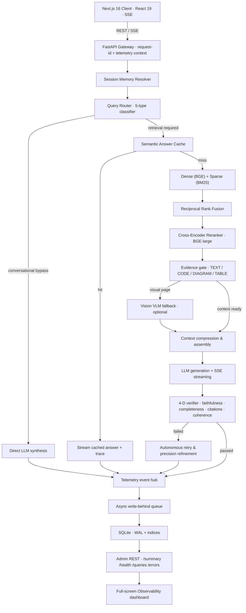

<div align="center">

# Aperture RAG — Grounded Answers for High-Stakes Documents

**A production-grade Retrieval-Augmented Generation platform that refuses to hallucinate — with an agentic verify-and-retry loop, hybrid retrieval, verbatim code extraction, and a full-screen observability plane that accounts for every millisecond of every query.**


-7C3AED?logo=ollama&logoColor=white)


</div>

---

## The problem

LLMs are fluent but unfaithful. In legal, HR, compliance, and technical-architecture domains, a confident-but-wrong answer is worse than no answer — and "the model made it up" is not an acceptable failure mode. A naive RAG bolt-on (embed → top-k → stuff-the-prompt) still hallucinates: it retrieves the wrong chunks, silently drops code formatting, serves stale cached answers after a document is deleted, and gives you zero visibility into *why* a given answer came out the way it did.

**Aperture RAG** is built around a single principle: **every answer must be traceable to retrieved evidence, or the system says so explicitly.** It pairs a high-precision retrieval stack with an agentic self-verification loop, treats ingestion and deletion as first-class data-lifecycle operations, and instruments the entire request path so you can inspect the 16 stages behind any response.

---

## What makes it interesting (engineering highlights)

> These are the parts I'd want a reviewer to read. Each one is a deliberate design decision, not a library call.

- **Agentic verify-and-retry loop.** After generation, a 4-dimensional verifier scores the answer on **faithfulness, completeness, citation coverage, and coherence**. If it fails, an autonomous retry engine widens retrieval parameters and regenerates (bounded cycles) instead of shipping an unsupported claim. Grounding claims are labelled `SUPPORTED` / `UNSUPPORTED` / `INFERRED`.

- **Hybrid retrieval that actually reranks.** Dense vectors (`BAAI/bge-small-en-v1.5`) and sparse **BM25** are fused with **Reciprocal Rank Fusion**, then re-scored by a **cross-encoder** (`BAAI/bge-reranker-large`). Cross-page section expansion pulls adjacent context so a chunk boundary never severs an answer.

- **Non-blocking ingestion for files up to 100 MB.** Uploads return in **~50 ms** and run parse → chunk → embed → index on a **single-worker background queue**; the client polls a live per-stage progress endpoint. (A 1.6 MB doc → **8,966 chunks** ingests in ~120 s of CPU embedding — the point is the request never blocks on it.) Uploads post **directly to the API**, bypassing a dev-proxy that throttled multipart bodies to ~0.6 MB/s and timed large PDFs out.

- **Delete means *gone*.** Removing a document cascades across **the vector store, BM25 postings, the docstore, the stored file, image assets, the vision cache, the semantic answer cache, and conversation state** — so a deleted document can never resurface through a cached answer.

- **Verbatim code extraction.** Chunking preserves code indentation (it no longer collapses whitespace), and the generation contract *requires* code to be reproduced character-for-character inside fenced ```language blocks. The UI renders those with a real code component: syntax highlighting, line numbers, and copy-to-clipboard.

- **Zero-latency observability.** Every request emits a trace to an **async write-behind queue** backed by **SQLite in WAL mode** — telemetry never sits on the request's critical path. A **16-stage latency waterfall** accounts for intake, memory resolution, rewrite, dense/sparse search, RRF, reranking, vision, TTFT, and SSE streaming, bucketed across `5m…7d`.

- **A UI that respects the work.** Real-time **SSE token streaming** with sub-second TTFT, a WebGL gravitational-lensing hero shared as one persistent layer across tabs (no re-mount, no black flash), and frame-rate-independent motion (magnetic-pill tabs, inertia scroll) that holds 60 fps and honors `prefers-reduced-motion`.

---

## Architecture



### The 16-stage request path
`request intake → session-memory resolution → query rewrite → dense search → BM25 search → RRF fusion → cross-encoder rerank → cross-page expansion → evidence classification → (optional) vision extraction → context assembly → prompt construction → time-to-first-token → LLM generation → 4-D verification → SSE token streaming` — each stage is timed and surfaced in the trace drawer.

---

## Tech stack

| Layer | Technology | Why |
| :--- | :--- | :--- |
| **Frontend** | Next.js 16 (Turbopack), React 19, Tailwind, Framer Motion, WebGL | SSE streaming UI, glass-over-hero design, 60 fps motion |
| **API** | FastAPI, Uvicorn, Python 3.11, Pydantic v2 | Async gateway + SSE, typed contracts |
| **Retrieval** | ChromaDB (dense) · BM25 (sparse) · RRF | Hybrid recall with precision reranking |
| **Embeddings / Rerank** | `bge-small-en-v1.5` · `bge-reranker-large` | Dense representations + cross-encoder scoring |
| **Generation** | Ollama (`qwen2.5:7b` default) | Local, privacy-first — no data leaves the host |
| **Vision (optional)** | Ollama (`qwen2.5vl:7b`) | Diagram / code-screenshot / table understanding |
| **Observability** | SQLite (WAL) + async write-behind thread | Persistent traces off the request critical path |

**Runs CPU-first.** The reranker defaults to CPU and GPU is used automatically when present (`RERANKER_DEVICE=cuda`). Vision is config-gated (`VISION_ENABLED`) because VLM inference on CPU is minutes-per-page; text and code extraction work fully without it.

---

## Quick start

**Prerequisites:** Python 3.11+, Node 18+, and [Ollama](https://ollama.com) running.

```bash
# 1. Models (text is required; vision is optional)
ollama pull qwen2.5:7b
ollama pull qwen2.5vl:7b   # optional — only if VISION_ENABLED=true

# 2. Backend (from company_policy_rag/)
python -m venv .venv
.venv\Scripts\activate            # Windows  ·  source .venv/bin/activate on Unix
pip install -r requirements.txt

# 3. Frontend
cd frontend && npm install && cd ..
```

Configure `company_policy_rag/.env` (see `.env.example`):

```env
OLLAMA_BASE_URL=http://localhost:11434
OLLAMA_LLM_MODEL=qwen2.5:7b
VISION_ENABLED=false          # true requires a GPU for reasonable latency
RERANKER_DEVICE=cpu           # cuda when a GPU is available
```

**Run both servers** (from `company_policy_rag/`):

```bash
# Windows one-shot:
start_dev.bat

# …or manually, in two terminals:
uvicorn backend.api.main:app --host 0.0.0.0 --port 8000 --reload
cd frontend && npm run dev
```

Open **http://localhost:3000**.

---

## API surface (selected)

| Method | Endpoint | Purpose |
| :--- | :--- | :--- |
| `POST` | `/api/chat/stream` | SSE token streaming with live reasoning trace |
| `POST` | `/api/documents/upload` | Non-blocking ingest (returns immediately, then poll status) |
| `GET` | `/api/documents/{id}/status` | Live per-stage ingestion progress |
| `DELETE` | `/api/documents/{id}` | Cascade delete across DB, caches, and conversation state |
| `GET` | `/api/admin/observability` | Canonical summary: percentiles, waterfall, health, traces |
| `GET` | `/api/admin/observability/queries/{id}` | Full single-trace inspection |
| `POST` | `/api/admin/observability/clear` | Purge telemetry |

---

## Project structure

```
company_policy_rag/
├── backend/
│   ├── api/            # FastAPI gateway, routers, middleware
│   ├── rag/            # pipeline, router, verifier, semantic cache, prompts
│   ├── retrieval/      # hybrid search, BM25, RRF, cross-encoder reranker
│   ├── ingestion/      # loaders (PDF/DOCX/MD/HTML/CSV/JSON/TXT) + chunkers
│   ├── embeddings/     # ChromaDB vector store + embedding service
│   ├── services/       # document lifecycle, telemetry (SQLite WAL)
│   └── vision/         # optional VLM extraction + asset/vision caches
├── frontend/           # Next.js 16 app — Space UI, SSE, observability dashboard
└── tests/              # 128 test modules: unit, edge-case, adversarial
```

---

## Testing & quality

- **128 test modules** across unit, boundary, and adversarial tiers (`pytest`), plus a frontend suite.
- Backend and frontend are fully type-checked (Pydantic v2 · TypeScript strict).

```bash
cd company_policy_rag && pytest            # backend
cd company_policy_rag/frontend && npm test # frontend
```

---

## Roadmap

- GPU-gated vision path for image-embedded code/diagram extraction at query time
- Per-document scoped cache invalidation (today deletion clears caches wholesale for correctness)
- Evaluation harness: faithfulness / retrieval-recall regression gates in CI

---

## License

Apache License 2.0.
