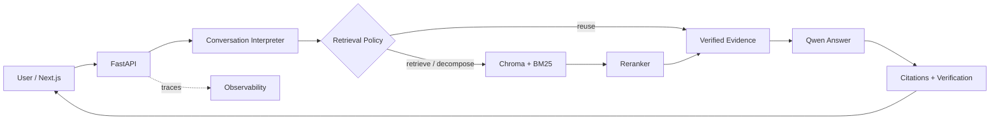

# Grounded Policy RAG

[](https://github.com/SoubhagyaJain/Company-policy-rag/actions/workflows/rag-ci.yml)
[](https://www.python.org/)
[](https://fastapi.tiangolo.com/)
[](https://nextjs.org/)
[](LICENSE)

A local-first document assistant that answers from retrieved evidence, preserves citations through follow-ups, and isolates every conversation session. It combines FastAPI, Next.js, hybrid Chroma/BM25 retrieval, cross-encoder reranking, local Ollama models, and an SQLite observability dashboard.

## Measured before/after quality

The checked-in benchmark holds the corpus, retriever, answer prompt, and `qwen2.5:7b` model constant. Only the conversation layer changes across 12 multi-turn cases.

| Metric | Before | After |
|---|---:|---:|
| Retrieval hit@3 | 90.9% | **100.0%** |
| Mean reciprocal rank | 86.4% | **95.5%** |
| Retrieval-policy accuracy | 75.0% | **100.0%** |
| Citation correctness | 81.2% | **100.0%** |
| Answers with only correct citations | 72.7% | **100.0%** |
| Unsupported-claim rate | 7.9% | **7.1%** |
| Logic + retrieval, p50 | **0.23 ms** | 0.43 ms |
| End-to-end answer latency, p50 | 5.96 s | **4.25 s** |

The unsupported-claim rate is an LLM-judged hallucination proxy. The sample is small and fictional, so every query, rewrite, retrieved section, answer, citation mapping, and judge count is available in the [benchmark report](company_policy_rag/docs/BENCHMARK_RESULTS.md), [raw results](company_policy_rag/data/eval/conversation_benchmark_results.json), and [dataset](company_policy_rag/data/eval/conversation_benchmark.json).

An independent eight-case production retrieval smoke set records **100% hit@3** and **85.4% mean reciprocal rank**. It runs the shipped Markdown loader, adaptive chunker, Chroma and BM25 indexes, and hybrid reciprocal-rank fusion against the [public smoke dataset](company_policy_rag/data/eval/retrieval_smoke.json).

## Architecture



The structured Pydantic interpreter resolves intent, topic, references, standalone query, and retrieval action in one step. The policy can retrieve, decompose, reuse verified evidence, ask for clarification, or skip retrieval. Assistant-generated prose never becomes trusted evidence.

This supports pronouns, short fragments, topic switches, explicit topic returns, comparisons, multi-part questions, “Explain that simply,” and “Show the source,” while keeping user sessions separate.

## One-command demo

Install [Docker Desktop](https://www.docker.com/products/docker-desktop/), then run:

```bash
git clone https://github.com/SoubhagyaJain/Company-policy-rag.git
cd Company-policy-rag/company_policy_rag
docker compose up --build
```

No `.env` file or host Ollama installation is required. The stack starts the UI, API with embedded Chroma, worker, Redis, and Ollama, then pulls the Qwen and embedding models. The first boot takes longer while those models and the reranker download.

Open [the app](http://localhost:3000), upload the fictional [Northstar Labs handbook](company_policy_rag/data/demo/sample_employee_handbook.md), and try:

```text
What is maternity leave?
Does it apply during probation?
How do I reset VPN?
Going back to maternity leave, what about contractors?
```

The Document Library starts clean. API documentation is available at [http://localhost:8000/docs](http://localhost:8000/docs).

## Reproduce quality checks

```bash
cd company_policy_rag
python scripts/run_core_tests.py
python scripts/benchmark_conversation.py --assert-minimums
python scripts/production_retrieval_smoke.py --assert-minimums
python scripts/benchmark_conversation.py --with-generation --assert-minimums
cd frontend && npm test && npm run build
```

The active [GitHub Actions workflow](.github/workflows/rag-ci.yml) runs 304 deterministic backend regressions, 216 frontend checks, a production UI build, the conversation benchmark gate, and the self-contained production retrieval smoke gate.

## Code map

| Path | Responsibility |
|---|---|
| [`backend/rag/conversation_interpreter.py`](company_policy_rag/backend/rag/conversation_interpreter.py) | Follow-up, topic, reference, and retrieval decisions |
| [`backend/rag/pipeline.py`](company_policy_rag/backend/rag/pipeline.py) | Retrieval, evidence assembly, generation, verification, and streaming |
| [`backend/services/document_service.py`](company_policy_rag/backend/services/document_service.py) | Multi-format ingestion and document lifecycle |
| [`backend/services/telemetry_service.py`](company_policy_rag/backend/services/telemetry_service.py) | Persistent traces, metrics, health, and retention |
| [`frontend/`](company_policy_rag/frontend) | Chat, Document Library, and observability UI |
| [`scripts/benchmark_conversation.py`](company_policy_rag/scripts/benchmark_conversation.py) | Auditable before/after evaluation |
| [`scripts/production_retrieval_smoke.py`](company_policy_rag/scripts/production_retrieval_smoke.py) | Self-contained production retrieval CI gate |

See the [full project walkthrough](company_policy_rag/README.md) for local development, supported formats, API routes, evaluation commands, and component details.

## License

MIT. The Northstar Labs handbook is fictional demo content released as CC0-1.0.
