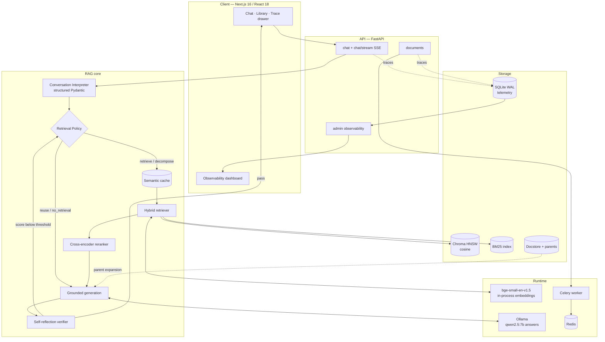
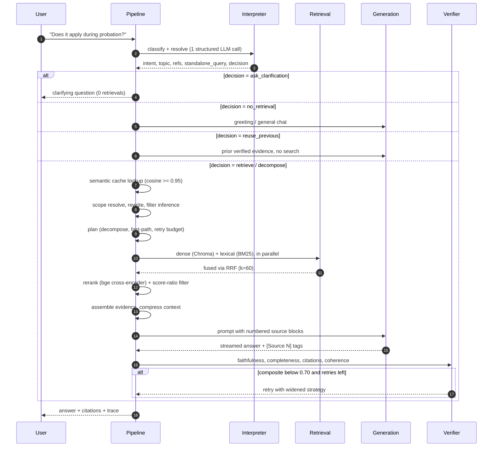
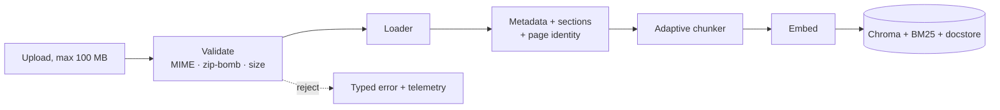

<div align="center">

# Grounded Policy RAG

**A local-first document assistant that answers only from retrieved evidence — and proves it.**

[](https://github.com/SoubhagyaJain/Company-policy-rag/actions/workflows/rag-ci.yml)
[](https://www.python.org/)
[](https://fastapi.tiangolo.com/)
[](https://nextjs.org/)
[](https://ollama.com/)
[](#-testing-strategy)
[](LICENSE)

[Quickstart](#-quickstart-one-command) · [Run from source](#-run-it-from-source-step-by-step) · [Using it](#-using-it) · [Architecture](#-architecture) · [Design decisions](#-design-decisions-and-trade-offs) · [Results](#-measured-results) · [Troubleshooting](#-troubleshooting)

</div>

---

## What this is

Upload your documents. Ask questions in natural language, including messy follow-ups like *"does it apply during probation?"* or *"going back to leave — what about contractors?"* Get answers that cite the exact section they came from, verified before they reach you.

Everything runs on your machine. No API keys, no data leaving the host.

```text
You:  What is maternity leave?
Bot:  Employees receive 26 weeks of paid maternity leave. [Source 1]
      └─ Northstar Labs Handbook § 4.2 "Parental Leave", p. 12

You:  Does it apply during probation?          ← pronoun, no subject, no keywords
Bot:  No. Section 4.2 requires 90 days of confirmed service. [Source 1]
      └─ resolved "it" → "maternity leave"; reused verified evidence, no re-retrieval
```

That second turn is the hard part, and it is what most of this codebase exists to get right.

---

## Table of contents

| | |
|---|---|
| [The problem](#-the-problem-this-solves) | Why naive RAG breaks on turn two |
| [Measured results](#-measured-results) | Three reproducible evaluation layers |
| [How changes are decided](#-how-changes-are-decided) | Every default has an A/B behind it |
| [Quickstart](#-quickstart-one-command) | Docker, ~10 min to a working demo |
| [Run it from source](#-run-it-from-source-step-by-step) | Step by step, with a checkpoint per step |
| [Using it](#-using-it) | UI walkthrough, API calls, first-run pitfalls |
| [Architecture](#-architecture) | Layers, request lifecycle, ingestion |
| [Design decisions](#-design-decisions-and-trade-offs) | The reasoning behind each choice |
| [Repository map](#-repository-map) | Where everything lives |
| [Configuration](#-configuration-reference) | Every knob that matters |
| [API reference](#-api-reference) | All 30+ endpoints |
| [Testing strategy](#-testing-strategy) | 518 checks and the CI gates |
| [Observability](#-observability) | Traces, metrics, health |
| [Limitations](#-limitations-and-known-constraints) | Honest scope |
| [Troubleshooting](#-troubleshooting) | Fixes for the common failures |

---

## 🎯 The problem this solves

A textbook RAG system is four lines of code: embed the question, search a vector store, stuff the top-k into a prompt, generate. It demos beautifully and falls apart the moment a real person uses it.

**Failure 1 — The follow-up has no keywords.** "Does it apply during probation?" embeds to nothing useful. Dense search returns the probation policy, not the leave policy. The answer is confidently wrong.

**Failure 2 — Conversation history poisons retrieval.** The obvious fix is to concatenate history into the query. Now a topic switch ("how do I reset VPN?") still drags leave-policy vocabulary into the search, and precision collapses.

**Failure 3 — The model's own prose becomes "evidence."** If the previous assistant turn is fed back as context, a single hallucination is laundered into a trusted fact and compounds across the conversation.

**Failure 4 — Citations drift.** The model emits `[Source 2]` because the format demands it, not because source 2 supports the claim. Nothing checks.

This system attacks all four:

| Failure | Mechanism | Where |
|---|---|---|
| Keyword-free follow-ups | A structured interpreter emits a **standalone query** before retrieval ever runs | [`conversation_interpreter.py`](company_policy_rag/backend/rag/conversation_interpreter.py) |
| History poisoning | An explicit **retrieval policy** with 5 actions, including "topic shift → drop prior context" | `RetrievalDecision` enum |
| Prose as evidence | Assistant text is **navigation context only**; only retrieved chunks and verified citations enter the evidence set | [`pipeline.py`](company_policy_rag/backend/rag/pipeline.py) |
| Citation drift | A **4-dimension verifier** scores every answer, and the prompt demands a tag per sentence | [`verifier.py`](company_policy_rag/backend/rag/verifier.py) |

**Failure 5 — Evidence is retrieved and then thrown away.** Retrieval can rank the right passage first and still lose it: a later re-ordering step, a scope rule, or a context-packing quota drops it before the prompt is built. Nothing in a retrieval metric catches that, because retrieval did its job. This system measures the whole funnel through to the final prompt, stage by stage — see [Measured results](#-measured-results).

---

## 📊 Measured results

Three evaluation layers, each reproducible from committed data. They answer different questions, and a system can pass one while failing another.

| Layer | Question it answers | Harness | Corpora |
|---|---|---|---|
| **Retrieval funnel** | Does the labelled evidence survive all the way into the final prompt? | [`eval_retrieval_backend.py`](company_policy_rag/scripts/eval_retrieval_backend.py) | 91 labelled questions over 3 corpora |
| **Answers** | Are the facts right, the citations real, and does it abstain when it should? | [`eval_answers_backend.py`](company_policy_rag/scripts/eval_answers_backend.py) | 24 labelled questions, live `qwen2.5:7b` |
| **Conversation** | Do follow-ups, topic shifts and reuse pick the right retrieval action? | [`benchmark_conversation.py`](company_policy_rag/scripts/benchmark_conversation.py) | 12 multi-turn cases |

### 1. Retrieval → final prompt context

The harness runs the production retrieval, scope, assembly and packing path with no LLM, then scores what reached the prompt. Current defaults, no reranker:

| Corpus | Labelled queries | Context Hit@6 | Context MRR | Coverage | Lost all evidence | p50 |
|---|---:|---:|---:|---:|---:|---:|
| Guidebook (PDF, technical) | 33 | 0.97 | 0.91 | 0.724 | 0 | 46 ms |
| Legal textbook (PDF) | 37 | 1.00 | 0.90 | 0.794 | 0 | 62 ms |
| Handbook (Markdown) | 21 | 1.00 | 1.00 | 1.000 | 0 | 41 ms |
| **All** | **91** | **0.99** | **0.93** | **0.816** | **0** | **50 ms** |

Only 4 labelled chunks in the whole set are retrieved and then dropped before the prompt. That number was **41** before the context-assembly fix below.

### 2. Answers (live model)

24 labelled handbook questions, 21 answerable and 3 that must abstain, through `RAGPipeline.query` with the shipped defaults:

| Metric | Value |
|---|---:|
| Key-fact recall | **1.000** |
| Answers carrying a `[Source N]` tag | **1.000** |
| Citation precision (cited chunk is a labelled one) | 0.905 |
| Cited chunk was actually in the prompt | **1.000** |
| Abstained exactly when it should | **1.000** |
| Answers free of copied source-header lines | **1.000** (was 0.500) |
| Latency p50 / p95 | 4.7 s / 10.4 s |
| Prompt tokens p50 · context overflow | 1294 · **0** |

Full run, including the failures and what they cost: [`docs/ANSWER_EVAL_BASELINE.md`](company_policy_rag/docs/ANSWER_EVAL_BASELINE.md).

### 3. Conversation layer

This benchmark holds the corpus, retriever, top-3 cutoff, answer prompt, and `qwen2.5:7b` model **constant**. Only the conversation layer changes: legacy query-rewriter (before) vs. the production interpreter (after), across 12 multi-turn cases.

| Metric | Before | After | Δ |
|---|---:|---:|---:|
| Retrieval hit@3 | 90.9% | **100.0%** | +9.1 pt |
| Mean reciprocal rank | 86.4% | **95.5%** | +9.1 pt |
| Retrieval-policy accuracy | 75.0% | **100.0%** | +25.0 pt |
| Standalone-query term coverage | 86.4% | **100.0%** | +13.6 pt |
| Citation correctness | 81.2% | **100.0%** | +18.8 pt |
| Answers with **only** correct citations | 72.7% | **100.0%** | +27.3 pt |
| Unsupported-claim rate (LLM-judged) | 7.9% | **7.1%** | −0.8 pt |
| Conversation logic + retrieval, p50 | **0.23 ms** | 0.43 ms | +0.20 ms |
| End-to-end answer latency, p50 | 5.96 s | **4.25 s** | −29% |

The conversation layer got **~2× slower in isolation** (0.23 → 0.43 ms) and the **end-to-end answer got 29% faster**, because better retrieval means fewer verification retries and shorter prompts. That trade is the whole thesis of the design.

This benchmark measures the conversation layer only, and it predates the retrieval and prompt work above — the interpreter arm it scores is the deterministic path that still ships. Re-running it is one command, and it gates every build.

<details>
<summary><b>Provenance — read this before trusting the numbers</b></summary>

- **Sample is small and fictional.** 12 multi-turn cases over a synthetic handbook. Treat this as a regression signal, not a leaderboard claim.
- **Hallucination proxy, not human eval.** "Unsupported-claim rate" is judged by `qwen2.5:7b`, not by a person. A separate [human rubric](company_policy_rag/data/eval/HUMAN_EVAL_RUBRIC.md) and [agreement study](company_policy_rag/scripts/compare_human_judge.py) exist for calibration.
- **Single machine, single run.** Windows 11, Python 3.11.9, Intel Core i5-13420H, RTX 4050 Laptop 6 GB. Ollama reported 39% CPU / 61% GPU placement. Latency will differ on your hardware.
- **Deterministic settings.** Temperature 0, seed 42.
- **Everything is checked in.** Every query, rewrite, retrieved section, answer, citation mapping, and judge count: [report](company_policy_rag/docs/BENCHMARK_RESULTS.md) · [raw JSON](company_policy_rag/data/eval/conversation_benchmark_results.json) · [dataset](company_policy_rag/data/eval/conversation_benchmark.json).

- **Labels are graded and committed**, per corpus, with the relevant chunk ids and the key facts an answer must contain: [`data/eval/retrieval/`](company_policy_rag/data/eval/retrieval). The label set is small on purpose — it is hand-checked, not model-generated.
- **The handbook corpus is at ceiling.** Every retrieval metric on it is 1.000, so it catches regressions but cannot show improvements. The guidebook and legal corpora carry the discriminating signal.

</details>

**Reproduce it yourself:**

```bash
cd company_policy_rag

# Conversation layer — deterministic, no model, ~30 s
python scripts/benchmark_conversation.py --assert-minimums

# Retrieval funnel — no model, ~20 s for all three corpora
python scripts/eval_retrieval_backend.py run \
  --corpus handbook=data/eval/retrieval/handbook_corpus.json \
  --queries handbook=data/eval/retrieval/handbook_labels.json \
  --configs <config.json> --out logs/retrieval_eval/mine

# Answers — needs Ollama, ~4 min for 24 questions
python scripts/eval_answers_backend.py run \
  --corpus handbook=data/eval/retrieval/handbook_corpus.json \
  --queries handbook=data/eval/retrieval/handbook_labels.json \
  --config mine --out logs/answer_eval/mine
```

---

## 🔬 How changes are decided

No retrieval or prompt default in this repository is there because it sounded right. Each one is an A/B on the harnesses above, with a paired bootstrap CI and a sign-flip p-value, written up in [`docs/PHASE4_AB_LOG.md`](company_policy_rag/docs/PHASE4_AB_LOG.md). A change that does not move a metric does not ship, however clever it is.

Some of what that produced:

| Change | Evidence | Outcome |
|---|---|---|
| **Keep the ranked hand-off as the prompt context** (`CONTEXT_ASSEMBLY_MODE=rank_policy`) | Context MRR +0.192, nDCG@10 +0.140 (p < 0.001), coverage +0.045 over 91 queries; relevant chunks discarded 41 → 4 | Shipped, now the default |
| **Per-sentence citation rule in the prompt** | Copied source-header lines 50% → 0% of answers, every answer tagged, ~1.5 s faster | Shipped |
| **Delete the query-expansion tables** | They fired on 18 of 35 guidebook eval questions and 0 elsewhere, appending the answer's own vocabulary | Deleted — the "gain" was eval leakage |
| **LLM pass of the conversation interpreter** | Ran on 11/11 follow-ups, output failed validation every time, ~8.5 s per turn, changed no decision | Off by default |
| **LLM query decomposition** | No gain across 91 queries (nDCG −0.010), one LLM call per comprehensive question | Off by default |
| **Cross-encoder reranker** | No context Hit@6 gain once scope and assembly were fixed, +2.1 s on CPU | Off by default, one env var to re-enable |
| **Lexical citation repair** | 0 safe corrections on 141 stored answers | Built, measured, deleted |

Two habits make this work: a **committed baseline** for every gate, so a regression is a build failure rather than a surprise; and a bias toward **deleting** anything that cannot show its value, including work already written.

---

## 🚀 Quickstart (one command)

### Prerequisites

| Requirement | Minimum | Why |
|---|---|---|
| [Docker Desktop](https://www.docker.com/products/docker-desktop/) | 4.x, Compose v2 | Runs the whole stack |
| RAM allocated to Docker | **8 GB** (16 GB recommended) | `qwen2.5:7b` needs ~5 GB resident |
| Free disk | **~12 GB** | LLM 4.7 GB + embedder 0.3 GB + reranker 1.1 GB + images |
| Ports free | `3000`, `8000`, `6379` | Overridable — see below |

> **No `.env` file, no API keys, and no host Ollama install are required.** Compose provisions everything.

### Run

```bash
git clone https://github.com/SoubhagyaJain/Company-policy-rag.git
cd Company-policy-rag/company_policy_rag
docker compose up --build
```

**First boot takes 10–20 minutes** — it downloads `qwen2.5:7b` through Ollama and the `bge-small-en-v1.5` embedder from Hugging Face. Subsequent starts take under a minute; models persist in named volumes.

Compose brings up six services in dependency order:

```text
redis ──────────────────┐
                        ├──► backend (FastAPI + Chroma + BM25) ──► frontend (Next.js)
ollama ──► ollama_setup ┘                   │
   (pulls the two models, then exits)       └──► celery_worker
```

### Verify it works

Wait for the backend healthcheck to go green, then:

```bash
curl http://localhost:8000/api/health
```

| Surface | URL |
|---|---|
| **App** | <http://localhost:3000> |
| Interactive API docs | <http://localhost:8000/docs> |
| Health / readiness | <http://localhost:8000/api/health> |
| Observability dashboard | <http://localhost:3000/admin> |

### Try it

The Document Library starts empty. Upload the fictional [Northstar Labs handbook](company_policy_rag/data/demo/sample_employee_handbook.md), wait for ingestion to report `completed`, then run this exact sequence — each line exercises a different branch of the retrieval policy:

```text
What is maternity leave?                               → RETRIEVE       (fresh search)
Does it apply during probation?                        → RETRIEVE       (pronoun resolved first)
Explain that simply.                                   → REUSE_PREVIOUS (no new search)
How do I reset VPN?                                    → RETRIEVE       (topic shift, prior context dropped)
Going back to maternity leave, what about contractors? → RETRIEVE       (explicit topic return)
```

Open the trace drawer on any answer to see which decision fired, what was retrieved, and what the verifier scored.

Uploaded documents **survive a restart**: the library, its Chroma collection and its BM25 index live under `APP_STORAGE_DIR`. Set `DOCUMENT_LIBRARY_MODE=session` for the older behaviour, where every process starts with an empty library.

### Stop / reset

```bash
docker compose down            # stop, keep models and data
docker compose down -v         # also delete volumes (re-downloads models next time)
```

### Change the defaults

Every value in [`docker-compose.yml`](company_policy_rag/docker-compose.yml) reads from the environment, so no file edits are needed:

```bash
BACKEND_PORT=8080 FRONTEND_PORT=3001 OLLAMA_LLM_MODEL=qwen2.5:3b docker compose up
```

For deeper tuning, copy [`.env.docker.example`](company_policy_rag/.env.docker.example) to `.env`.

---

## 💻 Run it from source, step by step

Use this when you are changing code. Docker is for demoing; this is for iterating. **Check the result of each step before starting the next** — every common failure shows up at one of these checkpoints.

### Step 0 — Prerequisites

| Need | Version | Check |
|---|---|---|
| Python | 3.11+ (CI pins 3.11) | `python --version` |
| Node.js | 20+ | `node --version` |
| [Ollama](https://ollama.com/) | running on the host | `curl http://localhost:11434/api/tags` |
| Free disk | ~8 GB | model 4.7 GB + embedder/reranker ~1.4 GB |
| Redis | optional | only for Celery-backed async ingestion |

### Step 1 — Pull the model

```bash
ollama pull qwen2.5:7b
```

✅ **Check:** `ollama list` shows `qwen2.5:7b`. The embedder (`BAAI/bge-small-en-v1.5`) is **not** an Ollama model — it downloads from Hugging Face on first use.

### Step 2 — Install the backend

```bash
cd company_policy_rag

python -m venv .venv
source .venv/bin/activate                 # Windows PowerShell: .venv\Scripts\Activate.ps1
                                          # Windows cmd:        .venv\Scripts\activate.bat

# CPU-only PyTorch keeps the install ~2 GB smaller; skip this line if you want CUDA
pip install torch torchvision --index-url https://download.pytorch.org/whl/cpu
pip install -r requirements.txt

cp .env.example .env                      # optional — every setting has a working default
```

✅ **Check:** `python -c "from backend.api.main import app; print('ok')"` prints `ok`. Run it from `company_policy_rag/`; a `ModuleNotFoundError: backend` means you are in the wrong directory or the venv is not active.

> **On a CPU-only machine, set `VISION_ENABLED=false` in `.env` now.** The page-understanding model runs at ~65 s/page on CPU, which makes PDF ingestion look hung. With a GPU, leave it on.

### Step 3 — Start the backend

```bash
uvicorn backend.api.main:app --reload --port 8000
```

Startup warms the embedder and the LLM handle inside FastAPI's `lifespan`, so the **first request is no slower than the rest**. Expect **30–60 s** before the port accepts traffic — loading the embedder dominates that, and the reranker is skipped entirely because it is off by default.

✅ **Check:**

```bash
curl http://localhost:8000/api/health
# {"status":"ok","redis":false,"vector_db":true,"bm25_index":true,"models_loaded":true,"index_ready":true,"chunk_count":0,...}
```

`redis: false` is fine — Redis is only needed for Celery-backed async ingestion. `chunk_count: 0` just means you have not uploaded anything yet.

This endpoint does **not** check Ollama. Verify that separately:

```bash
curl http://localhost:8000/api/models      # active model + everything Ollama has pulled
```

### Step 4 — Start the frontend

```bash
cd frontend
npm ci
npm run dev                               # http://localhost:3000
```

The dev server proxies `/api/*` to `http://127.0.0.1:8000`, so **no frontend env var is needed** for the standard setup. If your backend runs elsewhere, set `BACKEND_API_URL`. `npm run dev` also runs a `predev` hook that kills a stale server holding port 3000 — a Windows papercut that otherwise silently serves an old build.

✅ **Check:** <http://localhost:3000> loads the chat view and the Document Library reports 0 documents.

On Windows, [`start_dev.bat`](company_policy_rag/start_dev.bat) launches both servers in their own windows.

### Step 5 — Confirm the whole setup

```bash
cd company_policy_rag
python scripts/run_core_tests.py                           # 426 tests, ~30 s, no network, no GPU
python scripts/benchmark_conversation.py --assert-minimums # conversation gate
python scripts/ci_retrieval_smoke.py                       # retrieval gate vs the committed baseline
cd frontend && npm test                                    # 216 tests, ~0.3 s
```

If all four pass, your environment is correct. On Windows, prefix pytest-based commands with `KMP_DUPLICATE_LIB_OK=TRUE` (or set it once in your shell) — PyTorch and Intel OpenMP otherwise abort the process on import.

### Optional extras

```bash
pip install -r requirements-finetuning.txt   # LoRA/QLoRA + GGUF export + Ollama registration
pip install -e ".[marker]"                   # marker-pdf, higher-fidelity PDF parsing
```

---

## 📖 Using it

### In the UI

1. **Upload.** Document Library → upload [the fictional handbook](company_policy_rag/data/demo/sample_employee_handbook.md) or your own PDF/DOCX/MD/XLSX. Watch the ingestion stages; wait for `READY`.
2. **Ask.** "What is maternity leave?" — the answer streams, then citation cards appear under it.
3. **Follow up naturally.** "Does it apply during probation?" The pronoun is resolved before retrieval runs; you can see what it resolved to in the trace.
4. **Open the trace drawer** on any answer: the retrieval decision and why, the resolved references, what was retrieved and what reached the prompt, verification scores, timings per stage.
5. **Scope a question** to one document from the library when you have several — the pipeline then refuses evidence from anything else.
6. **Admin dashboard** at `/admin`: query traces, per-stage latency, ingestion events, cache and error incidents.

Uploads persist across restarts. To start clean, delete the documents in the UI, or stop the app and remove `app/storage/`.

### From the API

```bash
# Upload and wait for indexing
curl -F "file=@data/demo/sample_employee_handbook.md" http://localhost:8000/api/documents/upload
curl http://localhost:8000/api/documents            # status per document

# Ask (non-streaming)
curl -X POST http://localhost:8000/api/chat \
  -H "Content-Type: application/json" \
  -d '{"message": "How many annual-leave days do full-time employees get?"}'

# Ask (SSE: tokens, thinking events, citations, final trace)
curl -N -X POST http://localhost:8000/api/chat/stream \
  -H "Content-Type: application/json" \
  -d '{"message": "What is the domestic meal allowance?", "session_id": "demo"}'
```

The response carries `answer`, `citations[]` (each with document, section, page and the snippet), and `trace` (decision, stage timings, verification scores, token usage). Pass the same `session_id` across turns to get follow-up resolution; omit it and every turn is standalone.

Full interactive schema at <http://localhost:8000/docs>.

### Things that will trip you up

| Symptom | Cause | Fix |
|---|---|---|
| Ingestion appears to hang on a PDF | Vision path on CPU (~65 s/page) | `VISION_ENABLED=false` |
| Upload succeeds, 0 chunks indexed | Scanned/image-only PDF with vision off | No OCR fallback — use a text-layer PDF |
| Every answer is "I could not find this information in the provided document." | The library is empty — this is the correct, grounded response, not a bug | Upload a document and wait for `READY` |
| Answers ignore an uploaded document | Still indexing | Wait for `READY` in the library |
| "I could not find that" on an obvious fact | Question names a document that is not selected or uploaded | Check the library, or scope the question to the right document |
| `ModuleNotFoundError: backend` | Wrong cwd or inactive venv | Run from `company_policy_rag/` with the venv active |
| Windows pytest aborts on import | Duplicate OpenMP runtime | `KMP_DUPLICATE_LIB_OK=TRUE` |

More in [Troubleshooting](#-troubleshooting).

---

## 🏗 Architecture

### At a glance

Five layers. Each one owns a directory, and the boundaries are real — you can read any layer without the others.

| Layer | Directory | Owns | Key modules |
|---|---|---|---|
| **Interface** | `frontend/` | Chat, document library, per-answer trace drawer, admin dashboard | `hooks/useChatStream.ts` (SSE), `components/` |
| **API** | `backend/api/` | HTTP surface, dependency injection, request validation | `main.py`, `dependencies.py`, `routes/` (chat · documents · admin · models · health) |
| **RAG core** | `backend/rag/` | One turn, end to end: interpret → retrieve → assemble → generate → verify | `pipeline.py` (orchestration), `conversation_interpreter.py`, `policy_reliability.py`, `citations.py`, `verifier.py` |
| **Retrieval & ingestion** | `backend/retrieval/`, `backend/ingestion/`, `backend/embeddings/` | Dense + lexical search, fusion, loaders, chunkers, embeddings | `hybrid.py` (RRF), `bm25.py`, `dense.py`, `reranker.py`, `chunkers/`, `loaders/` |
| **Services & storage** | `backend/services/`, `storage/` | Document lifecycle, chat sessions, telemetry, Chroma + BM25 + SQLite on disk | `document_service.py`, `chat_service.py`, `telemetry_service.py` |

Two things sit deliberately outside that stack: `src/config.py`, the single `Settings` object every layer reads, and `backend/evaluation/` plus `scripts/`, which hold the harnesses that decide what the defaults are.

**What happens when you upload a document**

```text
file → validate (MIME, size, zip-bomb) → load (11 formats) → detect sections and page identity
     → adaptive chunking → embed → write to Chroma + BM25 + docstore → registry entry + telemetry
```

A failure at any stage marks the job `FAILED` and cleans up the partial index, so the library never lists a document you cannot search.

**What happens when you ask a question**

```text
message → interpret (standalone query + retrieval decision) → [semantic cache]
        → scope + plan → dense ∥ BM25 → RRF fusion → [rerank]
        → context assembly → token-budget packing → grounded prompt → stream
        → citations + verification → trace to SQLite
```

Bracketed stages are optional and off or conditional by default. Every stage is timed into `stage_timings` and every ranked id is recorded, which is what the trace drawer and the evaluation harnesses read.

### System view



### Request lifecycle

Every chat turn runs through `RAGPipeline._query_internal`. Stages are explicit, individually timed, and each emits a thinking event the UI streams live.



**Stage inventory** — each is a discrete method on `RAGPipeline`, timed into `stage_timings`:

| # | Stage | Responsibility |
|---|---|---|
| 1 | `_stage_classify_and_resolve` | Intent, topic, reference resolution, retrieval decision |
| 2 | *cache* | Semantic cache lookup — **skipped** for follow-ups, filtered, or scoped queries |
| 3 | `_stage_scope_and_rewrite` | Document scope, query rewrite, metadata-filter inference |
| 4 | `_stage_plan` | Multi-part decomposition, fast-path eligibility, retry budget |
| 5 | `_stage_retrieve` | Parallel dense + BM25, RRF fusion, filter-relaxation fallback |
| 6 | `_stage_rerank_and_context` | Optional rerank, context assembly, token-budget packing, policy block |
| 7 | `_stage_generate` | Grounded prompt, output budget fitted to the context window, streaming |
| 8 | `_stage_verify` | 4-dimension scoring, citation validation, optional retry |

Stage 6 is where a RAG system quietly loses. Everything that reaches it has already been ranked; anything it re-orders or drops never reaches the model, and no retrieval metric will tell you. It records its input and output ids per sub-stage (`post_filter`, `governing_selection`, `post_packing`, `final_context`), which is what makes the funnel in [Measured results](#-measured-results) measurable at all.

### The conversation interpreter

The interpreter produces a validated Pydantic object. **It is deterministic by default** — pattern-based resolution for pronouns, fragments, explicit returns, reuse requests and ambiguity — with an optional LLM pass behind `ENABLE_CONVERSATION_INTERPRETER=true`.

That flag ships off because it was measured: on the 12-case benchmark the model's output failed schema validation on all 11 follow-ups, cost ~8.5 s per turn, and changed no retrieval decision once the parse bug was fixed. The deterministic path already scores 100% on policy accuracy there. The LLM pass stays in the code, one env var away, for corpora where the patterns fall short.

Either path fills the same object:

```python
class ConversationInterpretation(BaseModel):
    intent: QueryCategory                # factual | policy | technical | conversational | ...
    answer_mode: AnswerMode              # direct | explanatory | enumerated | ...
    is_followup: bool
    topic_shift: bool                    # -> prior retrieval context is dropped
    returned_to_topic: bool              # "going back to leave..."
    active_topic: str | None
    active_entities: list[str]           # capped at 12
    standalone_query: str                # the ONLY string retrieval ever sees
    retrieval_decision: RetrievalDecision
    reuse_turn_id: str | None            # which verified evidence set to reuse
    resolved_references: list[ResolvedReference]  # "it" -> "maternity leave", + confidence
    sub_queries: list[str]               # capped at 4
    ambiguous: bool
    clarification_question: str | None
    confidence: float                    # 0.0-1.0
    rationale: str
```

The `retrieval_decision` is a closed enum — five actions, nothing else:

| Decision | Fires when | Cost |
|---|---|---|
| `RETRIEVE` | New information is needed | Full pipeline |
| `REUSE_PREVIOUS` | "Explain that simply", "show the source" | **Zero** retrievals |
| `DECOMPOSE` | Comparison or multi-part question | One retrieval per part |
| `ASK_CLARIFICATION` | A reference has several plausible targets | **Zero** retrievals |
| `NO_RETRIEVAL` | Greeting, meta-question, general chat | **Zero** retrievals |

A `model_validator` enforces the invariants — a clarification decision *must* carry a question, `standalone_query` is always stripped and non-empty, lists are capped. A malformed LLM response fails validation and falls back to the deterministic result rather than corrupting state. Grounding invariants are applied **after** the model, not by it: an explicit topic return or an unresolved reference cannot be overridden by a confident-sounding response.

### Retrieval

```text
standalone_query
      │
      ├──► Dense: bge-small-en-v1.5 → Chroma HNSW (cosine)   top-15 candidates
      │
      └──► Lexical: BM25 over the same chunk corpus          top-15 candidates
                                │
                  Reciprocal Rank Fusion  (k = 60)
                     score = sum of 1 / (60 + rank)
                                │
                  Cross-encoder rerank   optional, off by default
                                │
                  Context assembly  (rank order kept; governing clause
                     rescued into the tail for policy questions)
                                │
                  Token-budget packing + numbered source blocks
                                │
                        top-6 evidence chunks
```

**Why both retrievers.** Policy and legal corpora are full of exact tokens — section numbers, defined terms, statutory references — where lexical search is unbeatable. They are also full of paraphrase, where dense search is unbeatable. RRF fuses them without needing a tuned score-normalisation weight, which is exactly the kind of hyperparameter that silently overfits to one corpus.

**Why the reranker is off.** The theory is sound — a cross-encoder reads query and chunk jointly, where a bi-encoder compressed the chunk before it ever saw the query. The measurement disagreed for this corpus and model: once the scope and context-assembly bugs were fixed, the base reranker added **no** context Hit@6 and cost ~2.1 s per query on CPU ([`docs/RERANKER_ABLATION.md`](company_policy_rag/docs/RERANKER_ABLATION.md)). `ENABLE_RERANKER=true` turns it back on; `bge-reranker-large` does buy +0.045 context MRR if you have a GPU and can spend the latency.

**Why the ranked order is kept.** A governing-clause selector used to re-order the context, and it pushed ranked chunks 3–6 out of the prompt. It now only contributes the policy decision block, plus a tail rescue when the question is a workplace-policy one and ranking missed the clause. That single change is the largest quality win in the log: context MRR +0.192.

### Ingestion



**11 formats** via a loader factory: PDF, DOCX, XLSX, PPTX, TXT, MD, HTML, CSV, TSV, JSON, JSONL.

**Adaptive chunking** — the chunker is chosen from document structure, not from a config flag:

| Chunker | Chosen for |
|---|---|
| `MarkdownAwareChunker` | Markdown with heading hierarchy |
| `HeadingAwareChunker` | Documents with detected section headings |
| `TableAwareChunker` | Tabular content (keeps rows intact) |
| `SemanticChunker` | Prose with topic boundaries |
| `RecursiveChunker` | Fallback |

**Defence in depth on upload.** 100 MB hard cap, 200 MB post-expansion cap, 10 000 archive-member cap (Office files are zips — this blocks zip bombs), `defusedxml` for all XML parsing, MIME sniffing rather than trusting the extension. The container runs as a **non-root** user.

**Durable library.** `DOCUMENT_LIBRARY_MODE=persistent` (the default) keeps one library under `APP_STORAGE_DIR`: its Chroma collection, BM25 index, content hashes and the document registry are restored on startup, so uploads survive a restart. A failed vector write now raises and marks the ingestion job `FAILED`, instead of leaving a document that is listed but unsearchable.

`DOCUMENT_LIBRARY_MODE=session` restores the older isolation model — a fresh `storage/sessions/<uuid>/` per process, physically unreachable from any other session. That was the default until it was found to be creating a new library on every restart (223 orphaned directories by the time it was measured).

### Verification

The verifier scores every answer on four independent axes and gates on a composite:

| Dimension | Threshold | Method |
|---|---:|---|
| Faithfulness | 0.75 | Heuristic overlap, **escalated to an LLM judge** for policy/numeric answers |
| Completeness | 0.70 | Does the answer address the asked question |
| Citation coverage | 0.60 | Do emitted `[Source N]` tags resolve to real, relevant sources |
| Coherence | 0.70 | Structural sanity |
| **Composite** | **0.70** | Gate — below this can trigger a retry (`VERIFICATION_MAX_RETRIES`, default **0**) |

Two properties matter here:

1. **The LLM judge can only tighten a verdict, never loosen one.** It catches hallucinations the lexical heuristic misses; it cannot inflate a weak answer into a passing one.
2. **It falls back silently.** Any LLM or parse failure reverts to the heuristic score. A verifier outage degrades quality, it does not cause an outage.

Retries default to **0**. A retry costs a full generation plus an LLM judge, and nothing in the answer eval showed it buying quality; raise it only with an eval that does. Because a retry is what buffering exists for, policy/numeric answers now **stream while they are verified** instead of being held back: first token at 1.1 s instead of after the full 5.6 s answer. When the retry budget is above 0 they are buffered again, so a failed check can still replace them before display.

The verdict is not cosmetic when it fails: it lands in the trace and blocks the answer from entering the semantic cache.

---

## 🧠 Design decisions and trade-offs

The reasoning, including what was given up. This is the part worth reading.

<details open>
<summary><b>1. One structured interpretation instead of a rewriter chain</b></summary>

**Alternative:** the standard stack — a query-rewriter, then a router, then a decomposer, each its own LLM call.

**Chosen:** a single call returning one validated Pydantic object carrying intent, topic, references, standalone query, and retrieval action together.

**Why:** those decisions are *mutually dependent*. Whether "it" means maternity leave depends on whether the topic shifted; whether to decompose depends on the resolved intent. Splitting them into sequential calls forces each stage to guess at the others' conclusions, and errors compound. One call sees the whole picture.

**Cost:** a bigger prompt and a stricter output schema. Measured at **0.43 ms p50** for conversation logic + retrieval — 2× the old rewriter, and utterly dominated by the ~4 s of generation.

**Guardrail:** Pydantic validation. A malformed response is rejected, not partially applied.

**Update after measurement:** the *LLM* version of that call is now off by default. Its output failed validation on 11/11 benchmark follow-ups, cost ~8.5 s per turn, and matched the deterministic result once fixed. The structure survived; the model call did not earn its place. `ENABLE_CONVERSATION_INTERPRETER=true` restores it.
</details>

<details>
<summary><b>2. Assistant prose is never evidence</b></summary>

**Alternative:** feed the last N turns into the context window, as nearly every chat-RAG tutorial does.

**Chosen:** a hard split. Prior assistant text is *navigation context* — it helps resolve "it" and "that" — and is structurally barred from the evidence set. Only retrieved chunks and verified citations can ground a claim.

**Why:** without this, one hallucination on turn 2 becomes a cited fact on turn 5. The error rate compounds instead of staying flat.

**Cost:** more retrievals. `REUSE_PREVIOUS` recovers most of that by reusing *verified evidence sets* — never the prose that was generated from them.

This is enforced in the retrieval path too: metadata-filter inference reads only earlier **user** messages, never assistant output, so the model cannot narrow its own search into a corner it invented.
</details>

<details>
<summary><b>3. Local-first, no cloud LLM</b></summary>

**Chosen:** Ollama + `qwen2.5:7b` for answers, `BAAI/bge-small-en-v1.5` in-process for embeddings, everything on-host.

**Why:** the target corpus is HR handbooks, contracts, and internal policy — documents organisations often cannot send to a third-party API at all. Local also makes the benchmark honest: no silent model upgrades under the results, and temperature-0/seed-42 reproducibility.

**Cost:** a 7B model is weaker than a frontier model, and ~5 GB of RAM is a real deployment constraint. The pipeline compensates architecturally — tighter retrieval and explicit verification recover much of the gap.

**Escape hatch:** `OLLAMA_LLM_MODEL` swaps the model, and `PUT /api/models/active` switches it at runtime without a restart.
</details>

<details>
<summary><b>4. Hybrid retrieval with RRF, not weighted score fusion</b></summary>

**Alternative:** normalise dense and BM25 scores, blend with a tuned α.

**Chosen:** Reciprocal Rank Fusion, `k = 60`.

**Why:** RRF consumes *ranks*, not scores, so it needs no cross-retriever normalisation and no α to tune. That tuned α is precisely the parameter that overfits to whichever corpus you tuned it on — and this system is meant to accept arbitrary user uploads.

**Cost:** RRF discards score magnitude, so a runaway-confident dense hit gets no extra credit. The cross-encoder reranker restores that ordering afterwards, where it can actually read the text.
</details>

<details>
<summary><b>5. Semantic caching with deliberately narrow eligibility</b></summary>

**Chosen:** cache at cosine ≥ 0.95, but **only** for queries that are not follow-ups, carry no filters, target no specific document, and use global scope.

**Why:** a cache hit on a follow-up is a correctness bug, not a speedup. "Does it apply during probation?" is textually near-identical across two different conversations about two different policies. Narrow eligibility means the cache can only ever fire where the answer is genuinely context-free.

**Cost:** a much lower hit rate than a naive cache. That is the intended trade.
</details>

<details>
<summary><b>6. Verification that can force a retry</b></summary>

**Chosen:** score, then retry with a widened retrieval strategy — up to 2 attempts.

**Why:** an unverified RAG system has no failure mode short of "confidently wrong." A retry loop turns an unrecoverable quality failure into a latency cost.

**Cost:** worst case ~3× latency on hard queries. Mitigated by a **fast path** for simple single-shot factual queries that skips verification entirely, and by dynamic token budgets (128 tokens for direct answers up to 512 for complex ones) that keep the common case cheap.

**Update after measurement:** `VERIFICATION_MAX_RETRIES` now defaults to **0**. Verification still runs and still gates the cache and the trace, but no answer eval showed a retry improving an answer, and each one costs a full generation. The mechanism is intact and one env var away — it just is not on by default on the strength of an argument alone.
</details>

<details>
<summary><b>7. SQLite for telemetry instead of Postgres or a hosted APM</b></summary>

**Chosen:** SQLite in WAL mode — 6 tables covering query traces, vision events, memory events, cache events, error incidents, ingestion events.

**Why:** it matches the local-first constraint with zero operational surface. WAL gives concurrent readers alongside the writer, which is all a single-node deployment needs. Full trace detail is queryable by SQL and rendered in the built-in dashboard.

**Cost:** does not scale past one node. That is a deliberate boundary, and the service sits behind an interface — swapping the backing store means changing one class.
</details>

<details>
<summary><b>8. A durable library, with session isolation as the opt-in</b></summary>

**Was:** every backend process created `storage/sessions/<uuid>/` with its own indexes. Physical isolation is a real security property — a shared index is a leak surface no metadata filter fully closes.

**Chosen now:** `DOCUMENT_LIBRARY_MODE=persistent`. One library under `APP_STORAGE_DIR`, restored on startup.

**Why it changed:** the isolation was protecting against multi-tenancy the app does not have, while breaking the thing it does have — a user who uploads a document, restarts the backend, and finds an empty library. It had also left **223 orphaned session directories** on the dev machine. Isolation that only isolates you from yourself is not a security control.

**Cost:** one library per host. `DOCUMENT_LIBRARY_MODE=session` restores the old behaviour, and remains the right setting if this is ever exposed to more than one person — though real multi-tenancy needs authentication first, which this system does not have (see [Limitations](#-limitations-and-known-constraints)).
</details>

<details>
<summary><b>9. Ship on measurement, delete on measurement</b></summary>

**Chosen:** every retrieval or prompt default has to win an A/B on a committed label set, with a paired bootstrap CI, before it becomes the default — and work that cannot show its value gets deleted, not parked behind a flag.

**Why:** a RAG pipeline accretes plausible-sounding heuristics faster than anything else in software. Each one is defensible in isolation and none of them are measured. This repository has deleted a GraphRAG layer (cross-reference edges were 0/70 correct on real corpora), two query-expansion tables, seven sub-query tables, a hard-coded hallucination check, and a lexical citation-repair module written the same day it was removed.

**Cost:** slower to add features, and some deleted work was genuinely clever. The [A/B log](company_policy_rag/docs/PHASE4_AB_LOG.md) records what each change actually bought, including the ones that bought nothing.

**Honesty note:** removing the query-expansion tables *lowered* a headline number — guidebook context coverage fell 0.739 → 0.662. Those tables appended the answer's own vocabulary to 18 of 35 eval questions, so the number they produced was leakage. The context-assembly fix has since brought it back to 0.724 legitimately.
</details>

---

## 📁 Repository map

```text
Company-policy-rag/
├── README.md                          ← you are here
├── .github/workflows/
│   ├── rag-ci.yml                     ← tests · benchmark gate · live-Ollama smoke gate
│   ├── docker-publish.yml             ← Docker Hub on main + tags
│   └── pypi-publish.yml               ← PyPI on version tags
└── company_policy_rag/
    ├── docker-compose.yml             ← the one-command stack
    ├── pyproject.toml  requirements*.txt
    ├── backend/                       ← production application
    │   ├── api/                       ← FastAPI app, DI container, 5 route modules
    │   ├── rag/                       ← the core (21 modules)
    │   ├── retrieval/                 ← dense · bm25 · hybrid RRF · reranker · cache
    │   ├── ingestion/                 ← 11 loaders · 6 chunkers · metadata · pages
    │   ├── services/                  ← chat · document · telemetry (+ SQLite layer)
    │   ├── models/                    ← Pydantic domain + DTO models
    │   ├── vision/                    ← optional VLM page understanding
    │   └── evaluation/  tasks/  utils/
    ├── frontend/                      ← Next.js 16 app-router UI
    ├── scripts/                       ← 24 CLI tools: eval harnesses · CI gates · benchmarks · finetune
    ├── tests/                         ← unit · integration · e2e · adversarial
    ├── docs/                          ← A/B log, eval baselines, audits, roadmap, failure taxonomy
    ├── data/eval/                     ← labelled corpora, query labels, committed gate baselines
    └── src/                           ← config + first-generation pipeline (legacy path)
```

> **`backend/` vs `src/`.** `backend/` is the production system. `src/` holds the shared `Settings` object (still the single source of truth for configuration) plus the earlier single-file pipeline that the benchmark's "before" arm and some CLI tools still exercise. New work belongs in `backend/`.

**Start reading here:**

| Path | Why it matters |
|---|---|
| [`backend/rag/conversation_interpreter.py`](company_policy_rag/backend/rag/conversation_interpreter.py) | The central idea — 675 lines |
| [`backend/rag/pipeline.py`](company_policy_rag/backend/rag/pipeline.py) | 8-stage orchestration — the biggest module |
| [`backend/rag/verifier.py`](company_policy_rag/backend/rag/verifier.py) | 4-dimension answer scoring |
| [`backend/retrieval/hybrid.py`](company_policy_rag/backend/retrieval/hybrid.py) | RRF fusion — short and very readable |
| [`backend/services/document_service.py`](company_policy_rag/backend/services/document_service.py) | Ingestion lifecycle + session isolation |
| [`src/config.py`](company_policy_rag/src/config.py) | Every tunable, each with its rationale in a comment |
| [`backend/evaluation/answer_eval.py`](company_policy_rag/backend/evaluation/answer_eval.py) | What "a good answer" is defined as, in code |
| [`docs/PHASE4_AB_LOG.md`](company_policy_rag/docs/PHASE4_AB_LOG.md) | Why each default is what it is, with the numbers |
| [`scripts/benchmark_conversation.py`](company_policy_rag/scripts/benchmark_conversation.py) | The reproducible before/after harness |

---

## ⚙️ Configuration reference

All settings are Pydantic `BaseSettings` in [`src/config.py`](company_policy_rag/src/config.py) — env vars override defaults, 12-factor style. Values below are the **code defaults**; the shipped `.env.example` files tune some of them upward.

**Models**

| Variable | Default | Notes |
|---|---|---|
| `OLLAMA_BASE_URL` | `http://localhost:11434` | `http://ollama:11434` under Compose |
| `OLLAMA_LLM_MODEL` | `qwen2.5:7b` | Any Ollama chat model |
| `OLLAMA_EMBED_MODEL` | `nomic-embed-text` | Legacy `src/` path only — the backend embeds with `BAAI/bge-small-en-v1.5` in-process |
| `LLM_TEMPERATURE` | `0.1` | `0` for reproducible runs |
| `LLM_CONTEXT_WINDOW` | `4096` | Raise for long-context models |
| `LLM_REQUEST_TIMEOUT` | `300.0` | Seconds |

**Chunking**

| Variable | Default | Notes |
|---|---|---|
| `CHUNK_SIZE` | `480` | Tokens — child chunk, the retrieval unit |
| `CHUNK_OVERLAP` | `64` | Prevents clauses being split mid-sentence |
| `PARENT_CHUNK_SIZE` | `2000` | Generation unit |
| `ENABLE_HIERARCHICAL_CHUNKING` | `true` | Parent/child split |
| `ENABLE_SECTION_DETECTION` | `true` | Powers section-first citations |

**Retrieval**

| Variable | Default | Notes |
|---|---|---|
| `SIMILARITY_TOP_K` | `5` | Chunks that reach the prompt |
| `RETRIEVAL_CANDIDATE_K` | `15` | Dense candidates before fusion |
| `BM25_TOP_K` | `15` | Lexical candidates before fusion |
| `ENABLE_HYBRID_BM25` | `true` | Disable to A/B dense-only |
| `HYBRID_RRF_K` | `60` | RRF constant |
| `ENABLE_PARENT_DOCUMENT_RETRIEVAL` | `true` | Child→parent expansion |
| `RETRIEVAL_MAX_WORKERS` | `4` | Dense/lexical thread pool |

**Reranking**

| Variable | Default | Notes |
|---|---|---|
| `ENABLE_RERANKER` | **`false`** | Measured: no context Hit@6 gain, +2.1 s on CPU. `true` to re-enable |
| `RERANKER_MODEL` | `BAAI/bge-reranker-base` | `-large` buys +0.045 context MRR, GPU recommended |
| `RERANKER_TOP_N` | `5` | Survivors |
| `RERANKER_DEVICE` | `cpu` | `cuda` / `auto` if you have a GPU |
| `RERANKER_BATCH_SIZE` | `16` | Pairs scored per forward pass |
| `RERANK_MIN_SCORE_RATIO` | `0.40` | Drop chunks below 40% of top score |
| `RERANK_MIN_KEEP` | `3` | Floor, so the filter can't starve the prompt |

**Context assembly** *(what actually reaches the prompt — see [How changes are decided](#-how-changes-are-decided))*

| Variable | Default | Notes |
|---|---|---|
| `CONTEXT_ASSEMBLY_MODE` | `rank_policy` | Keep the ranked order; rescue a governing clause into the tail for policy questions. `rank`, `rank_rescue`, `rank_anchor`, `governing` also exist |
| `CONTEXT_RANK_ANCHOR_K` | `2` | Only used by `rank_anchor` |
| `SCOPE_UNBOUND_REFERENCE_MODE` | `resolve` | `strict` rejects all evidence when a question says "the guidebook" without naming a file |
| `MIN_CHUNK_WORDS` | `5` | Drop heading-only fragments before ranking |
| `ENABLE_QUERY_METADATA_FILTERING` | `false` | Filter inference reads fields the chunks don't carry; it removed good evidence |
| `ENABLE_LLM_MULTI_QUERY` | `false` | Measured: no gain over the deterministic split, one LLM call per question |

**Verification**

| Variable | Default | Notes |
|---|---|---|
| `ENABLE_ANSWER_VERIFICATION` | `true` | Master switch |
| `VERIFICATION_COMPOSITE_THRESHOLD` | `0.70` | Retry gate |
| `VERIFICATION_FAITHFULNESS_THRESHOLD` | `0.75` | |
| `VERIFICATION_CITATION_THRESHOLD` | `0.60` | |
| `VERIFICATION_MAX_RETRIES` | **`0`** | Above 0 also re-enables buffering of policy/numeric answers |
| `ENABLE_LLM_FAITHFULNESS_VERIFICATION` | `true` | LLM judge for high-risk answers; can only tighten a verdict |
| `GROUNDING_STRICTNESS` | `balanced` | `strict` abstains far more readily |

**Conversation, library & caching**

| Variable | Default | Notes |
|---|---|---|
| `ENABLE_CONVERSATION_INTERPRETER` | **`false`** | The optional *LLM pass*; the deterministic interpreter always runs |
| `DOCUMENT_LIBRARY_MODE` | `persistent` | `session` for a fresh, isolated library per process |
| `APP_STORAGE_DIR` | `app/storage` | Where the persistent library lives |
| `ENABLE_CONVERSATION_MEMORY` | `true` | |
| `MEMORY_WINDOW_SIZE` | `5` | Turn pairs |
| `SEMANTIC_CACHE_ENABLED` | `true` | |
| `SEMANTIC_CACHE_THRESHOLD` | `0.95` | Cosine — lower this at your peril |
| `RETRIEVAL_CACHE_TTL_SECONDS` | `3600` | |

**Vision** *(optional; leave off unless you have a GPU — see [Limitations](#-limitations-and-known-constraints))*

| Variable | Default | Notes |
|---|---|---|
| `VISION_ENABLED` | `true` | **Set `false` on CPU-only machines** |
| `VISION_MODEL` | `Qwen3-VL-2B-Instruct` | Loaded lazily, only when evidence demands it |
| `VISION_MIN_GPU_FREE_GB` | `2.0` | Won't load below this |
| `VISION_QUERY_BUDGET_SECONDS` | `40.0` | Hard cap per query |

---

## 🔌 API reference

Full interactive schema at `/docs`. CORS is currently open (`allow_origins=["*"]`) — restrict it before any public deployment.

**Chat**

| Method | Endpoint | Purpose |
|---|---|---|
| `POST` | `/api/chat` | Grounded answer with citations |
| `POST` | `/api/chat/stream` | SSE stream: tokens + thinking events + citations |
| `DELETE` | `/api/chat/sessions/{id}` | Delete a session |
| `DELETE` | `/api/chat/sessions/{id}/messages` | Clear history, keep the session |
| `DELETE` | `/api/chat/sessions` | Clear all |

**Documents**

| Method | Endpoint | Purpose |
|---|---|---|
| `POST` | `/api/documents/upload` | Validate → store → index (max 100 MB) |
| `GET` | `/api/documents` | List in current scope |
| `GET` | `/api/documents/{id}` | Detail |
| `GET` | `/api/documents/{id}/status` | Ingestion progress |
| `POST` | `/api/documents/{id}/retry` | Re-run failed ingestion |
| `DELETE` | `/api/documents/{id}` | Remove document + all index entries |
| `GET` | `/api/documents/duplicates` | Content-hash duplicate report |
| `POST` | `/api/documents/deduplicate` | Collapse duplicates |
| `GET` | `/api/documents/{id}/assets` | Extracted visual assets |
| `GET` | `/api/documents/{id}/pages/{page}/image` | Rendered page image |

**Observability**

| Method | Endpoint | Purpose |
|---|---|---|
| `GET` | `/api/admin/observability/summary` | Dashboard rollup |
| `GET` | `/api/admin/observability/health` | Per-subsystem health |
| `GET` | `/api/admin/observability/queries` | Query trace list |
| `GET` | `/api/admin/observability/queries/{id}` | Full single trace |
| `GET` | `/api/admin/observability/errors` | Error incidents |
| `GET` | `/api/admin/traces/{id}` | Stage-level trace detail |
| `DELETE` | `/api/admin/observability/clear` | Purge telemetry |

**System**

| Method | Endpoint | Purpose |
|---|---|---|
| `GET` | `/api/health` | Service + dependency readiness |
| `GET` | `/api/models` | Available Ollama models |
| `PUT` | `/api/models/active` | Hot-swap the answer model |

---

## 🧪 Testing strategy

**642 automated checks**, all verified green at the time of writing.

| Suite | Count | Runtime | Network |
|---|---:|---|---|
| Backend core regression | **426** | ~30 s | None |
| Frontend | **216** | ~0.3 s | None |
| Conversation benchmark gate | 12 cases | ~30 s | None (deterministic mode) |
| Retrieval smoke gate | 21 queries | ~40 s | None (embedder from the HF cache) |

```bash
cd company_policy_rag
python scripts/run_core_tests.py                              # the CI manifest, 426 tests
python scripts/benchmark_conversation.py --assert-minimums    # conversation gate
python scripts/ci_retrieval_smoke.py                          # retrieval gate
python scripts/benchmark_conversation.py --with-generation --assert-minimums   # + live model
cd frontend && npm test && npm run build
```

On Windows, set `KMP_DUPLICATE_LIB_OK=TRUE` before pytest — PyTorch and the Intel OpenMP runtime otherwise abort the process on import.

**Test layers**

- **Unit** — chunker correctness, citation verification, retrieval correctness, semantic-cache safety/concurrency, verifier stress, API routes
- **Integration** — SSE streaming, adversarial multi-turn conversations
- **E2E** — 4 tiers (feature coverage → boundaries → pairwise combinations → real-world workloads), plus Celery/Redis/SSE infrastructure
- **Adversarial** — dedicated "challenger" suites that actively try to break conversation state, cache safety, and thinking-event handling

**CI gates** ([`rag-ci.yml`](.github/workflows/rag-ci.yml)) — the build fails if:

1. Any of the 426 backend regressions fail
2. Any of the 216 frontend tests fail, or the production Next.js build breaks
3. The conversation benchmark drops **below 90% hit@3 or policy accuracy**, or regresses below the stored baseline
4. The retrieval smoke gate falls more than 0.03 below its [committed baseline](company_policy_rag/data/eval/retrieval/handbook_smoke_baseline.json) on context Hit@6, Hit@2, MRR or coverage
5. Ruff finds a lint violation in the tracked hot-path modules

Gates 3 and 4 are the important ones: **quality is a build failure, not a dashboard**. Gate 4 runs the production retrieval and context-assembly path with no LLM, so it is deterministic, takes under a minute, and is tight enough to catch a single lost query — reverting the context-assembly default alone fails it (MRR 1.000 → 0.881).

---

## 📈 Observability

Every query writes a full trace to SQLite (WAL mode), surfaced in the UI at `/admin` and over the API.

**Captured per query:** stage-by-stage timings for all 8 stages · the retrieval decision and its rationale · resolved references with confidence · candidates before and after rerank with scores · the assembled context and token count · verification scores across all four dimensions · retry count and reasons · cache hit/miss · model used.

**Six event tables:** `query_traces`, `ingestion_events`, `cache_events`, `memory_events`, `vision_events`, `error_incidents`.

The frontend exposes the same data in a per-message trace drawer, so you can inspect exactly why any answer came out the way it did — which is the only practical way to debug a RAG system.

---

## ⚠️ Limitations and known constraints

Stated plainly, because a README that only lists strengths is not an engineering document.

**Benchmark scope.** 91 labelled retrieval questions over 3 corpora, 24 labelled answer questions over 1, and 12 multi-turn conversation cases — single machine, hand-checked labels, an LLM-judged hallucination proxy. Strong regression signals; weak absolute claims. The handbook corpus is at ceiling on every retrieval metric, so improvements have to show up on guidebook or legal.

**Chunking is page-bound.** PDF chunks never cross a page boundary, `chunk_index` restarts on each page, and a section that spans pages is split. Ingestion also hard-codes 512/64 instead of reading `CHUNK_SIZE`. Measured consequences: 80 of 235 guidebook chunks are heading-only fragments, and only 7 distinct `chunk_index` values exist across the corpus. `MIN_CHUNK_WORDS=5` hides the worst of it at query time; the fix is a chunking rewrite, and it is not done.

**Parent expansion is inert.** `ENABLE_PARENT_DOCUMENT_RETRIEVAL` is on and the expansion code runs, but no chunker currently emits a `parent_id`, so nothing expands. It is a no-op, not a feature, until chunking v2 lands.

**Citation numbers still drift.** Every answer now carries a tag and the tagged chunk is always one that was in the prompt, but the model sometimes picks the wrong number for a correct sentence (citation precision 0.905 on the handbook set). A lexical repair pass was tried and could not fix it safely.

**Vision needs a GPU.** The Qwen3-VL page-understanding path runs at roughly **65 s/page on CPU**, which is unusable in practice. On a CPU-only host, set `VISION_ENABLED=false`. Consequence: **scanned/image-only PDFs will index 0 chunks** — there is no OCR fallback in that configuration. Text-layer PDFs are unaffected.

**Single-node by design.** SQLite telemetry, embedded Chroma, and per-process session storage do not survive horizontal scaling. Deliberate — but it is a ceiling.

**7B quality ceiling.** `qwen2.5:7b` is materially weaker than a frontier model at multi-hop reasoning. The retrieval and verification layers narrow that gap; they do not close it.

**Two code lineages.** `backend/` is production; `src/` retains the earlier pipeline plus the shared config object. This is a migration mid-flight, not a finished separation.

**Open CORS, no auth.** `allow_origins=["*"]` is fine for localhost and wrong for anything reachable. There is no authentication layer — session isolation is per-process, not per-user-identity.

**Retrieval-cost worst case.** A hard query that decomposes into parts and then fails verification twice can approach ~3× the normal latency budget — only reachable if you raise `VERIFICATION_MAX_RETRIES` above its default of 0.

See [`docs/PHASE4_AB_LOG.md`](company_policy_rag/docs/PHASE4_AB_LOG.md) (what changed and what it bought), [`docs/DOWNSTREAM_EVIDENCE_LOSS.md`](company_policy_rag/docs/DOWNSTREAM_EVIDENCE_LOSS.md) (the funnel study), [`docs/RAG_SYSTEM_AUDIT.md`](company_policy_rag/docs/RAG_SYSTEM_AUDIT.md), [`docs/RAG_FAILURE_TAXONOMY.md`](company_policy_rag/docs/RAG_FAILURE_TAXONOMY.md) and [`docs/RAG_IMPROVEMENT_ROADMAP.md`](company_policy_rag/docs/RAG_IMPROVEMENT_ROADMAP.md) for the full internal assessment.

---

## 🔧 Troubleshooting

| Symptom | Cause | Fix |
|---|---|---|
| `docker compose up` hangs at "pulling manifest" | Downloading ~5 GB of models | Expected on first boot. Watch progress: `docker compose logs -f ollama_setup` |
| Backend restarts in a loop | Docker has too little RAM for `qwen2.5:7b` | Raise Docker Desktop's memory limit to 8 GB+, or use a smaller model: `OLLAMA_LLM_MODEL=qwen2.5:3b docker compose up` |
| `bind: address already in use` | Port 3000/8000/6379 taken | `BACKEND_PORT=8080 FRONTEND_PORT=3001 docker compose up` |
| UI loads but every request fails | Frontend built with the wrong API URL | Rebuild with it set: `NEXT_PUBLIC_API_URL=http://localhost:8080 docker compose up --build` |
| First request takes ~30 s locally | Model warm-up during FastAPI `lifespan` | Expected once per process. Wait for the port to accept traffic before benchmarking |
| Upload succeeds, **0 chunks indexed** | Scanned/image-only PDF with `VISION_ENABLED=false` | No OCR fallback in that mode — use a text-layer PDF, or enable vision on a GPU host |
| Ingestion extremely slow on a PDF | Vision path active on CPU (~65 s/page) | Set `VISION_ENABLED=false` |
| `npm run dev` serves a stale build | Old dev server still holding port 3000 | Already handled by the `predev` hook; if it persists, kill the process manually |
| `ModuleNotFoundError: backend...` | `PYTHONPATH` not set, or wrong cwd | Run from `company_policy_rag/`, or `export PYTHONPATH=$PWD` |
| `No module named pytest` | Wrong virtualenv activated | Activate the venv you installed `requirements.txt` into |
| `posthog capture()` errors in logs | Chroma anonymous telemetry | Harmless; already suppressed via `ANONYMIZED_TELEMETRY=False` |
| Embedder/reranker download fails behind a proxy | HF hub unreachable | Point `HF_HOME` at a pre-populated cache; the reranker is already off by default |
| `storage/sessions/` growing large | Old per-process libraries from `DOCUMENT_LIBRARY_MODE=session` | Safe to delete while the app is stopped; the default mode no longer creates them |
| Uploaded documents disappear after a restart | `DOCUMENT_LIBRARY_MODE=session` | Use the default `persistent`, and keep `APP_STORAGE_DIR` on a stable path |
| Answers are vague or over-abstaining | Grounding too strict, or retrieval too narrow | Try `GROUNDING_STRICTNESS=balanced`, raise `SIMILARITY_TOP_K`, or turn the reranker on with `ENABLE_RERANKER=true` |
| A question about "the handbook" finds nothing | Named document is not in the library | Upload it, or ask without naming it — `SCOPE_UNBOUND_REFERENCE_MODE=strict` rejects all evidence in that case |

**Still stuck?** `docker compose logs -f backend` and `curl localhost:8000/api/health` identify almost every failure. Then open an [issue](https://github.com/SoubhagyaJain/Company-policy-rag/issues) with both outputs.

---

## 🤝 Contributing

```bash
git checkout -b feat/your-change
# ...
cd company_policy_rag
python scripts/run_core_tests.py
python scripts/benchmark_conversation.py --assert-minimums
python scripts/ci_retrieval_smoke.py
cd frontend && npm test && npm run build
python -m ruff check backend/ scripts/
```

**Changes to retrieval, context assembly, or the prompt need a measurement, not an argument.** Run the relevant harness before and after, and add the result to [`docs/PHASE4_AB_LOG.md`](company_policy_rag/docs/PHASE4_AB_LOG.md) — the deltas with their confidence intervals, including the ones that came out flat. A change that cannot show a gain should be deleted rather than kept behind a flag.

If a change legitimately moves a gate, regenerate and commit its baseline in the same PR, so the diff shows the quality impact next to the code:

```bash
python scripts/benchmark_conversation.py --with-generation --assert-minimums --report docs/BENCHMARK_RESULTS.md
python scripts/ci_retrieval_smoke.py --write-baseline
```

New code goes in `backend/`, not `src/`.

---

## 📄 License

[MIT](LICENSE). The Northstar Labs employee handbook is **fictional** demo content, released as CC0-1.0. No real company policy, personal data, or proprietary document is included in this repository.
