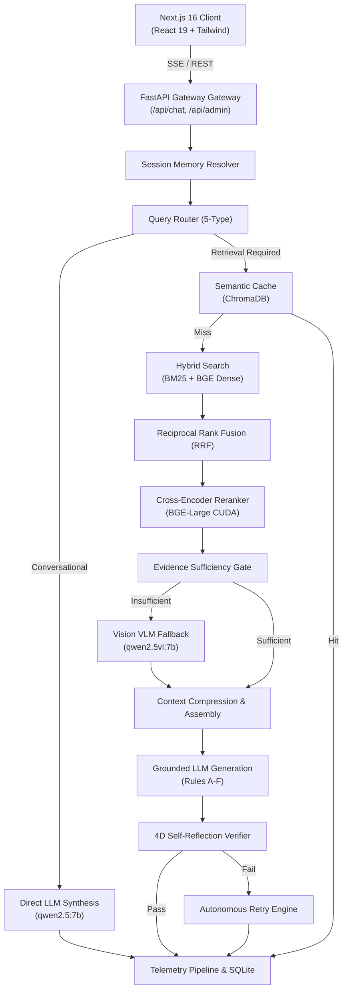

# System Architecture: Enterprise Policy RAG AI Assistant

This document describes the end-to-end architecture of the Enterprise Policy RAG AI Assistant, detailing the data flow, components, and interactions between the frontend, backend, retrieval engines, and LLM processing modules.

## High-Level Architecture

The system is built as a decoupled microservices architecture with a FastAPI backend and a Next.js frontend. It leverages a local Ollama daemon for privacy-first inference and ChromaDB for vector storage.

---

## 1. Frontend Client (Next.js)
The frontend is built with Next.js 16 (Turbopack) and React 19. It presents a liquid glass UI with a slide-over drawer for observability.
- **Thinking UI**: Real-time rendering of the agent's thought process using Server-Sent Events (SSE). It tracks milestones like `thinking -> token -> citation -> complete`.
- **Live Observability**: Includes a full-screen dashboard tracing latency, cache hits, and subsystem health probes.

---

## 2. API Gateway (FastAPI)
The FastAPI backend serves as the orchestration layer.
- Handles requests, generates unique trace IDs, and manages background tasks.
- **Preloading & Warm-up**: On startup, it preloads the dense embedding model, cross-encoder, and Ollama LLM into VRAM to ensure zero cold-start delay (sub-second TTFT).

---

## 3. Conversational Memory & Routing Layer
When a query enters the pipeline:
1. **Conversation Resolver (`ConversationResolver`)**: Uses historical turns to resolve pronouns and contextual referents (e.g., rewriting "How does it work?" to "How does the caching module work?").
2. **Query Router (`QueryRouter`)**: Classifies the query into one of five categories (Factual, Comparison, Enumeration, Procedural, Conversational). If conversational, it skips retrieval and routes to direct synthesis.

---

## 4. Hybrid Retrieval & Reranking Engine
For queries requiring factual grounding:
1. **Semantic Cache Lookup**: Checks for a cache hit via cosine similarity to previous queries in ChromaDB.
2. **Hybrid Search**: Combines Dense Vector Search (`BAAI/bge-small-en-v1.5`) and Sparse Keyword Search (BM25) over document chunks.
3. **Reciprocal Rank Fusion (RRF)**: Merges the sparse and dense results to balance exact keyword matches with semantic intent.
4. **Cross-Encoder Reranking**: Re-scores the fused candidates using `BAAI/bge-reranker-large` on GPU for high precision.

---

## 5. Vision Fallback & Multimodal Processing
The system uses a dual-model architecture.
1. **Evidence Sufficiency Gate**: Evaluates if the top retrieved textual chunks contain the needed facts or code implementations.
2. **Vision Extraction (`VisionService`)**: If visual evidence or code is missing, it intelligently inspects the surrounding PDF pages. It uses `qwen2.5vl:7b` to extract code screenshots, architectural diagrams, and table data, compiling them into visual chunks to supplement the text context.

---

## 6. Grounded LLM Generation
The context is assembled and compressed, then passed to the text model (`qwen2.5:7b`).
- **Grounded Prompting**: Uses rigorous Rules A-F enforcing strict adherence to context.
  - *Rule D*: No False Absence.
  - *Rule F*: Detailed Code Explanations.
- **Server-Sent Events (SSE)**: The response is streamed token-by-token directly to the client.

---

## 7. Self-Reflection & Retry Loop
Before finalizing, a **4D Verifier Gate** (`SelfReflectionVerifier`) evaluates the answer for:
1. Faithfulness to context
2. Completeness
3. Citation coverage
4. Coherence

If the verifier detects unsupported claims or missing details, the **Autonomous Retry Engine** adjust retrieval parameters (e.g., expanding search radius) and executes another cycle automatically.

---

## 8. Telemetry & Observability Database
Every execution step is logged to an asynchronous **Write-Behind Queue**.
- A dedicated background thread flushes traces into a **SQLite WAL (Write-Ahead Logging)** database.
- Captures microsecond-accurate waterfall latency metrics across 16 stages.
- Powers the real-time admin dashboards and `/api/admin/observability` endpoints.
