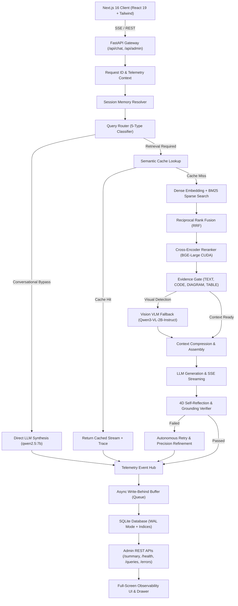

# 🚀 Enterprise Policy RAG AI Assistant & Observability Platform


-7C3AED?logo=ollama)


-brightgreen)

A production-grade **Retrieval-Augmented Generation (RAG)** platform designed to eliminate hallucinations in high-stakes domains (legal, HR, compliance, technical architecture). Built with a decoupled microservices architecture, advanced hybrid retrieval, cross-encoder reranking, **conversational memory**, an **Agentic Intelligence Layer** (query routing, self-reflection & verification, dynamic metadata filtering), **dual-model vision pipeline** (code screenshot extraction, diagram understanding, table OCR via `Qwen3-VL-2B-Instruct`), **end-to-end model fine-tuning & Ollama export**, and a **Full-Screen Production Observability & Telemetry Dashboard** with persistent SQLite storage.

---

## ✨ System Capabilities

### 📊 Production Observability & Telemetry Platform
- **Full-Screen Fluid Dashboard** — Edge-to-edge widescreen dashboard with interactive native fullscreen mode (`document.requestFullscreen()`), responsive multi-column layouts, and a warm paper design aesthetic (`#FAF9F5` light, `#141413` dark, Terracotta, Cream, Sand, and Charcoal).
- **Persistent SQLite Telemetry DB** — Zero-latency async write-behind queue with a dedicated background thread, SQLite WAL mode, and indexed aggregations across `5m`, `15m`, `1h`, `6h`, `24h`, and `7d` time horizons.
- **10-Subsystem Live Health Probes** — Continuous health monitoring across API Gateway, Ollama Daemon, Chroma Vector DB, BM25 Index, Embedding Model, Text Generation Model, Vision VLM, Semantic Cache, Vision Cache, and Session Memory.
- **16-Stage Waterfall Latency Breakdown** — Microsecond-accurate latency accounting from request intake, memory resolution, rewrite, dense/sparse search, RRF fusion, neural reranking, vision extraction, TTFT, to SSE token streaming.
- **Strict Multi-Model Separation** — Clear separation between Text Synthesis (`qwen2.5:7b`) and Vision VLM (`Qwen3-VL-2B-Instruct`) with distinct latency percentiles, throughput counters, and circuit breaker states.
- **Multi-Tier Cache Telemetry** — Independent metrics for Semantic Response Cache, Embedding Cache, Vision Cache, Negative Vision Cache, and Retrieval Candidates Cache.
- **Evidence & Grounding Claims Inspection** — Classification of retrieved evidence into `TEXT`, `CODE`, `DIAGRAM`, and `TABLE`, combined with self-reflection grounding claim verifications (`SUPPORTED`, `UNSUPPORTED`, `INFERRED`).
- **Query Trace Inspection Drawer** — Slide-over drawer visualizer for waterfall timings, extracted visual snippets, citation sources, and raw JSON export.

### 🧠 Conversational Memory & Multi-Turn Reasoning
- **Multi-turn context awareness** — Session-based conversation memory preserving multi-turn context.
- **Pronoun & referent resolution** — Follow-up questions (*"Are there any exceptions for it?"*, *"What does it do?"*) resolve referents from past turns.
- **Context-aware query rewriting** — Dynamic query expansion informed by prior dialogue.

### 🔀 Dynamic Model Switching
- **In-chat model selector** — Switch LLM backends dynamically directly from the UI without service restarts.
- **Thread-safe model proxy** — Concurrent multi-user requests with different target models execute safely.
- **Supported backends**: `qwen2.5:7b`, `qwen2.5:14b`, `llama3.1:8b`, `mistral:7b`, `gemma2:9b`, and custom fine-tuned adapters.

### ⚡ Real-Time Streaming & Semantic Cache
- **Server-Sent Events (SSE)** — Token-by-token streaming response delivery with sub-second Time-To-First-Token (TTFT).
- **Semantic Caching** — Sub-100ms cosine similarity cache lookup in ChromaDB; cache hits stream simulated tokens smoothly for UI consistency.

### 🎯 High-Precision Hybrid Retrieval & Reranking
- **Hybrid Dense + Sparse Search** — Combines dense vector similarity (`BAAI/bge-small-en-v1.5`) with sparse BM25 keyword matching via Reciprocal Rank Fusion (RRF).
- **Cross-Encoder Neural Reranker** — `BAAI/bge-reranker-large` on CUDA GPU re-scores candidates with high precision.
- **Cross-Page Section Expansion** — Expands adjacent pages and sections for complete contextual grounding.

### 🛡️ Agentic Self-Reflection & Grounding
- **5-Type Query Router** — Classifies queries into `factual`, `comparison`, `enumeration`, `procedural`, or `conversational` with conversational bypass semantics (`retrieval_required=False`).
- **4D Verifier Gate** — Evaluates **Faithfulness**, **Completeness**, **Citation Coverage**, and **Coherence**.
- **Autonomous Retry Engine** — Automatically adjusts retrieval parameters and retries (up to 2 cycles) if unverified claims or missing aspects are detected.

### 👁️ Multimodal Vision RAG
- **Dual-Model Architecture** — `qwen2.5:7b` (Text) and `Qwen3-VL-2B-Instruct` (Vision).
- **Visual Asset Detection** — Classifies PDF pages (`CODE_SCREENSHOT`, `DIAGRAM_ARCHITECTURE`, `TABLE_DATA`) and caches OCR/diagram structures with SHA-256 content addressing.
- **Lazy Vision Fallback** — Triggers on-demand extraction for visual pages during query execution when references are detected.

### 🛠️ LoRA Fine-Tuning & Custom Ollama Registration
- **End-to-End Fine-Tuning Pipeline** — Custom LoRA training scripts (`scripts/finetune_qwen_coder.py`, `src/finetuning/trainer.py`) for Alpaca, ShareGPT, and Messages formats.
- **GGUF Export & Quantization** — Automatic conversion to GGUF (`q4_k_m`, `q8_0`, `f16`), `Modelfile` generation, and one-command registration into local Ollama.

---

## 📐 System Architecture



---

## 💻 Tech Stack

| Component | Technology | Purpose |
| :--- | :--- | :--- |
| **Frontend** | Next.js 16 (Turbopack), React 19, Tailwind CSS, Framer Motion | Full-screen liquid glass UI, real-time SSE streaming, slide-over drawer |
| **Backend API** | FastAPI, Uvicorn, Python 3.11, Pydantic v2 | High-throughput asynchronous REST gateway and SSE streaming |
| **Observability DB** | SQLite3 (WAL Mode, write-behind threading) | Zero-latency persistent query traces, metrics bucketing, and error tracking |
| **Vector Store** | ChromaDB | High-speed dense vector similarity index |
| **Embeddings** | `BAAI/bge-small-en-v1.5` | Dense document and query vector representations |
| **Reranker** | `BAAI/bge-reranker-large` (CUDA GPU) | Neural cross-encoder reranking |
| **Text Generation** | Ollama (`qwen2.5:7b` default) | Local, privacy-first grounded response generation |
| **Vision VLM** | Ollama (`Qwen3-VL-2B-Instruct`) | Multimodal diagram, code screenshot, and table understanding |
| **Hardware** | NVIDIA RTX 4050 (CUDA) | Accelerated neural inference, embeddings, and reranking |

---

## 🚀 Quick Start

### Prerequisites

- **Python 3.11+**
- **Node.js 18+** & `npm`
- **Ollama** installed and running ([ollama.com](https://ollama.com))
- **NVIDIA GPU** with CUDA (optional, falls back gracefully to CPU)

### 1. Pull Required Models

```bash
ollama pull qwen2.5:7b
ollama pull Qwen3-VL-2B-Instruct
ollama pull nomic-embed-text

# Optional alternative models
ollama pull llama3.1:8b
ollama pull mistral:7b
ollama pull gemma2:9b
```

### 2. Backend Setup

```bash
cd company_policy_rag

# Create virtual environment
python -m venv .venv

# Activate environment
# Windows:
.venv\Scripts\Activate.ps1
# Linux/macOS:
source .venv/bin/activate

# Install dependencies
pip install -r requirements.txt
```

### 3. Frontend Setup

```bash
cd frontend
npm install
```

### 4. Configuration

Configure your environment settings in `.env`:

```env
OLLAMA_BASE_URL=http://localhost:11434
OLLAMA_LLM_MODEL=qwen2.5:7b
VISION_MODEL=Qwen3-VL-2B-Instruct
VISION_ENABLED=true
RERANKER_DEVICE=cuda
TELEMETRY_DB_PATH=storage/telemetry.sqlite3
```

### 5. Run the Application

Open **two terminals**:

**Terminal 1 — Backend:**
```bash
cd company_policy_rag
.venv\Scripts\Activate.ps1
uvicorn backend.api.main:app --host 127.0.0.1 --port 8000 --reload
```

**Terminal 2 — Frontend:**
```bash
cd company_policy_rag/frontend
npm run dev
```

Visit `http://localhost:3000` in your browser.

---

## 📡 Observability API Endpoints

| Method | Endpoint | Description |
| :--- | :--- | :--- |
| `GET` | `/api/health` | Subsystem health probe and system ready status |
| `GET` | `/api/admin/observability/summary` | Full canonical observability summary with percentiles and metrics |
| `GET` | `/api/admin/observability/health` | Detailed 10-subsystem live probe status report |
| `GET` | `/api/admin/observability/queries` | Filtered list of query traces with latency and token metrics |
| `GET` | `/api/admin/observability/queries/{id}` | Detailed trace inspection by trace ID or request ID |
| `GET` | `/api/admin/observability/errors` | Incident and error logging center |
| `POST` | `/api/admin/observability/clear` | Purge persistent telemetry logs and traces |

---

## 🧪 Test Verification & Quality Gates

The platform includes comprehensive end-to-end, boundary, adversarial, and unit test suites:

### 1. Frontend Test Suite (`npm test`)
```text
================================================================================
  TEST EXECUTION SUMMARY
================================================================================
  Total Suites:   6 (Tiers 1-4, Adversarial Challenger 1 & 2)
  Total Tests:    192
  Passed:         192
  Failed:         0
  Success Rate:   100.0%
================================================================================
✅ ALL TESTS PASSED (100% Pass Rate)
```

### 2. Next.js Production Build
```text
▲ Next.js 16.3.0 (Turbopack)
✓ Compiled successfully in 1304ms
  Running TypeScript ... Finished TypeScript in 2.1s
✓ Generating static pages (5/5) in 708ms
```

### 3. Backend Pytest Suite
```bash
pytest tests/test_production_observability_full.py -v
# 5/5 PASSED (100%)
```

---

## 📄 License

This project is licensed under the Apache License 2.0.