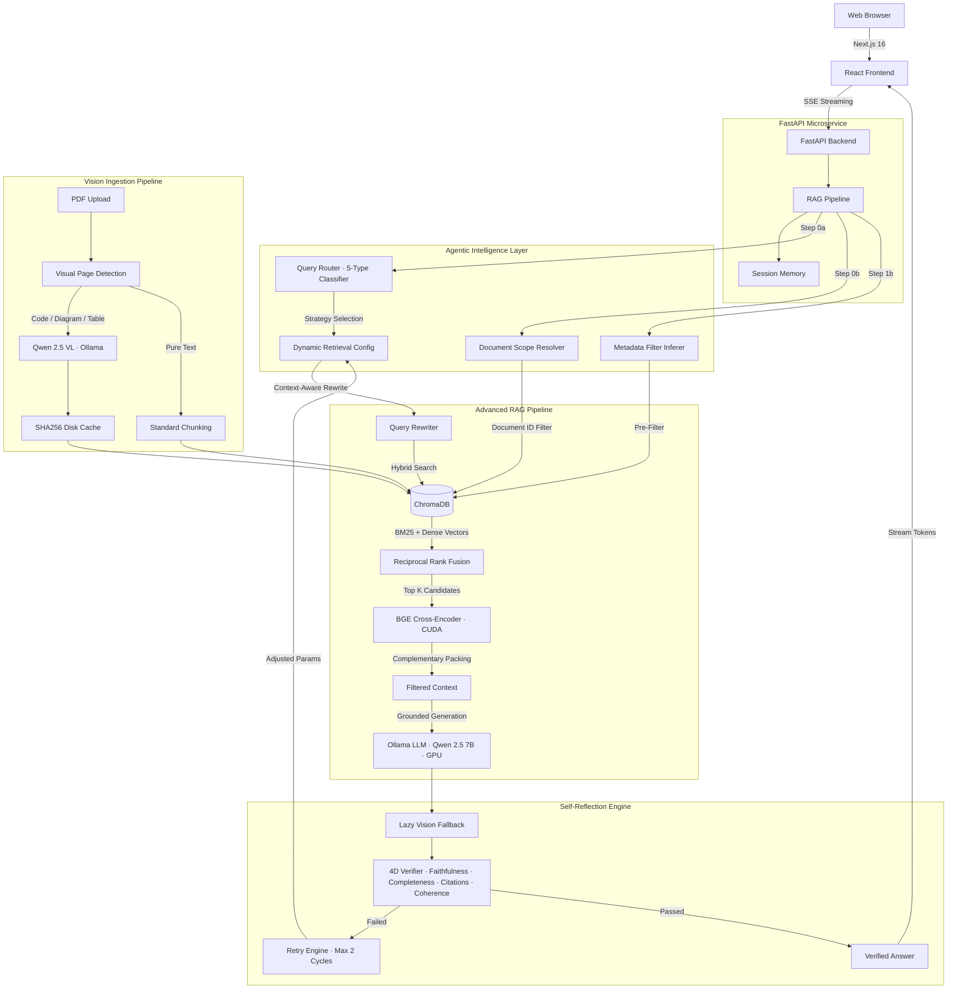

# 🚀 Enterprise Policy RAG AI Assistant


-7C3AED?logo=ollama)


A production-grade **Retrieval-Augmented Generation (RAG)** AI assistant designed to eliminate hallucinations in high-stakes domains (legal, HR, compliance). Built with a decoupled microservices architecture, advanced hybrid retrieval, cross-encoder reranking, **conversational memory**, an **Agentic Intelligence Layer** (query routing, self-reflection & verification, dynamic metadata filtering), **document-aware retrieval** with cross-document isolation, a **dual-model vision pipeline** (code screenshot extraction, diagram understanding, table OCR via Qwen 2.5 VL), and a real-time streaming UI with **live model switching**.

---

## ✨ Features

### 🧠 Conversational Memory
- **Multi-turn context awareness** — the AI assistant remembers previous messages within the same session.
- **Pronoun resolution** — follow-up questions like *"Are there any exceptions for it?"* are automatically resolved using conversation history.
- **Context-aware query rewriting** — the AI Query Rewriter uses past conversation turns to generate better search queries, improving retrieval accuracy.

### 🔀 Live Model Switching
- **In-chat model dropdown** — switch between LLM models directly from the chat UI without restarting.
- **Thread-safe model proxy** — concurrent requests with different models are handled safely.
- **Supported models**: `qwen2.5:7b`, `qwen2.5:14b`, `llama3.1:8b`, `mistral:7b`, `gemma2:9b` (any Ollama model can be added).

### ⚡ Real-Time Streaming
- **Server-Sent Events (SSE)** — tokens stream to the browser in real-time as the LLM generates them.
- **Sub-second TTFT** — optimized pipeline delivers Time-To-First-Token under 1 second on cached queries.
- **Live retrieval telemetry** — the UI shows retrieval stage timings, reranking scores, and citation sources in real-time.

### 🧠 Semantic Caching
- **Instant Answers** — semantically similar queries bypass the LLM and retrieval pipeline.
- **Cost & Latency Reduction** — sub-100ms response times for cached hits using ChromaDB cosine similarity.
- **Simulated SSE Streaming** — cache hits are streamed back smoothly to maintain UI consistency.

### 🎯 High-Precision Retrieval
- **Hybrid Search (Dense + Sparse)** — combines dense vector similarity (`BAAI/bge-small-en-v1.5`) with sparse BM25 keyword matching via Reciprocal Rank Fusion (RRF).
- **Cross-Encoder Reranking** — `BAAI/bge-reranker-large` running on **CUDA GPU** re-scores candidates for maximum precision.
- **Parent Context Expansion** — expands retrieved chunks to include surrounding context for more complete answers.

### 🛡️ Hallucination Mitigation
- **Strict Grounding Enforcement** — the LLM is forced to abstain rather than guess when sources don't contain the answer.
- **Deterministic Citations** — every claim is bound to exact `[Source N]` references from retrieved document chunks.
- **Faithfulness Evaluation** — automated LLM-as-a-judge evaluation validates output fidelity.

### 📄 Document Management
- **Multi-format upload** — supports PDF, DOCX, TXT, MD, HTML, CSV, JSON (up to 100MB).
- **Adaptive chunking** — intelligent section-aware chunking preserves document structure.
- **Live document stats** — the UI shows total documents, chunks, file sizes, and indexing status.

### 🧭 Agentic Intelligence Layer

#### Query Router & Strategy Selector
- **5-type intent classification** — automatically classifies every query as `factual`, `comparison`, `enumeration`, `procedural`, or `conversational` using regex-based heuristics with sub-millisecond latency.
- **Dynamic retrieval tuning** — each query type triggers a different retrieval strategy with tuned parameters (`dense_top_k`, `bm25_top_k`, `rerank_top_n`, `min_score_ratio`, `multi_query`, `parent_expansion`, `temperature`).
- **Conversational bypass** — greetings and pleasantries skip the vector database entirely for instant responses.
- **Trace telemetry** — classification decision, confidence score, and selected strategy appear in SSE `trace` events and the observability dashboard.

#### Self-Reflection & Answer Verification Engine
- **4-dimensional evaluation** — every generated answer is scored on **Faithfulness** (grounding to source chunks), **Completeness** (coverage of query aspects), **Citation Coverage** (presence and validity of `[Source N]` tags), and **Coherence** (structural quality).
- **Composite scoring** — weighted composite: `0.35 × Faithfulness + 0.30 × Completeness + 0.20 × Citation + 0.15 × Coherence`, with per-dimension pass gates.
- **Autonomous retry engine** — when verification fails, the system automatically retries with adjusted retrieval parameters (broader top-k, tighter min-score-ratio, enabled multi-query) for up to **2 retry cycles** with a hard cap and graceful fallback.
- **Dimension-specific fixes** — faithfulness failures tighten grounding; completeness failures broaden search; citation failures force explicit sourcing; coherence failures restructure output.
- **Full observability** — verification scores, retry attempts, and adjustment reasons are logged in traces and SSE events.

#### Dynamic Metadata Extraction & Filtering
- **Ingestion-time metadata extraction** — automatically extracts department/category (HR, IT, Legal, Finance, etc.), effective dates (normalized to ISO 8601), policy identifiers, key entities (roles, dollar amounts, time periods), and topic tags from document content.
- **ChromaDB metadata indexing** — extracted metadata is flattened and stored alongside chunk embeddings for pre-retrieval filtering.
- **Query-time filter inference** — the `QueryMetadataInferer` detects departments, policy IDs, topics, and categories from natural language queries with intelligent disambiguation (e.g., English pronoun "it" vs. IT department).
- **Multi-turn context inheritance** — follow-up questions inherit department context from conversation history.
- **Filter relaxation fallback** — if filtered retrieval returns zero candidates, filters are automatically dropped and search retries unfiltered to prevent empty responses.
- **Configurable** — all metadata features are togglable via environment variables (`ENABLE_METADATA_EXTRACTION`, `ENABLE_QUERY_METADATA_FILTERING`, `ENABLE_FILTER_FALLBACK_RELAXATION`).

### 📌 Document-Aware Retrieval
- **Cross-document isolation** — when a user asks about *"this document"*, *"the uploaded file"*, or *"this PDF"*, retrieval is scoped strictly to that document. No cross-document bleed.
- **Automatic scope detection** — regex-based heuristics detect document-scoped references (`this document`, `the doc`, `the uploaded file`, `page 5`, etc.) and apply `document_id` filters to both ChromaDB and BM25 queries.
- **Active document tracking** — the frontend passes `active_document_id` and `active_document_name` to every query, enabling precise document targeting.
- **Graceful fallback** — if document-scoped retrieval returns zero results, the system falls back to global search rather than returning an empty answer.

### 👁️ Vision Model & Document Understanding
- **Dual-model architecture** — `qwen2.5:7b` handles text generation while `qwen2.5vl:7b` handles visual document understanding (code screenshots, diagrams, tables). Vision processing runs **only during ingestion**, keeping the query path at zero extra latency.
- **Visual page detection heuristics** — automatically classifies PDF pages as `CODE_SCREENSHOT`, `DIAGRAM_ARCHITECTURE`, `TABLE_DATA`, or `NONE` (pure text, skipped). Small icons (<120×80px) are filtered out.
- **Specialized OCR prompts** — code extraction preserves indentation, function names, classes, imports, and parameters verbatim. Diagram extraction captures component relationships and data flows.
- **SHA256 content-addressed cache** — visual extractions are cached to `storage/vision_cache/` keyed by `(document_id, page_number, SHA256(image_bytes), vision_model)`. Re-ingesting unchanged documents reuses cached results in <1ms.
- **Complementary chunk packing** — for procedural queries (*"How can I make X Analyst Agent?"*), the context compressor ensures a balanced mix of description, implementation code, task code, and diagrams — preventing redundant prose from crowding out code.
- **Query-time lazy visual fallback** — if a document was previously ingested without vision and retrieved text contains cues (*"Here's how it's done"*, *"See code below"*), only that specific page is lazily extracted, cached, and injected into context.
- **Model management** — configurable via environment variables (`VISION_MODEL`, `VISION_ENABLED`). If the vision model is missing locally, the system reports `ollama pull qwen2.5vl:7b` without auto-downloading. VRAM is reused via `keep_alive: 15m` during batch ingestion.

---

## 📐 System Architecture



---

## 💻 Tech Stack

| Component | Technology | Purpose |
|-----------|------------|---------|
| **Frontend** | Next.js 16, React 19, Tailwind CSS, Framer Motion | SSR, liquid glass UI, real-time streaming |
| **Backend API** | FastAPI, Uvicorn, Python 3.11 | Async-first API with Pydantic validation |
| **RAG Core** | LlamaIndex, PyTorch | Modular retrievers, rerankers, and generators |
| **Vector Store** | ChromaDB | Persistent, fast vector similarity search |
| **Embeddings** | `BAAI/bge-small-en-v1.5` | Dense vector embeddings |
| **Reranker** | `BAAI/bge-reranker-large` | Cross-encoder reranking on CUDA GPU |
| **LLM** | Ollama (local) — `qwen2.5:7b` default | Privacy-first, configurable, multi-model |
| **Vision LLM** | Ollama (local) — `qwen2.5vl:7b` | Code screenshot OCR, diagram & table extraction |
| **GPU** | NVIDIA RTX 4050 (CUDA) | Accelerated reranking and embeddings |

---

## 🚀 Getting Started

### Prerequisites

- **Python 3.11+** with a virtual environment
- **Node.js 18+** and npm
- **Ollama** installed and running ([ollama.com](https://ollama.com))
- **NVIDIA GPU** with CUDA (optional, falls back to CPU)

### 1. Pull the Required Models

```bash
ollama pull qwen2.5:7b
ollama pull nomic-embed-text

# Vision model — for code screenshot, diagram & table extraction from PDFs
ollama pull qwen2.5vl:7b

# Optional — for model switching
ollama pull llama3.1:8b
ollama pull mistral:7b
ollama pull gemma2:9b
```

### 2. Setup Backend

```bash
cd company_policy_rag

# Create virtual environment
python -m venv .venv

# Activate it
# Windows:
.venv\Scripts\Activate.ps1
# macOS/Linux:
source .venv/bin/activate

# Install dependencies
pip install -r requirements.txt
```

### 3. Setup Frontend

```bash
cd frontend
npm install
```

### 4. Configure Environment

Edit the `.env` file in the project root to match your setup:

```env
OLLAMA_BASE_URL=http://localhost:11434
OLLAMA_LLM_MODEL=qwen2.5:7b
VISION_MODEL=qwen2.5vl:7b       # Vision model for document understanding
VISION_ENABLED=true              # Set to false to disable vision processing
RERANKER_DEVICE=cuda             # Use 'cpu' if no NVIDIA GPU
```

### 5. Run the Application

Open **two terminals**:

**Terminal 1 — Backend:**
```bash
cd company_policy_rag
.venv\Scripts\Activate.ps1
uvicorn backend.api.main:app --host 127.0.0.1 --port 8000 --reload
```

**Terminal 2 — Frontend:**
```bash
cd company_policy_rag/frontend
npm run dev
```

### 6. Run the Test Suite (Optional)
To verify the system's integrity, including the dynamic model switching and concurrency handling, you can run the comprehensive automated test suite (497 tests).

```bash
cd company_policy_rag
.venv\Scripts\Activate.ps1
pytest -v
```

### 7. Access the App

| Service | URL |
|---------|-----|
| **Chat UI** | [http://localhost:3000](http://localhost:3000) |
| **API Docs (Swagger)** | [http://localhost:8000/docs](http://localhost:8000/docs) |
| **Health Check** | [http://localhost:8000/api/health](http://localhost:8000/api/health) |

---

## 🗂️ Project Structure

```
company_policy_rag/
├── backend/
│   ├── api/
│   │   ├── main.py              # FastAPI app entry point
│   │   ├── dependencies.py      # Dependency injection factory
│   │   └── routes/              # API route handlers
│   ├── embeddings/              # Embedding service & vector store
│   ├── ingestion/
│   │   ├── chunkers/            # Adaptive chunking strategies
│   │   ├── loaders/             # Multi-format document loaders (PDF with vision integration)
│   │   └── metadata_extractor.py # Ingestion metadata extraction
│   ├── models/                  # Pydantic data models (QueryClassification, VerificationReport, RAGTrace)
│   ├── rag/
│   │   ├── pipeline.py          # Master RAG pipeline orchestrator (with document-aware scope & lazy vision fallback)
│   │   ├── query_router.py      # 5-type query classifier & strategy selector
│   │   ├── filter_extractor.py  # Query-time metadata filter inferer
│   │   ├── verifier.py          # 4-dimensional self-reflection verifier
│   │   ├── retry_engine.py      # Autonomous retry & parameter adjustment engine
│   │   ├── query_rewrite.py     # Context-aware query rewriter
│   │   ├── citations.py         # Citation extraction engine
│   │   ├── semantic_cache.py    # Semantic caching manager
│   │   └── context_compression.py # 🆕 Complementary chunk packing (code + prose + table balancing)
│   ├── retrieval/
│   │   ├── hybrid.py            # Hybrid dense + BM25 retriever
│   │   ├── reranker.py          # Cross-encoder reranker (CUDA)
│   │   ├── vector.py            # Dense vector retriever
│   │   └── bm25.py              # BM25 sparse retriever
│   ├── services/
│   │   ├── chat_service.py      # Chat orchestration + session memory
│   │   ├── document_service.py  # Document ingestion & management
│   │   └── telemetry_service.py # Observability & trace recording
│   └── vision/                  # 🆕 Vision Model Subsystem
│       ├── __init__.py          # Package exports
│       ├── vision_service.py    # Visual page detection, OCR prompts, Ollama VLM integration
│       └── vision_cache.py      # SHA256 content-addressed disk cache
├── frontend/
│   ├── app/                     # Next.js App Router pages
│   ├── components/
│   │   ├── ChatWindow.tsx       # Chat UI with model switcher
│   │   ├── ChatMessage.tsx      # Message bubbles with citations
│   │   ├── DocumentsView.tsx    # Document management panel
│   │   ├── AdminView.tsx        # Observability dashboard
│   │   ├── SessionSidebar.tsx   # Chat session management
│   │   └── CitationDrawer.tsx   # Source citation viewer
│   ├── hooks/                   # Custom React hooks
│   └── lib/                     # API client, types, utilities
├── storage/
│   ├── chroma/                  # ChromaDB vector store persistence
│   └── vision_cache/            # 🆕 Cached vision extractions (JSON per page)
├── tests/
│   ├── test_vision_model_support.py      # 🆕 Vision subsystem tests (10 tests)
│   ├── test_document_aware_retrieval.py  # 🆕 Document-aware retrieval tests (11 tests)
│   ├── unit/                    # Unit tests (chunkers, verifier, retry engine, etc.)
│   └── e2e/                     # End-to-end agentic layer tests (Tiers 1-4)
├── .env                         # Environment configuration
└── requirements.txt             # Python dependencies
```

---

## 🧪 Usage Examples

### Basic Chat
Ask any question about your uploaded company documents:
> *"What is the policy for remote work?"*

### Follow-up with Memory
The AI assistant remembers context within the same session:
> *"Are there any exceptions for it?"*
> → Automatically resolves "it" to "remote work" from the previous message.

### Switch Models Mid-Chat
Click the **model dropdown** (CPU icon) in the chat top bar to switch between:
- Qwen 2.5 7B (fast & balanced)
- Qwen 2.5 14B (higher quality)
- Llama 3.1 8B (Meta open model)
- Mistral 7B (efficient reasoning)
- Gemma 2 9B (Google compact)

### Upload Documents
Navigate to the **Documents** tab and drag & drop PDF, DOCX, TXT, MD, CSV, JSON, or HTML files. They are automatically chunked, embedded, and indexed. PDFs with code screenshots, architecture diagrams, or data tables are processed by the vision model during ingestion.

### Document-Scoped Queries
When viewing a specific document, ask questions scoped to it:
> *"What are the top projects in this document?"*
> *"Summarize page 3 of this PDF."*
> → Retrieval is automatically scoped to that document only. No cross-document bleed.

### Vision-Enhanced Code Extraction
Upload a PDF that contains code screenshots or architecture diagrams:
> *"How can I make X Analyst Agent?"*
> → The system retrieves both the text description **and** the implementation code extracted from the screenshot image, combining them into a complete answer.

---

## ⚙️ Environment Variables

Key configuration options in `.env`:

| Variable | Default | Description |
|----------|---------|-------------|
| `OLLAMA_LLM_MODEL` | `qwen2.5:7b` | Default LLM model |
| `OLLAMA_BASE_URL` | `http://localhost:11434` | Ollama server URL |
| `RERANKER_DEVICE` | `cuda` | Reranker device (`cuda` or `cpu`) |
| `RERANKER_MODEL` | `BAAI/bge-reranker-large` | Cross-encoder model |
| `LLM_TEMPERATURE` | `0.1` | Generation temperature |
| `LLM_REQUEST_TIMEOUT` | `60.0` | LLM request timeout (seconds) |
| `ENABLE_QUERY_REWRITE` | `true` | Enable LLM-based query rewriting |
| `ENABLE_RERANKER` | `true` | Enable cross-encoder reranking |
| `GROUNDING_STRICTNESS` | `balanced` | `balanced` or `strict` |
| `ENABLE_QUERY_ROUTING` | `true` | 🆕 Enable agentic query classification & strategy selection |
| `ENABLE_ANSWER_VERIFICATION` | `true` | 🆕 Enable self-reflection verification after generation |
| `VERIFICATION_MAX_RETRIES` | `2` | 🆕 Max retry cycles when verification fails |
| `VERIFICATION_FAITHFULNESS_THRESHOLD` | `0.75` | 🆕 Minimum faithfulness score to pass |
| `VERIFICATION_COMPOSITE_THRESHOLD` | `0.70` | 🆕 Minimum composite verification score |
| `QUERY_ROUTER_CONFIDENCE_THRESHOLD` | `0.70` | 🆕 Minimum confidence for query classification |
| `ENABLE_CONVERSATIONAL_BYPASS` | `true` | 🆕 Skip retrieval for greetings/pleasantries |
| `ENABLE_METADATA_EXTRACTION` | `true` | 🆕 Extract metadata during document ingestion |
| `ENABLE_QUERY_METADATA_FILTERING` | `true` | 🆕 Infer metadata filters from queries |
| `ENABLE_FILTER_FALLBACK_RELAXATION` | `true` | 🆕 Drop filters and retry if zero results |
| `VISION_MODEL` | `qwen2.5vl:7b` | 🆕 Ollama vision model for document understanding |
| `VISION_ENABLED` | `true` | 🆕 Enable/disable vision processing during ingestion |
| `VISION_DPI` | `150` | 🆕 DPI for rendering PDF pages to images |
| `VISION_REQUEST_TIMEOUT` | `90.0` | 🆕 Timeout (seconds) for vision model API calls |
| `ENABLE_LAZY_VISION_FALLBACK` | `true` | 🆕 Enable query-time lazy visual extraction |

---

## 📊 Evaluation & Benchmarks

### Golden Dataset Evaluation

Evaluated on a curated **95-question golden dataset** (60 policy + 35 AI guidebook) across 8 query categories, using an automated **LLM-as-judge** pipeline (`src/evaluation.py`) with local Ollama models.

#### Aggregate Metrics (60-case full run, Qwen 2.5 7B)

| Metric | Score | Quality Gate |
|--------|-------|-------------|
| **Hit Rate** | 0.717 | ≥ 0.75 |
| **Context Precision** | 0.538 | ≥ 0.50 ✅ |
| **Context Recall** | 0.675 | ≥ 0.55 ✅ |
| **Faithfulness** (LLM Judge) | 0.733 | ≥ 0.70 ✅ |
| **Answer Relevancy** (LLM Judge) | 0.610 | ≥ 0.60 ✅ |

#### Per-Corpus Breakdown

| Corpus | Hit Rate | Ctx Precision | Ctx Recall | Faithfulness | Relevancy |
|--------|----------|---------------|------------|--------------|-----------|
| **Policy Handbook** | 0.720 | 0.537 | 0.687 | 0.780 | 0.716 |
| **AI Guidebook** | 0.714 | 0.538 | 0.667 | 0.700 | 0.534 |

#### Per-Query-Type Breakdown

| Query Type | Hit Rate | Faithfulness | Relevancy |
|------------|----------|--------------|-----------|
| `factual` (28 cases) | 0.571 | 0.782 | 0.621 |
| `policy_interpretation` (6) | 1.000 | 0.717 | 0.750 |
| `edge_case` (5) | 0.400 | 0.860 | 0.640 |
| `enumeration` (5) | 0.800 | 0.800 | 0.460 |
| `code` (4) | 1.000 | 0.375 | 0.600 |
| `pattern` (6) | 0.833 | 0.667 | 0.567 |
| `workflow` (6) | 1.000 | 0.667 | 0.567 |

> **Note**: Edge-case queries intentionally test abstention behavior — low hit rate is expected when the corpus genuinely lacks the topic. High faithfulness (0.860) confirms the system correctly refuses to hallucinate.

### Human Evaluation & Judge Agreement

5-case human evaluation scored by project author against rubric (`HUMAN_EVAL_RUBRIC.md`):

| Metric | Human Score | LLM Judge Score | Agreement |
|--------|-------------|-----------------|-----------|
| **Faithfulness** | 0.85 | — | Pearson r = **0.95**, MAE = 0.05, within-0.1 agreement = 80% |
| **Answer Relevancy** | 0.75 | — | Pearson r = **0.82**, MAE = 0.17, within-0.1 agreement = 60% |

Cohen's Kappa (faithfulness, threshold 0.5): **1.0** — perfect binary agreement between human and LLM judge.

### Self-Reflection Verification Thresholds

The agentic verification engine enforces per-dimension quality gates:

| Dimension | Weight | Pass Threshold |
|-----------|--------|---------------|
| **Faithfulness** | 0.35 | ≥ 0.75 |
| **Completeness** | 0.30 | ≥ 0.70 |
| **Citation Coverage** | 0.20 | ≥ 0.60 |
| **Coherence** | 0.15 | ≥ 0.70 |
| **Composite** | — | ≥ 0.70 |

Failed answers trigger up to **2 autonomous retry cycles** with parameter adjustments before graceful fallback.

### Latency Benchmarks (RTX 4050 · CUDA · Qwen 2.5 7B)

| Pipeline Stage | Mean (ms) | P50 (ms) | P95 (ms) |
|----------------|-----------|----------|----------|
| Query Rewrite | 1,129 | 1,063 | 1,337 |
| ChromaDB Retrieval | 55 | 49 | 75 |
| Cross-Encoder Reranking | 28,553 | 28,466 | 29,688 |
| LLM Generation | 16,392 | 20,183 | 25,509 |
| Faithfulness Guard | 839 | 859 | 1,088 |
| **End-to-End** | **48,984** | **53,543** | **58,769** |

> **Cache Hit Latency**: Sub-100ms for semantically cached queries via ChromaDB cosine similarity.

### Test Suite

| Category | Tests | Coverage |
|----------|-------|----------|
| **Unit Tests** | 527 | Query router, verifier, retry engine, chunkers, reranker, citations |
| **E2E Tests** | 117 | Agentic layer tiers 1–4 (features, boundaries, cross-feature, real-world scenarios) |
| **Integration Tests** | 10 | Full pipeline integration with LLM and vector store |
| **Total** | **654** | Across **73 test files** |

Additional quality signals:
- **Dynamic Model Switching**: Zero-downtime model swaps via debounced queue and Reader-Writer locks. 50+ rapid UI clicks drain seamlessly without VRAM exhaustion.
- **Adversarial Resilience**: Path Traversal (LFI) defense on uploads, strict payload bounds, graceful SSE `cancel_token` handling.

---

## 📈 Roadmap

- [x] Hybrid Dense + BM25 retrieval with RRF
- [x] Cross-Encoder reranking on CUDA GPU
- [x] Real-time SSE token streaming
- [x] Conversational memory with pronoun resolution
- [x] Live model switching from chat UI
- [x] Multi-format document upload & management
- [x] Observability dashboard with trace telemetry
- [x] Semantic caching (vector-based cache for similar queries)
- [x] 🆕 Query Router & Strategy Selector (5-type intent classification)
- [x] 🆕 Self-Reflection & Answer Verification (4D scoring + autonomous retry)
- [x] 🆕 Dynamic Metadata Extraction & Filtering (ingestion tagging + query-time inference)
- [x] 🆕 Filter Relaxation Fallback (zero-result recovery)
- [x] 🆕 Frontend Agentic Visual Indicators (routing badges, verification pills, 4D progress bars, filter tags, cache badges)
- [x] 🆕 Document-Aware Retrieval (cross-document isolation, active document scoping, graceful fallback)
- [x] 🆕 Dual-Model Vision Pipeline (Qwen 2.5 VL — code screenshot OCR, diagram understanding, table extraction)
- [x] 🆕 Vision Ingestion Cache (SHA256 content-addressed disk cache, zero reprocessing on re-ingestion)
- [x] 🆕 Complementary Chunk Packing (balanced code + prose + table context for procedural queries)
- [x] 🆕 Query-Time Lazy Vision Fallback (on-demand page extraction when visual cues detected)
- [ ] Graph RAG integration (Neo4j for entity relationships)
- [ ] Multi-user authentication & role-based access
- [ ] Kubernetes Helm charts for cloud deployment

---

## 📝 License

This project is for educational and portfolio demonstration purposes.

---

**Built with ❤️ using FastAPI, Next.js, Ollama, and ChromaDB**