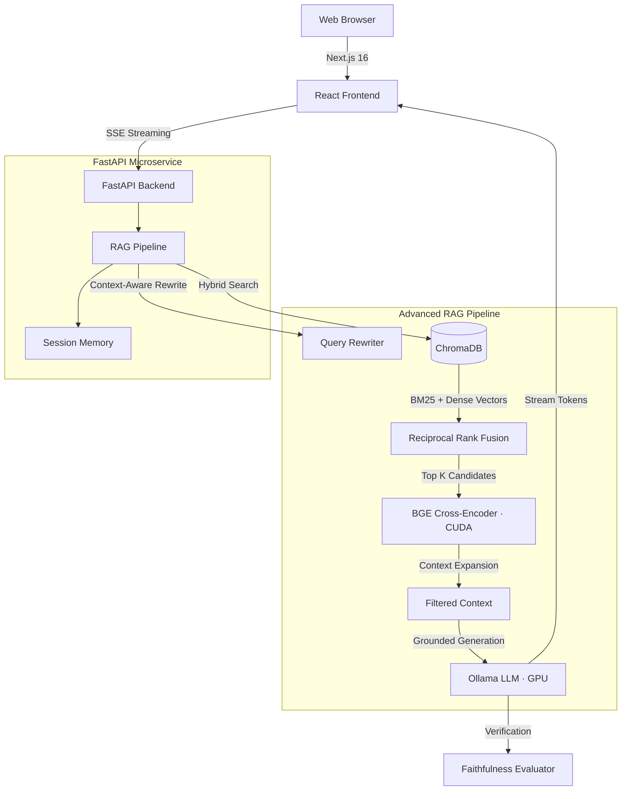

# 🚀 Enterprise Policy RAG AI Assistant


-7C3AED?logo=ollama)


A production-grade **Retrieval-Augmented Generation (RAG)** AI assistant designed to eliminate hallucinations in high-stakes domains (legal, HR, compliance). Built with a decoupled microservices architecture, advanced hybrid retrieval, cross-encoder reranking, **conversational memory**, and a real-time streaming UI with **live model switching**.

---

## ✨ Features

### 🧠 Conversational Memory
- **Multi-turn context awareness** — the AI assistant remembers previous messages within the same session.
- **Pronoun resolution** — follow-up questions like *"Are there any exceptions for it?"* are automatically resolved using conversation history.
- **Context-aware query rewriting** — the AI Query Rewriter uses past conversation turns to generate better search queries, improving retrieval accuracy.

### 🔀 Live Model Switching
- **In-chat model dropdown** — switch between LLM models directly from the chat UI without restarting.
- **Thread-safe model proxy** — concurrent requests with different models are handled safely.
- **Supported models**: `qwen2.5:7b`, `qwen2.5:14b`, `llama3.1:8b`, `mistral:7b`, `gemma2:9b` (any Ollama model can be added).

### ⚡ Real-Time Streaming
- **Server-Sent Events (SSE)** — tokens stream to the browser in real-time as the LLM generates them.
- **Sub-second TTFT** — optimized pipeline delivers Time-To-First-Token under 1 second on cached queries.
- **Live retrieval telemetry** — the UI shows retrieval stage timings, reranking scores, and citation sources in real-time.

### 🧠 Semantic Caching
- **Instant Answers** — semantically similar queries bypass the LLM and retrieval pipeline.
- **Cost & Latency Reduction** — sub-100ms response times for cached hits using ChromaDB cosine similarity.
- **Simulated SSE Streaming** — cache hits are streamed back smoothly to maintain UI consistency.

### 🎯 High-Precision Retrieval
- **Hybrid Search (Dense + Sparse)** — combines dense vector similarity (`BAAI/bge-small-en-v1.5`) with sparse BM25 keyword matching via Reciprocal Rank Fusion (RRF).
- **Cross-Encoder Reranking** — `BAAI/bge-reranker-large` running on **CUDA GPU** re-scores candidates for maximum precision.
- **Parent Context Expansion** — expands retrieved chunks to include surrounding context for more complete answers.

### 🛡️ Hallucination Mitigation
- **Strict Grounding Enforcement** — the LLM is forced to abstain rather than guess when sources don't contain the answer.
- **Deterministic Citations** — every claim is bound to exact `[Source N]` references from retrieved document chunks.
- **Faithfulness Evaluation** — automated LLM-as-a-judge evaluation validates output fidelity.

### 📄 Document Management
- **Multi-format upload** — supports PDF, DOCX, TXT, MD, HTML, CSV, JSON (up to 100MB).
- **Adaptive chunking** — intelligent section-aware chunking preserves document structure.
- **Live document stats** — the UI shows total documents, chunks, file sizes, and indexing status.

---

## 📐 System Architecture



---

## 💻 Tech Stack

| Component | Technology | Purpose |
|-----------|------------|---------|
| **Frontend** | Next.js 16, React 19, Tailwind CSS, Framer Motion | SSR, liquid glass UI, real-time streaming |
| **Backend API** | FastAPI, Uvicorn, Python 3.11 | Async-first API with Pydantic validation |
| **RAG Core** | LlamaIndex, PyTorch | Modular retrievers, rerankers, and generators |
| **Vector Store** | ChromaDB | Persistent, fast vector similarity search |
| **Embeddings** | `BAAI/bge-small-en-v1.5` | Dense vector embeddings |
| **Reranker** | `BAAI/bge-reranker-large` | Cross-encoder reranking on CUDA GPU |
| **LLM** | Ollama (local) — `qwen2.5:7b` default | Privacy-first, configurable, multi-model |
| **GPU** | NVIDIA RTX 4050 (CUDA) | Accelerated reranking and embeddings |

---

## 🚀 Getting Started

### Prerequisites

- **Python 3.11+** with a virtual environment
- **Node.js 18+** and npm
- **Ollama** installed and running ([ollama.com](https://ollama.com))
- **NVIDIA GPU** with CUDA (optional, falls back to CPU)

### 1. Pull the Required Models

```bash
ollama pull qwen2.5:7b
ollama pull nomic-embed-text

# Optional — for model switching
ollama pull llama3.1:8b
ollama pull mistral:7b
ollama pull gemma2:9b
```

### 2. Setup Backend

```bash
cd company_policy_rag

# Create virtual environment
python -m venv .venv

# Activate it
# Windows:
.venv\Scripts\Activate.ps1
# macOS/Linux:
source .venv/bin/activate

# Install dependencies
pip install -r requirements.txt
```

### 3. Setup Frontend

```bash
cd frontend
npm install
```

### 4. Configure Environment

Edit the `.env` file in the project root to match your setup:

```env
OLLAMA_BASE_URL=http://localhost:11434
OLLAMA_LLM_MODEL=qwen2.5:7b
RERANKER_DEVICE=cuda    # Use 'cpu' if no NVIDIA GPU
```

### 5. Run the Application

Open **two terminals**:

**Terminal 1 — Backend:**
```bash
cd company_policy_rag
.venv\Scripts\Activate.ps1
uvicorn backend.api.main:app --host 127.0.0.1 --port 8000 --reload
```

**Terminal 2 — Frontend:**
```bash
cd company_policy_rag/frontend
npm run dev
```

### 6. Access the App

| Service | URL |
|---------|-----|
| **Chat UI** | [http://localhost:3000](http://localhost:3000) |
| **API Docs (Swagger)** | [http://localhost:8000/docs](http://localhost:8000/docs) |
| **Health Check** | [http://localhost:8000/api/health](http://localhost:8000/api/health) |

---

## 🗂️ Project Structure

```
company_policy_rag/
├── backend/
│   ├── api/
│   │   ├── main.py              # FastAPI app entry point
│   │   ├── dependencies.py      # Dependency injection factory
│   │   └── routes/              # API route handlers
│   ├── embeddings/              # Embedding service & vector store
│   ├── models/                  # Pydantic data models
│   ├── rag/
│   │   ├── pipeline.py          # Master RAG pipeline orchestrator
│   │   ├── query_rewrite.py     # Context-aware query rewriter
│   │   ├── citations.py         # Citation extraction engine
│   │   └── context_compression.py
│   ├── retrieval/
│   │   ├── hybrid.py            # Hybrid dense + BM25 retriever
│   │   ├── reranker.py          # Cross-encoder reranker (CUDA)
│   │   ├── vector.py            # Dense vector retriever
│   │   └── bm25.py              # BM25 sparse retriever
│   └── services/
│       ├── chat_service.py      # Chat orchestration + session memory
│       ├── document_service.py  # Document ingestion & management
│       └── telemetry_service.py # Observability & trace recording
├── frontend/
│   ├── app/                     # Next.js App Router pages
│   ├── components/
│   │   ├── ChatWindow.tsx       # Chat UI with model switcher
│   │   ├── ChatMessage.tsx      # Message bubbles with citations
│   │   ├── DocumentsView.tsx    # Document management panel
│   │   ├── AdminView.tsx        # Observability dashboard
│   │   ├── SessionSidebar.tsx   # Chat session management
│   │   └── CitationDrawer.tsx   # Source citation viewer
│   ├── hooks/                   # Custom React hooks
│   └── lib/                     # API client, types, utilities
├── .env                         # Environment configuration
└── requirements.txt             # Python dependencies
```

---

## 🧪 Usage Examples

### Basic Chat
Ask any question about your uploaded company documents:
> *"What is the policy for remote work?"*

### Follow-up with Memory
The AI assistant remembers context within the same session:
> *"Are there any exceptions for it?"*
> → Automatically resolves "it" to "remote work" from the previous message.

### Switch Models Mid-Chat
Click the **model dropdown** (CPU icon) in the chat top bar to switch between:
- Qwen 2.5 7B (fast & balanced)
- Qwen 2.5 14B (higher quality)
- Llama 3.1 8B (Meta open model)
- Mistral 7B (efficient reasoning)
- Gemma 2 9B (Google compact)

### Upload Documents
Navigate to the **Documents** tab and drag & drop PDF, DOCX, TXT, MD, CSV, JSON, or HTML files. They are automatically chunked, embedded, and indexed.

---

## ⚙️ Environment Variables

Key configuration options in `.env`:

| Variable | Default | Description |
|----------|---------|-------------|
| `OLLAMA_LLM_MODEL` | `qwen2.5:7b` | Default LLM model |
| `OLLAMA_BASE_URL` | `http://localhost:11434` | Ollama server URL |
| `RERANKER_DEVICE` | `cuda` | Reranker device (`cuda` or `cpu`) |
| `RERANKER_MODEL` | `BAAI/bge-reranker-large` | Cross-encoder model |
| `LLM_TEMPERATURE` | `0.1` | Generation temperature |
| `LLM_REQUEST_TIMEOUT` | `60.0` | LLM request timeout (seconds) |
| `ENABLE_QUERY_REWRITE` | `true` | Enable LLM-based query rewriting |
| `ENABLE_RERANKER` | `true` | Enable cross-encoder reranking |
| `GROUNDING_STRICTNESS` | `balanced` | `balanced` or `strict` |

---

## 📈 Roadmap

- [x] Hybrid Dense + BM25 retrieval with RRF
- [x] Cross-Encoder reranking on CUDA GPU
- [x] Real-time SSE token streaming
- [x] Conversational memory with pronoun resolution
- [x] Live model switching from chat UI
- [x] Multi-format document upload & management
- [x] Observability dashboard with trace telemetry
- [x] Semantic caching (vector-based cache for similar queries)
- [ ] Graph RAG integration (Neo4j for entity relationships)
- [ ] Multi-user authentication & role-based access
- [ ] Kubernetes Helm charts for cloud deployment

---

## 📝 License

This project is for educational and portfolio demonstration purposes.

---

**Built with ❤️ using FastAPI, Next.js, Ollama, and ChromaDB**