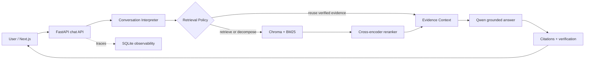

# Grounded Policy RAG

[](https://github.com/SoubhagyaJain/Company-policy-rag/actions/workflows/rag-ci.yml)
[](https://www.python.org/)
[](https://fastapi.tiangolo.com/)
[](https://nextjs.org/)
[](../LICENSE)

A local-first document assistant that answers from retrieved evidence, preserves citations across follow-ups, and keeps conversation state isolated by session. It combines a FastAPI backend, Next.js interface, hybrid retrieval, neural reranking, local Ollama models, and built-in evaluation and observability.

## Measured results

The versioned [conversation benchmark](data/eval/conversation_benchmark.json) holds the fictional corpus, production BM25 retriever, top-3 cutoff, answer prompt, and Qwen model constant. It compares the legacy query-rewriter path with the current conversation interpreter over 12 multi-turn cases.

| Metric | Before | After |
|---|---:|---:|
| Retrieval hit@3 | 90.9% | **100.0%** |
| Mean reciprocal rank | 86.4% | **95.5%** |
| Retrieval-policy accuracy | 75.0% | **100.0%** |
| Standalone-query term coverage | 86.4% | **100.0%** |
| Citation correctness | 81.2% | **100.0%** |
| Answers with only correct citations | 72.7% | **100.0%** |
| Unsupported-claim rate | 7.9% | **7.1%** |
| Conversation logic + retrieval, p50 | **0.23 ms** | 0.43 ms |
| End-to-end answer latency, p50 | 5.96 s | **4.25 s** |

The model-backed run used `qwen2.5:7b` at temperature 0 and seed 42 on an Intel Core i5-13420H and NVIDIA RTX 4050 Laptop GPU. The unsupported-claim rate is an LLM-judged hallucination proxy, not a human score. The dataset is deliberately small and fictional, so the repository includes every query, retrieved section, answer, citation mapping, judge count, and timing for review in the [full benchmark report](docs/BENCHMARK_RESULTS.md) and [machine-readable results](data/eval/conversation_benchmark_results.json).

The separate eight-case production retrieval smoke set records **100% hit@3** and **85.4% mean reciprocal rank**. It runs the shipped Markdown loader, adaptive chunker, Chroma and BM25 indexes, and hybrid reciprocal-rank fusion against the [public smoke dataset](data/eval/retrieval_smoke.json).

## Architecture



One structured Pydantic interpretation resolves intent, topic, references, standalone query, and retrieval action. The policy then chooses fresh retrieval, evidence reuse, decomposition, clarification, or no retrieval. Only retrieved chunks and verified citations enter evidence context; previous assistant text is navigation context and never becomes trusted evidence.

The conversation layer supports:

- Pronouns and short follow-ups such as “Does it apply to them?”, “International?”, and “How much?”
- Topic changes without leaking earlier retrieval context
- Explicit returns such as “Going back to leave…”
- Safe evidence reuse for “Explain point 2 simply” and “Show the source”
- Clarification when a reference has several plausible meanings
- Comparison and multi-part query decomposition
- Deep-copy session state with per-conversation document scope

## One-command demo

Install [Docker Desktop](https://www.docker.com/products/docker-desktop/), then run:

```bash
git clone https://github.com/SoubhagyaJain/Company-policy-rag.git
cd Company-policy-rag/company_policy_rag
docker compose up --build
```

No `.env` file or host Ollama installation is required. Compose starts the UI, API with embedded Chroma, worker, Redis, and Ollama, then pulls `qwen2.5:7b` and `nomic-embed-text`. The first boot downloads the models and reranker, so it takes longer than later starts.

Open:

- App: [http://localhost:3000](http://localhost:3000)
- API documentation: [http://localhost:8000/docs](http://localhost:8000/docs)
- Health check: [http://localhost:8000/api/health](http://localhost:8000/api/health)

The document library starts clean. Upload [the fictional Northstar Labs handbook](data/demo/sample_employee_handbook.md) from the Document Library, wait for indexing to finish, and try:

```text
What is maternity leave?
Does it apply during probation?
How do I reset VPN?
Going back to maternity leave, what about contractors?
```

Stop the stack with `docker compose down`. Defaults can be changed through environment variables listed in [.env.docker.example](.env.docker.example).

## Local development

Prerequisites: Python 3.11+, Node.js 20+, and Ollama.

```bash
ollama pull qwen2.5:7b
ollama pull nomic-embed-text

python -m venv .venv
# Windows: .venv\Scripts\Activate.ps1
# macOS/Linux: source .venv/bin/activate
pip install -r requirements.txt

uvicorn backend.api.main:app --reload
```

In a second terminal:

```bash
cd frontend
npm ci
npm run dev
```

LoRA/QLoRA tools are optional:

```bash
pip install -r requirements-finetuning.txt
```

## Evaluation and tests

Run the deterministic conversation gate used by CI:

```bash
python scripts/benchmark_conversation.py --assert-minimums
```

Exercise the production ingestion and hybrid retrieval components without network downloads:

```bash
python scripts/production_retrieval_smoke.py --assert-minimums
```

Regenerate the complete model-backed portfolio report:

```bash
python scripts/benchmark_conversation.py --with-generation --assert-minimums
```

Run the full backend and frontend suites when changing their wider subsystems:

```bash
python scripts/run_core_tests.py
cd frontend && npm test && npm run build
```

The root [RAG CI workflow](../.github/workflows/rag-ci.yml) runs backend tests, frontend tests and build, the conversation regression gate, and the self-contained production retrieval smoke gate. CI fails when the conversation path regresses below its baseline or retrieval falls below 100% hit@3 and 80% mean reciprocal rank.

## Document and answer flow

1. Upload PDF, DOCX, XLSX, PPTX, TXT, Markdown, HTML, CSV/TSV, JSON, or JSONL up to 100 MB.
2. The ingestion service validates the file, extracts content, creates section-aware chunks, and updates vector and BM25 indexes.
3. The conversation interpreter turns context-dependent input into a validated standalone request and retrieval decision.
4. Dense and lexical candidates are fused and reranked; visual extraction runs only when the evidence requires it.
5. Qwen receives verified source blocks and produces a streamed answer with `[Source N]` citations.
6. The verifier checks grounding and citation coverage before state is updated with trusted evidence.

## Main components

| Path | Responsibility |
|---|---|
| `backend/rag/conversation_interpreter.py` | Structured follow-up, reference, topic, and retrieval decisions |
| `backend/rag/pipeline.py` | Retrieval, evidence assembly, generation, verification, and streaming |
| `backend/services/document_service.py` | Multi-format ingestion and document lifecycle |
| `backend/services/telemetry_service.py` | SQLite WAL traces, metrics, health, and retention |
| `frontend/` | Next.js chat, document library, and observability interface |
| `scripts/benchmark_conversation.py` | Reproducible before/after conversation benchmark |
| `scripts/production_retrieval_smoke.py` | Production loader, chunker, Chroma, BM25, and hybrid retrieval gate |
| `data/demo/` | Fictional, portfolio-safe sample documents |

## API surface

| Method | Endpoint | Purpose |
|---|---|---|
| `POST` | `/api/chat` | Grounded chat response |
| `POST` | `/api/chat/stream` | Server-sent event response stream |
| `POST` | `/api/documents/upload` | Validate, store, and index a document |
| `GET` | `/api/documents` | List documents in the active scope |
| `GET` | `/api/documents/{id}/status` | Read ingestion progress |
| `DELETE` | `/api/documents/{id}` | Remove a document and its index entries |
| `GET` | `/api/admin/observability` | Dashboard telemetry snapshot |
| `GET` | `/api/health` | Service and dependency readiness |

## License

MIT. The Northstar Labs handbook is fictional demo content released as CC0-1.0.
