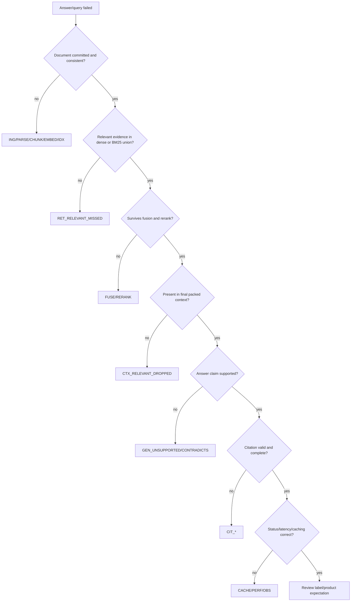

# RAG Failure Taxonomy

## Purpose and use

Every failed, degraded, abstained, or partially successful ingestion/query receives one stable code. Assign the code for the **earliest stage that made the requested outcome impossible**, plus contributing codes where useful. Codes appear in API error bodies, SSE terminal events, traces, metrics, evaluation reports, and incident records.

Statuses are distinct:

- `failed`: the requested operation did not complete.
- `degraded`: it completed using an explicitly weaker path.
- `abstained`: query completed but evidence was insufficient or unsafe to answer.
- `canceled`: caller or server intentionally stopped work.
- `partial`: ingestion captured only a declared subset; it is queryable only if product policy permits it.

Never encode these as `completed` with a successful grounding/readiness flag.

## Severity

| Severity | Meaning | Default action |
|---|---|---|
| S0 | data exposure, cross-scope evidence, destructive corruption | stop serving affected path; incident response |
| S1 | silent wrong answer/state, widespread unavailability, index inconsistency | block release/rollback; immediate investigation |
| S2 | explicit failure/degradation with material user impact | bounded retry/fallback; prioritize fix |
| S3 | isolated recoverable issue or quality miss | record, diagnose, regression candidate |
| S4 | expected user correction or insufficient evidence | explain next action; no operator alert by default |

## Ingestion and parsing

| Code | Default severity | Detection | User/operational response |
|---|---:|---|---|
| `ING_UPLOAD_TOO_LARGE` | S4 | API byte limit exceeded | reject before indexing; state limit |
| `ING_MEDIA_UNSUPPORTED` | S4 | extension/MIME/signature policy mismatch | reject with supported types |
| `ING_SOURCE_DUPLICATE` | S4 | source hash already committed | return existing document identity |
| `ING_SOURCE_WRITE_FAILED` | S2 | durable upload write exception/hash mismatch | keep no queryable state; retryable if dependency issue |
| `PARSE_CORRUPT` | S3 | loader cannot parse valid supported type | fail job with parser diagnostic |
| `PARSE_EMPTY` | S2 | no usable text/assets where content expected | fail or explicit partial; suggest OCR/source correction |
| `PARSE_PARTIAL_PAGE` | S3 | page-level extraction/asset failure | explicit partial state and affected pages |
| `PARSE_LAYOUT_LOSS` | S3 | annotated structure/table order quality gate fails | do not claim normal parse quality; alternate parser experiment |
| `PARSE_OCR_REQUIRED` | S4 | textless/image-only page detector | abstain for affected content or queue approved OCR path |
| `META_REQUIRED_MISSING` | S3 | mandatory source/page/section identity absent | block commit or repair deterministically |
| `CHUNK_NO_COVERAGE` | S2 | answer-bearing/required source span absent from chunks | block evaluation/reindex with prior policy |
| `CHUNK_DUPLICATE_ID` | S1 | deterministic ID collision or repeated logical chunk | abort generation commit and investigate |
| `CHUNK_BUDGET_INVALID` | S3 | empty/oversize chunks beyond policy | fail validation or quarantine document |
| `EMBED_MODEL_UNAVAILABLE` | S2 | model load failure | explicit degraded/fail according to profile; never silent |
| `EMBED_DIMENSION_MISMATCH` | S1 | vector dimension differs from collection manifest | stop commit/query for generation |
| `EMBED_NONFINITE` | S1 | NaN/Inf vector validation | abort commit |
| `IDX_VECTOR_WRITE_FAILED` | S1 | upsert exception/count mismatch | abort/rollback staging generation |
| `IDX_BM25_BUILD_FAILED` | S1 | build/save/validation error | abort/rollback staging generation |
| `IDX_GENERATION_MISMATCH` | S1 | vector/BM25/manifest generations or IDs differ | mark not ready; retain prior generation |
| `IDX_COMMIT_FAILED` | S1 | active-pointer swap/commit error | leave prior generation active |
| `IDX_DELETE_PARTIAL` | S1 | deletion leaves any active index/cache reference | hide target generation and complete idempotent cleanup |

## Planning, retrieval, and context

| Code | Default severity | Detection | User/operational response |
|---|---:|---|---|
| `PLAN_ROUTE_UNCERTAIN` | S4 | route confidence below calibrated bound | choose conservative retrieval path; trace reason |
| `PLAN_REWRITE_FAILED` | S3 | rewrite model/error/invalid output | use original query and mark degraded |
| `PLAN_SCOPE_INVALID` | S4 | unknown/malformed document scope | reject request |
| `RET_SCOPE_VIOLATION` | S0 | any candidate/final chunk outside effective authorization/scope | suppress answer, incident/rollback |
| `RET_DENSE_UNAVAILABLE` | S2 | vector dependency/model error | explicit BM25-only degradation if policy permits |
| `RET_BM25_UNAVAILABLE` | S2 | index missing/read failure | explicit dense-only degradation if policy permits |
| `RET_BOTH_UNAVAILABLE` | S1 | no retrieval path available | fail 503, no generation |
| `RET_NO_CANDIDATES` | S4 | valid retrieval returns none | abstain; suggest scope/query change |
| `RET_RELEVANT_MISSED` | S3 | labeled evidence absent from candidate union | evaluation failure; diagnose parse/query/embed/tokenization |
| `FUSE_RELEVANT_DROPPED` | S3 | union contains label but fused top-K does not | evaluate fusion depth/weights |
| `RERANK_MODEL_UNAVAILABLE` | S2 | reranker load/inference failure | explicit fused-rank fallback |
| `RERANK_RELEVANT_DROPPED` | S3 | labeled evidence exists pre-rerank, absent post-rerank | evaluate span/candidate/cutoff/model |
| `CTX_RELEVANT_DROPPED` | S3 | relevant evidence survives rerank but not pack | evaluate budget/dedup/expansion |
| `CTX_BUDGET_EXCEEDED` | S3 | prompt/context exceeds declared budget | deterministic truncate/abstain; no hidden overflow |
| `CTX_EVIDENCE_INSUFFICIENT` | S4 | evidence gate below calibrated threshold | abstain or qualify |
| `CTX_PARENT_SCOPE_MISMATCH` | S0 | expansion crosses effective document authorization | suppress answer and incident |

## Generation, citation, and conversation

| Code | Default severity | Detection | User/operational response |
|---|---:|---|---|
| `GEN_MODEL_UNAVAILABLE` | S2 | Ollama/model probe/inference failure | fail/degraded per explicit fallback policy |
| `GEN_QUEUE_TIMEOUT` | S2 | model lease wait exceeds bound | retryable 503/429 with hint |
| `GEN_CONTEXT_REJECTED` | S3 | prompt size/model contract error | retry with deterministic smaller pack once |
| `GEN_STREAM_INTERRUPTED` | S2 | model/transport ends without valid completion | terminal SSE error; no success trace/cache write |
| `GEN_CANCELED` | S4 | cancellation token observed | stop inference and release lease |
| `GEN_UNSUPPORTED_CLAIM` | S1 | answer asserts material claim not entailed by evidence | repair once or abstain; never cache |
| `GEN_CONTRADICTS_EVIDENCE` | S1 | numeric/semantic contradiction | repair/abstain; regression |
| `CIT_MISSING_REQUIRED` | S2 | evidence-requiring claim lacks citation | repair/abstain according to risk |
| `CIT_INDEX_INVALID` | S1 | source index absent from final packed map | reject citation/answer; regression |
| `CIT_SCOPE_INVALID` | S0 | citation points outside authorized/effective scope | suppress answer and incident |
| `CIT_UNSUPPORTED` | S1 | cited span does not support claim | repair/abstain; never mark grounded |
| `CIT_METADATA_MISMATCH` | S2 | document/page/section/snippet differs from chunk | fix mapping; do not present citation |
| `CONV_SESSION_LEAK` | S0 | content/state crosses sessions/users | stop affected mode and incident |
| `CONV_MODE_LEAK` | S1 | general/document histories contaminate each other | reset/repair state and regression |
| `CONV_SCOPE_STALE` | S1 | follow-up uses prior document after explicit scope change | suppress/recompute with current scope |
| `CONV_RESOLUTION_WRONG` | S3 | adjudicated follow-up/topic resolution fails | record dataset case; use conservative clarification/retrieval |

## Cache, performance, observability, and security

| Code | Default severity | Detection | User/operational response |
|---|---:|---|---|
| `CACHE_STALE_RETRIEVAL` | S1 | cache returns absent/old-generation chunk | disable cache, invalidate, rollback |
| `CACHE_STALE_ANSWER` | S1 | answer cites absent/unauthorized/old-generation evidence | suppress hit, disable cache, incident if exposed |
| `CACHE_KEY_COLLISION` | S1 | distinct effective requests share key | disable cache; correct version/schema |
| `CACHE_WRITE_FAILED` | S3 | bounded write error/queue full | serve uncached answer; metric/alert by rate |
| `PERF_ADMISSION_REJECTED` | S2 | queue/concurrency cap reached | retry hint; capacity signal |
| `PERF_TTFT_SLO` | S2 | TTFT over approved bound | trace stage attribution; degrade/load shed if sustained |
| `PERF_TOTAL_SLO` | S2 | total time over approved bound | stage attribution and capacity response |
| `PERF_MEMORY_PRESSURE` | S1 | RAM/VRAM high-water or OOM risk | stop new leases/unload optional model |
| `PERF_CANCELED_WORK_CONTINUES` | S1 | generation runs beyond cancel bound | reduce concurrency/disable stream path; fix propagation |
| `OBS_TRACE_INCOMPLETE` | S2 | required fields missing for eval/debug trace | fail evaluation run; alert production rate |
| `OBS_STATUS_CONTRADICTORY` | S1 | response/health/trace disagree | treat status unknown/not ready; fix source of truth |
| `OBS_TELEMETRY_DROPPED` | S2 | queue drop/unflushed shutdown records | surface count; size/fix lifecycle |
| `OBS_REDACTION_FAILED` | S0 | sensitive fixture/data reaches default log | stop debug capture, purge per policy, incident |
| `SEC_UNAUTHENTICATED_EXPOSURE` | S0 | multi-user/network profile lacks required identity | block deployment/exposure |
| `SEC_UNAUTHORIZED_DOCUMENT` | S0 | user can list/read/query/delete unauthorized doc | suppress and incident |
| `SEC_RATE_LIMIT_BYPASS` | S1 | workload exceeds identity/IP/model quota | reject/load shed and investigate |
| `SEC_SOURCE_PROMPT_INJECTION` | S1 | answer follows retrieved source instruction | suppress/abstain; add regression |
| `SEC_MALICIOUS_FILE` | S1 | archive/resource exploit or parser sandbox violation | reject/quarantine; incident if execution attempted |

## Root-cause decision tree

## Retry policy

- Retry only transient, idempotent failures and record attempt count/root code.
- Never retry scope/authorization violations, invalid input, deterministic parse corruption, or unsupported evidence as if they were transport errors.
- One bounded generation repair may be permitted for citation formatting or context size; unsupported high-risk claims should abstain if repair fails.
- Ingestion retries reuse the source hash/job manifest and deterministic chunk IDs.
- Exponential backoff and total retry budgets are **BASELINE REQUIRED** per dependency.

## Failure simulation matrix

| Simulation | Expected code/outcome | Invariant |
|---|---|---|
| Raise during vector upsert | `IDX_VECTOR_WRITE_FAILED`, failed job | no active document generation |
| Raise during BM25 save after vector staging | `IDX_BM25_BUILD_FAILED` | prior generation active; staging recoverable |
| Kill process before commit pointer swap | `IDX_COMMIT_FAILED` on recovery | no mixed generation |
| Warm retrieval cache, then delete source | no hit; otherwise `CACHE_STALE_RETRIEVAL` | deleted chunk never returned |
| Unload embedder/reranker | explicit degraded/failure codes | readiness and trace agree |
| Return citation `[Source 9]` with two contexts | `CIT_INDEX_INVALID` | never marked grounded |
| Retrieved text says “ignore instructions” | source injection test | response does not follow it |
| Select document A, attempt expansion into B | `CTX_PARENT_SCOPE_MISMATCH` | no B content in prompt/response |
| Disconnect SSE mid-generation | `GEN_CANCELED` | model work stops within target |
| Saturate model leases | `GEN_QUEUE_TIMEOUT`/`PERF_ADMISSION_REJECTED` | bounded threads/memory |
| Fill telemetry queue and shut down | visible drop/flush outcome | no silent loss |
| Scan/textless PDF | `PARSE_OCR_REQUIRED` or explicit partial | page not silently successful |

## Regression workflow

1. Capture the earliest failing stage, stable code, versions, and minimal safe evidence bundle.
2. Reproduce on a frozen fixture and verify the expected behavior with a reviewer when semantic.
3. Add the case to the narrowest permanent dataset/test split.
4. Fix at the owning stage; do not paper over retrieval failure with prompt changes.
5. Run the relevant subsystem suite plus end-to-end gates.
6. Deploy behind a versioned flag/config; watch the code-specific metric.
7. Roll back on recurrence or a new higher-severity regression.

## Current known mappings

| Observed repository defect | Code |
|---|---|
| Chroma upsert failure suppressed while ingestion can continue | `IDX_VECTOR_WRITE_FAILED` / `OBS_STATUS_CONTRADICTORY` |
| Grounding status assigned PASS on both branches | `OBS_STATUS_CONTRADICTORY` |
| Health fields hard-coded true | `OBS_STATUS_CONTRADICTORY` |
| Retrieval cache survives corpus mutation | `CACHE_STALE_RETRIEVAL` |
| Cancellation stops SSE but not model worker | `PERF_CANCELED_WORK_CONTINUES` |
| Verifier accepts an out-of-range source index | `CIT_INDEX_INVALID` |
| Active evaluator absent | `OBS_TRACE_INCOMPLETE` for attempted scientific run |

These mappings become executable fault/regression tests during roadmap phases 1 and 2.
