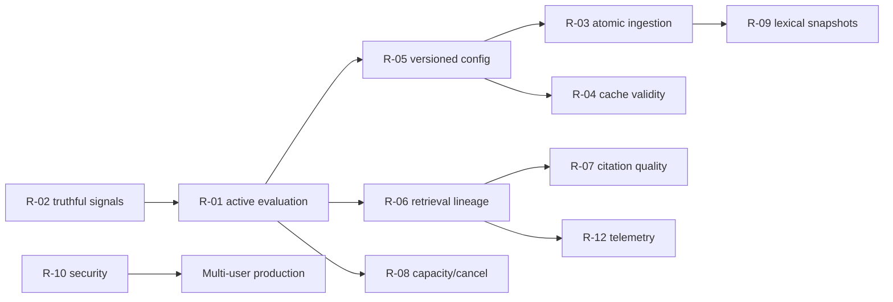

# RAG Improvement Roadmap

This is the authoritative implementation contract for audit recommendations. No production implementation is included in this audit deliverable.

## Priority model

- **P0:** correctness, silent failure, or inability to measure the supported runtime.
- **P1:** material quality, reliability, capacity, or security risk.
- **P2:** optimization after P0/P1 baselines and gates are established.

Impact and complexity use Low/Medium/High. Acceptance thresholds marked **BASELINE REQUIRED** are set after the first reproducible run, then checked into the evaluation manifest.

## Delivery phases

| Phase | Goal | Exit criterion |
|---|---|---|
| 0 — Declare | Name the supported runtime and freeze evidence | Architecture decision record names `backend/` + `frontend/`; active golden corpus is versioned. |
| 1 — Trust signals | Eliminate false success and stale state | Known P0 defect tests pass; all health/grounding/cache states reflect real state. |
| 2 — Measure | Evaluate and observe the shipped path | Active evaluator runs in CI; full lineage exists for eval/debug traces; baseline report is checked in. |
| 3 — Make consistent | Atomic ingestion and versioned configuration | Failed jobs are invisible/recoverable; one RAG fingerprint is present across index/cache/trace. |
| 4 — Improve quality | Tune retrieval/context/citations by experiment | Composite quality improves without violating latency/memory gates. |
| 5 — Operate | Bound local-model concurrency and secure exposure | Capacity/SLO tests pass; auth/quotas exist for approved deployment model. |

## Recommendation R-01 — Active-runtime evaluation gate

- **Problem:** checked-in quality results exercise legacy `src/`, not the FastAPI pipeline shipped by Docker.
- **Evidence:** `src/evaluation.py` owns the golden runner; `.github/workflows/ci.yml` does not call `scripts/ci_eval_gate.py`; active assembly is in `backend/api/dependencies.py`.
- **Root-cause hypothesis:** the backend was replaced incrementally while evaluation ownership remained with the prior stack.
- **Current behavior:** CI can pass while active retrieval, citations, or conversation regress.
- **Target behavior:** deterministic smoke and scheduled full evaluations invoke `RAGPipeline` using a frozen index/config/model manifest.
- **Proposed change:** add an evaluation adapter around `backend/rag/pipeline.py`, stable fixture corpus/index generation, labeled answer-bearing chunks, machine-readable report, and CI smoke gate.
- **Files/functions affected:** new adapter under `backend/evaluation/`; `scripts/ci_eval_gate.py`; `.github/workflows/ci.yml`; `data/eval/*`; `RAGPipeline.query`.
- **Expected impact:** Very high quality confidence; High operational confidence.
- **Complexity:** Medium. **Risk:** Low; primarily test code.
- **Benchmark:** plan in `RAG_EVALUATION_PLAN.md`, run legacy and active suites separately.
- **Acceptance:** 100% CI smoke execution; thresholds for retrieval/citation/faithfulness/latency set after active baseline; no metric regression beyond its confidence/tolerance band.
- **Rollback:** disable the blocking job but retain report-only execution; do not restore legacy scores as active evidence.

## Recommendation R-02 — Correct false status and trace signals

- **Problem:** grounding and readiness can report success independent of real results.
- **Evidence:** `backend/rag/pipeline.py` assigns `PASS` in both branches; health/admin routes hard-code model/index readiness; early stream retrieval counts are zero.
- **Root-cause hypothesis:** UI scaffolding became operational telemetry without a single truth source.
- **Current behavior:** operators and users can receive false-green signals.
- **Target behavior:** every status is computed from a typed state/probe and consistent across response, SSE, health, and persisted trace.
- **Proposed change:** centralize readiness snapshot; fix grounding branch; emit retrieval events only with actual counts/timings; add fault-injection tests.
- **Files/functions affected:** `backend/rag/pipeline.py:_query_internal`, stream event generation; `backend/api/routes/health.py`; admin routes; trace models; frontend SSE reducer.
- **Expected impact:** High. **Complexity:** Low-Medium. **Risk:** Low.
- **Benchmark:** inject unavailable reranker/vector/BM25/Ollama and failed verification; compare all exposed statuses.
- **Acceptance:** zero contradictory statuses in test matrix; probes fail within agreed timeout (**BASELINE REQUIRED**).
- **Rollback:** revert presentation changes while keeping raw probe fields; never reinstate hard-coded green status.

## Recommendation R-03 — Atomic, validated ingestion

- **Problem:** partial indexing can be labeled ready and retries can duplicate state.
- **Evidence:** `ChromaVectorStore.add_chunks` suppresses errors; `DocumentService._execute_ingestion_stages` commits vector, BM25, and registry sequentially without rollback.
- **Root-cause hypothesis:** stage progress was implemented without a commit protocol.
- **Current behavior:** queryable vector and lexical corpora can diverge.
- **Target behavior:** a document generation becomes visible only after vector/BM25 counts and metadata validate; retries are idempotent.
- **Proposed change:** propagate store failures; deterministic chunk IDs; durable job manifest; staging generation; validation and atomic active-generation pointer; cleanup/recovery commands.
- **Files/functions affected:** `backend/services/document_service.py`; `backend/embeddings/vector_store.py`; `backend/retrieval/bm25.py`; document DTO/status routes; telemetry ingestion models.
- **Expected impact:** Very high correctness. **Complexity:** High. **Risk:** Medium due to index migration.
- **Benchmark:** fault injection after every stage, concurrent upload/query, duplicate retry, process termination/restart.
- **Acceptance:** 0 query-visible partial documents in the matrix; retry produces exactly one logical chunk set; previous generation remains queryable on failure.
- **Rollback:** retain/read the prior generation and disable new writes; manifest-driven deletion of staging records.

## Recommendation R-04 — Cache versioning and invalidation

- **Problem:** retrieval-cache results can outlive upload/delete or retrieval-policy changes.
- **Evidence:** `backend/retrieval/retrieval_cache.py` keys only query/filters/top-k; mutation paths do not clear it.
- **Root-cause hypothesis:** cache was treated as a latency-only wrapper rather than part of the consistency model.
- **Current behavior:** stale chunks can be returned for up to TTL and across configuration changes.
- **Target behavior:** cache keys include committed corpus generation and full relevant policy fingerprint; deleted evidence cannot hit.
- **Proposed change:** expose a cheap generation ID; add retrieval-stack fingerprint; update answer-cache policy label; validate cited chunk existence on answer hit; bounded cache-write executor.
- **Files/functions affected:** retrieval cache, semantic cache manager, `DocumentService` commit/delete, `RAGPipeline`, settings.
- **Expected impact:** High correctness. **Complexity:** Medium. **Risk:** Low (temporary hit-rate loss).
- **Benchmark:** warm cache, upload/delete/replace document, change chunk/retrieval/reranker config, repeat query.
- **Acceptance:** 0 stale hits; invalidation p95 **BASELINE REQUIRED**; cache-on answers equal cache-off evidence identity.
- **Rollback:** disable affected cache via feature flag; correctness takes precedence over hit rate.

## Recommendation R-05 — One configuration and architecture fingerprint

- **Problem:** component-local defaults disagree with `src/config.py`; deployed Chroma/Celery topology does not match active use.
- **Evidence:** chunk 512 versus settings 480, reranker model/top-n/ratio differences, collection/path differences, local PersistentClient ignoring Compose Chroma host, Celery health-only tasks.
- **Root-cause hypothesis:** duplicated construction evolved across backend migration.
- **Current behavior:** local, CI, and Docker behavior can differ without a visible version change.
- **Target behavior:** one typed active settings object; validation fails on conflicting/unused topology; fingerprint recorded everywhere.
- **Proposed change:** move active settings under `backend/config`; inject into constructors; log effective sanitized config; deprecate active imports from `src`; choose/remove unused services.
- **Files/functions affected:** `backend/api/dependencies.py`; component constructors; `src/config.py`; `docker-compose.yml`; tests/README.
- **Expected impact:** High. **Complexity:** Medium. **Risk:** Medium because hidden defaults become explicit.
- **Benchmark:** config snapshot tests across local/test/Docker profiles; golden parity test.
- **Acceptance:** zero undocumented active defaults; same profile yields same fingerprint; startup rejects invalid combinations.
- **Rollback:** preserve previous profile as a versioned config file and point deployment to it.

## Recommendation R-06 — Retrieval lineage and reranker correction

- **Problem:** retrieval decisions cannot be fully reconstructed, and reranker policy can discard relevant evidence.
- **Evidence:** telemetry stores final evidence but not all dense/BM25/fusion candidates; reranker truncates candidates/text and ratio-filters raw logits.
- **Root-cause hypothesis:** user-facing response needs were prioritized over evaluation/debug lineage.
- **Current behavior:** a miss cannot reliably be attributed to parse, dense, BM25, fusion, rerank, or packing.
- **Target behavior:** evaluation/debug traces expose every rank transition; candidate depth/span/threshold are benchmarked and calibrated.
- **Proposed change:** typed candidate lineage; retain source contributions; rerank configurable K; choose representative text span; use absolute/calibrated cutoff or top-N; apply configured batching.
- **Files/functions affected:** dense/BM25/hybrid/reranker models and services; `RAGPipeline`; telemetry models/service; admin debugger.
- **Expected impact:** Very high diagnostic and likely quality gain. **Complexity:** Medium. **Risk:** Medium latency increase.
- **Benchmark:** EXP-004 through EXP-008 in backlog; ablation dense-only/BM25-only/hybrid/rerank.
- **Acceptance:** 100% candidate lineage in eval runs; improve nDCG/MRR/citation recall versus baseline without exceeding latency budget (**BASELINE REQUIRED**).
- **Rollback:** keep new lineage schema, restore prior rerank policy by fingerprint.

## Recommendation R-07 — Citation and abstention correctness

- **Problem:** citations are source-tag mappings, not robust claim support; invalid indices and false PASS are possible.
- **Evidence:** citation fallback rank may not match final packed order; verifier accepts indices up to at least 10 and uses weak lexical overlap.
- **Root-cause hypothesis:** heuristic checks were presented as verification without claim-level labels/calibration.
- **Current behavior:** answers may appear grounded while citations are missing, out of range, or weakly related.
- **Target behavior:** final source indices are assigned after packing; atomic claims receive support status; unsupported high-risk claims trigger repair or abstention.
- **Proposed change:** parse atomic claims; validate index/scope, numbers, quotes, code, and policy audience; calculate citation precision/recall/completeness; separate heuristic signal from calibrated verdict.
- **Files/functions affected:** context packer, prompt builder, `backend/rag/citations.py`, verifier, retry/response models, UI.
- **Expected impact:** Very high trust. **Complexity:** Medium-High. **Risk:** Medium (more abstentions).
- **Benchmark:** citation-labeled set plus unsupported/adversarial questions and human review.
- **Acceptance:** targets established from baseline; zero out-of-range accepted citations; unsupported-answer rate decreases without unacceptable refusal increase.
- **Rollback:** fall back to strict source-index validation plus explicit `verification_unavailable`; never use known false PASS logic.

## Recommendation R-08 — Cooperative streaming cancellation and admission control

- **Problem:** disconnected streams continue consuming model capacity; concurrent model work is unbounded.
- **Evidence:** `RAGPipeline.stream_query` creates a daemon thread and cancellation is not passed into Ollama generation; only vision has a semaphore.
- **Root-cause hypothesis:** streaming transport and model execution lifecycles are decoupled.
- **Current behavior:** overload can amplify itself and model memory contention is opaque.
- **Target behavior:** bounded leases/queue, cancellation reaches the generator, and resources are released promptly.
- **Proposed change:** pass cancellation token through pipeline/client; stop Ollama stream where supported; add `ModelLeaseManager`; expose queue/model timing and overload result.
- **Files/functions affected:** chat route/service; `RAGPipeline.stream_query`; Ollama client; dependency assembly; telemetry/health; frontend cancellation handling.
- **Expected impact:** High reliability/latency. **Complexity:** Medium. **Risk:** Medium threading changes.
- **Benchmark:** concurrent load with 0/25/50% disconnects, model switches, rerank and vision contention.
- **Acceptance:** canceled generation stops within target **BASELINE REQUIRED**; no leaked worker growth; p95 latency and memory meet named capacity target.
- **Rollback:** limit concurrency to one and disable stream mode temporarily; retain cancellation instrumentation.

## Recommendation R-09 — BM25/index mutation safety and scale

- **Problem:** every upload rebuilds the full lexical index with no explicit concurrency control.
- **Evidence:** `DocumentService._execute_ingestion_stages` reads all entries then calls BM25 build/save; `BM25Retriever` has no read/write lock.
- **Root-cause hypothesis:** design assumes a small, static, single-writer corpus.
- **Current behavior:** ingestion cost grows with corpus size and concurrent readers may see mutation races.
- **Target behavior:** immutable/versioned lexical snapshots with atomic swap; rebuild cost and query consistency are measured.
- **Proposed change:** lock snapshot creation, build off-path, validate, atomically swap generation; consider incremental/search-engine replacement only if benchmark requires it.
- **Files/functions affected:** BM25 retriever, DocumentService, job manifest, health/readiness.
- **Expected impact:** High at scale. **Complexity:** Medium. **Risk:** Medium.
- **Benchmark:** 1k/10k/100k/target chunks, concurrent QPS during rebuild, crash before swap.
- **Acceptance:** no mixed-generation results; query p95 degradation and rebuild time targets **BASELINE REQUIRED**.
- **Rollback:** switch pointer to prior lexical snapshot.

## Recommendation R-10 — Security and untrusted-content boundary

- **Problem:** all APIs are globally accessible and documents can influence prompts as raw text.
- **Evidence:** no auth/security dependency on routes; global document/admin operations; prompts consume retrieved text without a formal untrusted-data contract.
- **Root-cause hypothesis:** trusted local single-user assumptions were not made explicit.
- **Current behavior:** unsafe for multi-user or public network exposure; prompt injection and data leakage are unmeasured.
- **Target behavior:** deployment profile declares trusted-local or authenticated multi-user; authorization is enforced before retrieval and again before packing; quotas and injection tests exist.
- **Proposed change:** document threat model; add identity/ACL/rate controls only for approved multi-user profile; delimit evidence and prohibit instruction following from sources; redact telemetry.
- **Files/functions affected:** API middleware/dependencies/routes, document metadata/filters, context/prompt builder, telemetry, deployment docs.
- **Expected impact:** Very high before exposure. **Complexity:** High. **Risk:** Medium integration risk.
- **Benchmark:** cross-user access, enumeration, rate, prompt injection, malicious file, sensitive telemetry tests.
- **Acceptance:** zero unauthorized retrieval/admin access; adversarial targets from evaluation plan pass; privacy/retention review approved.
- **Rollback:** return deployment to loopback/trusted-local mode; do not expose without controls.

## Recommendation R-11 — Parser quality gates and selective OCR

- **Problem:** layout-heavy/scanned PDFs can yield empty or misleading text without a document quality verdict.
- **Evidence:** PDF loader uses text extraction and pypdf fallback, with no OCR; vision ingestion is cache-only.
- **Root-cause hypothesis:** fast local text parsing was optimized before corpus composition was measured.
- **Current behavior:** textless pages can disappear from retrievable evidence.
- **Target behavior:** page-level parse statistics classify text, image-only, table-heavy, or failed pages; OCR/vision is opt-in based on evidence.
- **Proposed change:** add parse quality report; detect textless pages; benchmark selective OCR/table extraction; expose partial readiness.
- **Files/functions affected:** PDF loader, asset/vision manager, DocumentService stage state, document/admin UI.
- **Expected impact:** Medium-High depending on corpus. **Complexity:** Medium. **Risk:** Medium compute cost.
- **Benchmark:** representative scanned, two-column, table, image, code, and normal PDFs.
- **Acceptance:** targets **BASELINE REQUIRED** by document class; no textless page silently counted successful.
- **Rollback:** retain detection/reporting, disable OCR inference.

## Recommendation R-12 — Telemetry lifecycle, privacy, and real performance metrics

- **Problem:** traces omit key lineage/timing, use approximate tokens, may drop on shutdown, and can store sensitive text.
- **Evidence:** telemetry final-evidence-only mapping, whitespace tokens, total-time throughput, bounded write queue without established lifecycle flush, raw query/answer preview fields.
- **Root-cause hypothesis:** diagnostic and operational telemetry were combined without a data contract.
- **Current behavior:** scientific attribution and privacy posture are both weak.
- **Target behavior:** aggregate operational metrics are always-on and low-risk; sampled debug traces are richer, access-controlled, redacted, and expiring.
- **Proposed change:** schema in `RAG_OBSERVABILITY_PLAN.md`; tokenizer counts; stage/model queue/TTFT/generation timings; queue-drop/flush metrics; redaction and retention policy.
- **Files/functions affected:** RAG/telemetry models, service/DB lifecycle, API lifespan, logging config, admin UI.
- **Expected impact:** High. **Complexity:** Medium. **Risk:** Low-Medium schema migration.
- **Benchmark:** trace completeness tests, shutdown with queued records, redaction corpus, telemetry overhead load test.
- **Acceptance:** required fields complete in >= target rate **BASELINE REQUIRED**; zero known sensitive fixtures in default logs; bounded overhead target **BASELINE REQUIRED**.
- **Rollback:** disable rich sampling while retaining aggregate counters and failure logs.

## Quick-win sprint

In one focused sprint, implement R-02's known correctness fixes, propagate vector write failures from R-03, add a corpus generation to retrieval-cache keys from R-04, unify HTTP/query request IDs, surface degraded model fallbacks, and make CI run an active eight-question smoke report in non-blocking mode. Turn the smoke report into a gate only after one stable baseline and threshold review.

## Dependency order

## Program-level stop and rollback rules

- Change one retrieval/generation variable per experiment unless the design is explicitly factorial.
- Preserve corpus, golden set, index generation, model revision, and effective config for every run.
- Stop a rollout on any P0 failure, unauthorized evidence, stale-cache hit, silent degraded fallback, or statistically/practically meaningful quality regression.
- Roll back via versioned config/index/cache generation; source documents and prior committed indexes remain immutable during the rollout window.
- A latency win never compensates for a faithfulness/citation safety regression. A quality win must remain inside approved latency/memory/cost gates.
