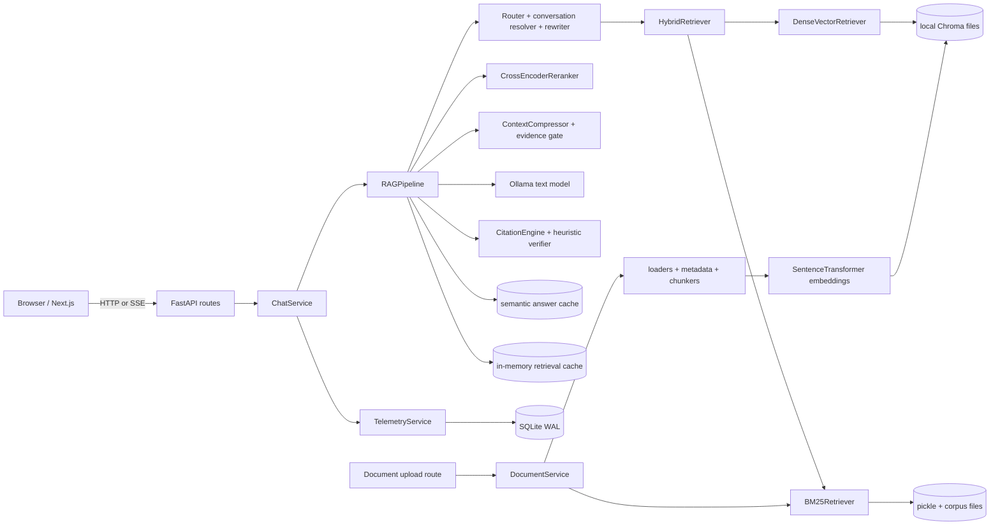

# RAG System Audit

**Audit date:** 2026-08-31

**Scope:** repository evidence only

**Production telemetry reviewed:** none
**Measurement rule:** unknown current values are marked **BASELINE REQUIRED**

## Executive verdict

This repository contains a capable local RAG prototype with unusually broad feature coverage: structure-aware ingestion, dense plus BM25 retrieval, reranking, metadata scope, conversational resolution, streaming, citations, semantic caching, verification heuristics, trace records, and a substantial test inventory. The active product path is FastAPI plus Next.js, assembled in `backend/api/dependencies.py` and executed by `backend/rag/pipeline.py`.

It is not yet a scientifically defensible production RAG system. The largest problem is not a missing algorithm; it is that important correctness claims cannot currently be measured on the active runtime. The checked-in golden evaluation exercises legacy `src/` retrieval, the CI workflow does not run the evaluation gate, several health/readiness values are hard-coded, and configuration is split between `src/config.py` and component-local defaults. There are also concrete correctness and reliability defects: vector writes can fail without failing ingestion, retrieval-cache entries survive corpus changes, streaming cancellation does not stop model work, the verifier can accept invalid citation indices, and the trace marks grounding `PASS` on both branches.

The recommended direction is incremental: establish one supported runtime and measurable baselines, repair atomicity/cache/trace defects, make retrieval evidence auditable, then tune chunking/retrieval/reranking on a versioned evaluation set. Do not add a new database, orchestration framework, agent framework, or hosted model until measurements show the current local architecture cannot meet an explicit target.

## What was inspected

- Runtime and deployment: `docker-compose.yml`, `backend/api/main.py`, `backend/api/dependencies.py`, API routes, Next.js API client and page entry point.
- Ingestion: `backend/services/document_service.py`, loaders, metadata extraction, adaptive chunkers, embeddings, Chroma wrapper, BM25 persistence.
- Query execution: `backend/rag/pipeline.py` and its router, rewrite, retrieval, compression, evidence, generation, citation, verification, retry, cache, and streaming collaborators.
- Conversation and API: `backend/services/chat_service.py`, `backend/rag/conversation.py`, request DTOs, session hooks, document/admin endpoints.
- Evaluation and CI: `src/evaluation.py`, `scripts/ci_eval_gate.py`, datasets under `data/eval/`, tests, `.github/workflows/ci.yml`.
- Observability: RAG trace models, telemetry service/database, logging, health/admin routes.

No production deployment, real user traffic, GPU profile, external security review, or live corpus was supplied. Capacity, quality, latency, cost, and SLO values therefore require baselining.

## Supported runtime versus legacy runtime

The repository contains two materially different paths.

| Concern | Active product path | Legacy or parallel path | Audit consequence |
|---|---|---|---|
| Web UI | `frontend/app/page.tsx` | Streamlit/Chainlit files under `src/` | Next.js is the supported UI in Docker. |
| API | `backend/api/main.py` | Direct `src/` calls | FastAPI is the active boundary. |
| RAG pipeline | `backend/rag/pipeline.py:RAGPipeline` | `src/` indexing/retrieval/generation | Results are not interchangeable. |
| Evaluation | no active-backend harness | `src/evaluation.py` | Existing golden scores do not validate the shipped path. |
| Vector store | local `chromadb.PersistentClient` in `backend/embeddings/vector_store.py` | other legacy construction | The Compose `chroma` service is not used by the active wrapper. |
| Background work | upload in FastAPI threadpool | Celery ping/health tasks only | The deployed worker does not execute ingestion or queries. |

**Decision required:** designate `backend/` plus `frontend/` as the sole supported product path. Retain `src/` only for explicitly labeled migration utilities until its remaining dependencies are removed.

## Current end-to-end architecture

### Document path

`backend/api/routes/documents.py:upload_document` buffers an upload up to 100 MB and calls `DocumentService.upload_document` in a FastAPI threadpool. `DocumentService._execute_ingestion_stages` loads text, extracts metadata, chunks, embeds, writes Chroma, rebuilds the entire BM25 index, and updates in-memory registries. PDF loading uses PyMuPDF with pypdf fallback and extracts page text and image assets; there is no OCR fallback for textless scanned pages. Vision enrichment during ingestion is cache-only.

### Query path

`backend/api/routes/chat.py` calls `ChatService.execute_query` for JSON or `ChatService.stream_query` for SSE. `RAGPipeline._query_internal` routes intent, resolves conversation, optionally bypasses retrieval for general chat/greetings, checks the semantic answer cache, resolves document scope, rewrites, retrieves with dense plus BM25/RRF, relaxes non-hard filters, reranks, expands/packs context, applies an evidence gate, generates with Ollama, extracts citations, runs heuristic verification, and writes trace/cache data.

## Component ownership map

| Capability | Primary owner | Important collaborators | State owned |
|---|---|---|---|
| API lifecycle/readiness | `backend/api/main.py` | `backend/api/routes/health.py` | singleton warmup state |
| Dependency assembly | `backend/api/dependencies.py` | `src/config.py` | process-wide service singletons |
| Upload/ingestion | `backend/services/document_service.py:DocumentService` | loaders, chunkers, embeddings | document registry, docstore, stage state |
| Parsing | `backend/ingestion/loaders/*` | metadata extractor | `RawDocument` pages/assets |
| Chunking | `backend/ingestion/chunkers/*` | document models | chunk boundaries and metadata |
| Embeddings | `backend/embeddings/embeddings.py:EmbeddingService` | SentenceTransformers | model and in-memory vector cache |
| Dense index | `backend/embeddings/vector_store.py:ChromaVectorStore` | Chroma PersistentClient | vectors, chunk metadata, corpus fingerprint |
| Lexical index | `backend/retrieval/bm25.py:BM25Retriever` | `rank_bm25` | in-memory BM25 plus pickle/corpus persistence |
| Hybrid retrieval | `backend/retrieval/hybrid.py:HybridRetriever` | dense, BM25 | RRF results |
| Reranking | `backend/retrieval/reranker.py:CrossEncoderReranker` | CrossEncoder | reranker model |
| Orchestration | `backend/rag/pipeline.py:RAGPipeline` | all RAG services | query execution and trace |
| Conversation | `backend/services/chat_service.py:ChatService` | `ConversationStateManager` | two TTL caches keyed by session |
| Generation/model lifecycle | `backend/generation/ollama_client.py`, model manager | Ollama | active/preloaded model state |
| Citations/verification | `backend/rag/citations.py`, verifier | retrieved context | citation objects and heuristic scores |
| Caches | semantic and retrieval cache modules | corpus fingerprint | Chroma/memory answer cache, memory retrieval cache |
| Telemetry | `backend/services/telemetry_service.py`, telemetry DB | trace models | async SQLite records |
| Frontend | `frontend/app/page.tsx`, `frontend/lib/api-client.ts` | hooks/components | browser session and UI state |
| Legacy evaluation | `src/evaluation.py` | `data/eval/*` | golden results for legacy path only |

Ownership means code responsibility, not an inferred human or team owner. Human ownership is **BASELINE REQUIRED**.

## Detailed findings

### Ingestion and document understanding

Strengths:

- Duplicate detection uses file SHA-256; uploaded filenames are reduced to `Path(filename).name`.
- `RawDocument`/`Chunk` metadata preserves page identity, section paths, categories, policy IDs, dates, content types, and asset references.
- Adaptive chunking has specialized markdown, heading, semantic, recursive, code, and markdown-table paths.
- Page-aware PDF parsing and image-asset extraction provide a useful base for citations.

Gaps and failure modes:

- `ChromaVectorStore.add_chunks` logs and suppresses Chroma write failures, while `DocumentService._execute_ingestion_stages` can still mark the document ready. This is a silent partial-index failure.
- Vector upsert, BM25 rebuild, registry update, and file retention have no transaction boundary or rollback manifest. A retry can duplicate partially committed chunks.
- BM25 is rebuilt from the full corpus on every upload and has no explicit read/write lock. Concurrent upload/query behavior is not controlled.
- The API buffers the whole upload and ingestion runs synchronously in a request thread. Celery is deployed but owns only health tasks.
- PDF parsing has no OCR path, robust multi-column reconstruction, header/footer suppression, or native table/equation understanding. Scanned or layout-heavy policy documents will degrade silently.
- Chunk sizes are hard-coded as 512/64 in dependency assembly while `src/config.py` advertises 480/64. Character-based token estimation is approximate.
- Ingestion telemetry records visual/vision counts from raw-document count even when live vision did not run.
- Loader fallback and MIME/content validation are not a complete hostile-file boundary. There is no authentication or tenant boundary on document operations.

### Retrieval and reranking

Strengths:

- Dense vectors are normalized and combined with a transparent RRF implementation.
- BM25 searchable text includes body, section/page descriptors, source filename, and category.
- Hard document/page scope is retained during filter relaxation.
- Response modes set explicit candidate/context/output budgets.

Gaps and failure modes:

- `HybridRetriever.search` executes dense and BM25 serially despite describing parallel retrieval.
- BM25 tokenization is a lowercase alphanumeric regex. It splits versioned identifiers and code-like terms and has no phrase, stemming, or domain normalization.
- The reranker only examines `max(top_n * 2, 8)` already fused candidates and truncates each to the first 350 characters. Relevant evidence late in a chunk cannot influence ranking.
- Reranker defaults conflict: dependency assembly uses `BAAI/bge-reranker-large`, top 5, ratio 0.40; central settings advertise base, top 4, ratio 0.50. The configured batch size is not applied.
- Relative thresholding on raw cross-encoder logits is unsafe when scores are negative.
- If embedding/reranker models are unavailable, deterministic or rank-preserving fallbacks keep the service alive but can masquerade as valid semantic quality unless explicitly surfaced.
- Multi-query expansion contains guidebook-specific hard-coded queries, limiting generality across policy corpora.
- The in-memory retrieval cache key lacks corpus, embedder, chunker, fusion, reranker, and policy versions and is not invalidated on upload/delete.

### Context, conversation, generation, and citations

Strengths:

- Document selection and page scope are modeled explicitly.
- Context packing deduplicates and respects response-mode budgets.
- Semantic answer cache keys include query, model, corpus version, prompt version, scope/filters/mode and applies numeric/negation/audience guards.
- General-chat and greeting bypasses avoid needless retrieval.

Gaps and failure modes:

- Conversation histories are split correctly by documents/general mode, but `RAGPipeline` initializes previous evidence lists as empty. Evidence continuity advertised by trace fields is not active.
- Query rewrite and structural multi-query calls are sequential additions before first model token; no measured latency budget governs them.
- Streaming uses a daemon worker thread per request. Client cancellation stops SSE delivery but is not propagated to Ollama generation, so disconnected work continues.
- Early `retrieval_done` streaming metadata reports zero counts; complete retrieval/thinking events can arrive only after the worker finishes, making UI progress misleading.
- There is no text-model admission control, queue-depth signal, or model-residency budget. Text, reranker, embeddings, and lazy vision can contend for CPU/GPU memory.
- Citation fallback can assign a chunk's old rank rather than its final generation position. Citations are tag mappings, not claim-to-evidence entailment checks.
- `SelfReflectionVerifier` is lexical/heuristic, not model-based. It treats citation indices up to `max(total_chunks, 10)` as potentially valid and can report high faithfulness from very small word overlap.
- `RAGPipeline` assigns `grounding_status="PASS"` regardless of verifier result.
- Semantic-cache hits retain citations but not the exact final context snapshot needed for post-hoc claim/evidence debugging.

### Caching and consistency

| Cache | Current validity basis | Key risk | Required correction |
|---|---|---|---|
| Embedding LRU | text hash, process local | model change is not in key | include embedding model/version; reset on reload |
| Retrieval LRU | query, filters, top-k, TTL | stale after corpus/config changes | add corpus and retrieval stack fingerprint; invalidate on mutation |
| Semantic answer cache | query + model + corpus + prompt + scope guards | policy fingerprint is a hard-coded label; context not retained | version the whole retrieval/prompt stack and retain evidence IDs/snapshot |
| Browser sessions | localStorage/process endpoints | no identity/tenant isolation | add identity only when multi-user deployment is approved |

### API, deployment, and security

- Query length is capped at 8,000 characters and several identifiers have length caps; this is good boundary validation.
- No authentication, authorization, tenant isolation, request rate limit, ingestion quota, or per-model concurrency limit is present. All documents/admin data are globally reachable to anyone with network access.
- The active Chroma wrapper opens local persistent files. `CHROMA_HOST`/`CHROMA_PORT` and the Compose Chroma service do not affect it, so the deployed architecture has an unused service and two possible stores.
- Redis is used for Celery infrastructure, while product caches are primarily process-local/Chroma-based. Multiple API replicas would not share conversation or retrieval-cache state.
- Health/admin routes report several readiness flags as `true` instead of probing them.
- The HTTP middleware request ID and `ChatService` request ID are independently generated, preventing reliable end-to-end correlation.
- Retrieved document text is placed into prompts without an explicit untrusted-content delimiter/instruction hierarchy. Prompt-injection resilience is **BASELINE REQUIRED**.

### Evaluation and observability

Strengths:

- Trace models capture route, rewrite, strategy, scope, filters, counts, evidence types, model, cache state, and coarse stage timing.
- Telemetry uses SQLite WAL and a bounded asynchronous writer queue.
- Golden datasets and many regression tests already exist.

Gaps and failure modes:

- The checked-in golden evaluator calls legacy `src/` retrieval, not `backend/rag/pipeline.py`. Its last CI smoke file reports hit rate 1.0, precision 0.895833, recall 0.75, but those are **not active-runtime baselines**.
- `scripts/ci_eval_gate.py` is not invoked by `.github/workflows/ci.yml`; quality regression is not gated.
- Retrieval grading is mostly fuzzy section/keyword matching. It lacks labeled answer-bearing chunk IDs and MRR/nDCG/Precision@K across the active path.
- Full candidate lists, rejected evidence, per-source ranks/scores, exact final prompt/context order, generation timing, queue time, GPU memory, and cancellation waste are not retained.
- Token counts are whitespace estimates and throughput includes non-generation time.
- Telemetry queue drops and shutdown loss are possible; lifecycle flush behavior is not established.
- Raw queries and answer previews can contain policy or personal data; a classification/redaction/retention policy is absent.
- Static analysis and frontend lint are allowed to fail in CI. No performance or quality SLO is gated.

## Maturity scorecard

Scale: 0 absent, 1 ad hoc, 2 prototype, 3 repeatable, 4 measured/controlled, 5 continuously optimized.

| Subsystem | Score | Evidence-based rationale |
|---|---:|---|
| Parsing/document understanding | 2.5 | Broad formats and metadata, but no OCR/layout assurance or quality gate. |
| Chunking | 3.0 | Multiple deterministic strategies and metadata; no active-path benchmark or tokenizer-aware boundaries. |
| Embeddings/vector storage | 2.5 | Normalized local model and persistence; silent fallback/write failure and deployment mismatch. |
| Lexical/hybrid retrieval | 2.5 | BM25 + RRF exists; simplistic tokenization, serial execution, stale cache, no active benchmark. |
| Reranking | 2.0 | Cross-encoder integration exists; limited candidate window, score-threshold defect, config drift. |
| Context assembly | 3.0 | Scope and budget controls are good; evidence continuity and audited provenance are incomplete. |
| Conversation | 2.5 | Mode-separated TTL history and follow-up resolver; process-local and prior evidence reuse disabled. |
| Generation/model serving | 2.0 | Ollama integration and streaming; no admission control, cancellation, residency or measured capacity. |
| Citations/faithfulness | 2.0 | Structured citations and verifier; claim-level validation is weak and known status/index bugs exist. |
| Caching | 2.5 | Strong semantic-cache concept; retrieval invalidation and full-stack versioning are incomplete. |
| API/security | 1.5 | DTO validation and CORS; no auth, quotas, tenancy, or hostile-content controls. |
| Observability | 2.5 | Rich schemas and async persistence; misleading readiness/grounding fields and missing candidate lineage. |
| Evaluation/CI | 1.5 | Datasets and scripts exist, but they do not measure or gate the active runtime. |
| Deployment/operations | 2.0 | Compose and health scaffolding; unused services, single-process state, no capacity evidence. |

## Top ten bottlenecks

Rank combines user impact, likelihood, breadth, and ease of detecting the failure.

| Rank | Bottleneck | Why it matters | Priority |
|---:|---|---|---|
| 1 | No active-runtime quality baseline or CI gate | Improvements and regressions cannot be distinguished. | P0 |
| 2 | Silent/non-atomic ingestion | A document can appear ready while one index is missing or inconsistent. | P0 |
| 3 | Retrieval cache ignores corpus/config changes | Deleted or newly uploaded evidence may not affect answers. | P0 |
| 4 | Misleading grounding/readiness/stream trace fields | Operators and reviewers can trust false signals. | P0 |
| 5 | Streaming cancellation does not stop generation | Wastes scarce local model capacity and amplifies overload. | P0 |
| 6 | Configuration and active/legacy architecture drift | Tests, deployment, and local runs can exercise different systems. | P1 |
| 7 | Reranker candidate/truncation/threshold behavior | Relevant evidence can be discarded before generation. | P1 |
| 8 | Full BM25 rebuild and no index mutation lock | Upload latency and concurrent consistency worsen with corpus size. | P1 |
| 9 | No admission control/model memory policy | Concurrent queries, reranking, embeddings, and vision can exhaust local hardware. | P1 |
| 10 | No auth/tenant/rate boundary | Deployment beyond a trusted single-user network is unsafe. | P1 before multi-user exposure |

## Priority matrix and quick wins

| Change | Impact | Effort | Risk | Classification |
|---|---|---|---|---|
| Fix always-PASS grounding and citation-index validation | High | Low | Low | Quick win / P0 |
| Replace hard-coded health flags with real probes | High | Low | Low | Quick win / P0 |
| Version/invalidate retrieval cache on corpus mutation | High | Low-Med | Low | Quick win / P0 |
| Make vector-store failure propagate and fail ingestion | High | Low | Medium | Quick win / P0 |
| Add active-backend golden harness and CI smoke gate | Very high | Medium | Low | P0 foundation |
| Unify request/trace IDs | Medium | Low | Low | Quick win / P1 |
| Surface all degraded model fallbacks in responses/health | High | Low-Med | Low | Quick win / P1 |
| Introduce ingestion commit manifest + rollback/recovery | Very high | Medium-High | Medium | P1 |
| Add model admission control and true cancellation | High | Medium | Medium | P1 |
| Benchmark chunk/retrieval/rerank variants | Very high | Medium | Low | P1 after baseline |

The detailed change contracts, acceptance criteria, and rollback plans are in `RAG_IMPROVEMENT_ROADMAP.md`.

## Current performance and quality baselines

| Measure | Active runtime value |
|---|---|
| Parse success by file type | **BASELINE REQUIRED** |
| Index consistency / partial-ingestion rate | **BASELINE REQUIRED** |
| HitRate@K, MRR@K, nDCG@K | **BASELINE REQUIRED** |
| Context precision/recall | **BASELINE REQUIRED** |
| Faithfulness and answer correctness | **BASELINE REQUIRED** |
| Citation precision/recall/completeness | **BASELINE REQUIRED** |
| p50/p95/p99 end-to-end latency and TTFT | **BASELINE REQUIRED** |
| Queries/minute and concurrent-session capacity | **BASELINE REQUIRED** |
| CPU/GPU/RAM peaks and model load time | **BASELINE REQUIRED** |
| Cache hit rate, stale-hit rate, and saved latency | **BASELINE REQUIRED** |
| Cancellation completion/wasted-token rate | **BASELINE REQUIRED** |

## If I owned this system, what I would do first

For the first two weeks I would freeze feature expansion and establish a trustworthy measurement and correctness floor:

1. Make `backend/` the named supported runtime and build an active-pipeline golden smoke suite.
2. Fix the known false-success paths: vector write suppression, grounding always-PASS, citation index range, hard-coded health flags, and retrieval-cache invalidation.
3. Add one correlation ID and persist full retrieval lineage for a small sampled/debug cohort.
4. Measure quality, TTFT, total latency, memory, and concurrency on a fixed corpus and hardware profile.
5. Only then run controlled chunking, retrieval, and reranker experiments from `RAG_EXPERIMENT_BACKLOG.md`.

## Things I would deliberately not build yet

- A new vector database or hosted search service.
- An agent framework, graph orchestrator, or autonomous tool loop.
- Fine-tuning, synthetic query generation at scale, or model replacement.
- Kafka, Kubernetes, distributed tracing infrastructure, or a data warehouse.
- Automatic live vision/OCR for every page.
- Multi-tenant authorization before a deployment use case and identity source are approved.

Each could eventually be justified, but none addresses the current inability to prove correctness and consistency.

## Non-negotiable quality gates before production

- The active runtime, not legacy `src/`, passes versioned retrieval, answer, citation, conversation, and adversarial gates.
- Any failed index stage leaves the document non-queryable and recoverable; no silent degradation is accepted.
- Corpus mutation invalidates every affected cache and test proves deleted evidence cannot be served.
- Health/readiness and grounding status are derived from real state and have fault-injection tests.
- p95 latency, TTFT, concurrency, and memory targets are defined and met on named hardware.
- Every answer claim category requiring evidence has valid, in-scope citation coverage; abstention behavior is tested.
- Authentication, authorization, quotas, retention, and prompt-injection controls are approved before network exposure to multiple users.
- Rollback restores the prior index/config/model versions without losing the source corpus.

## Unknowns that must be validated before production

- Expected corpus size, update rate, file-type mix, languages, and scanned-page frequency.
- Named hardware, Ollama deployment topology, GPU/RAM budget, and concurrent-user target.
- Required answer latency, availability, freshness, and recovery objectives.
- Regulatory classification, document sensitivity, audit retention, and data deletion obligations.
- Identity provider, tenant model, and document-level authorization rules.
- User task distribution and the business cost of false answers versus abstentions.
- Whether visual tables/figures are truly answer-bearing enough to justify live vision.
- Whether one process is sufficient or multiple replicas are required.

## Companion documents

- `RAG_TARGET_ARCHITECTURE.md` — incremental target design and flows.
- `RAG_IMPROVEMENT_ROADMAP.md` — prioritized implementation contracts.
- `RAG_EVALUATION_PLAN.md` — datasets, metrics, gates, and experimental design.
- `RAG_OBSERVABILITY_PLAN.md` — trace model, dashboards, alerts, and privacy.
- `RAG_FAILURE_TAXONOMY.md` — failure codes, detection, recovery, and simulations.
- `RAG_EXPERIMENT_BACKLOG.md` — controlled experiments with stop criteria.
