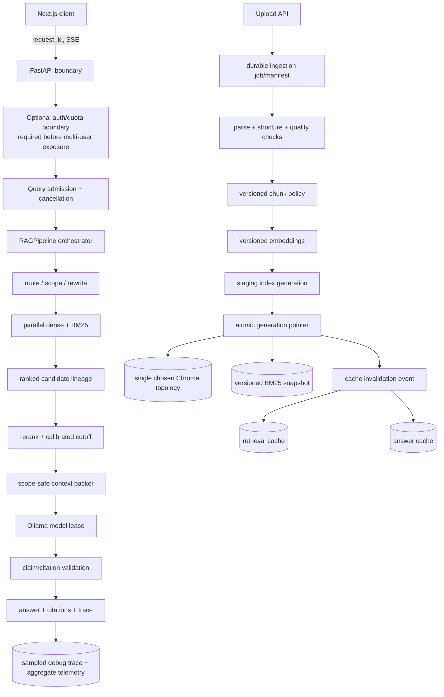
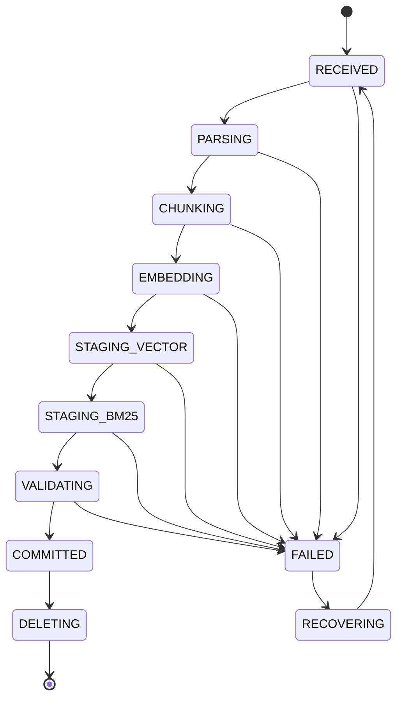

# RAG Target Architecture

**Principle:** evolve the existing FastAPI/Next.js/Ollama/Chroma/BM25 system; introduce new infrastructure only after a measured constraint justifies it.

## Target outcomes

- One supported product runtime: `frontend/` + `backend/`.
- Every indexed document is either atomically queryable in all required indexes or explicitly failed/recoverable.
- Every answer can be reconstructed from a versioned query, candidate lineage, final context, prompt policy, model, and citations.
- Corpus/config/model mutations invalidate affected caches deterministically.
- Text generation is cancellable and admitted according to measured hardware capacity.
- Quality and latency are gated on the same runtime shipped by Docker.

## Incremental target map



This design does not require a new broker or database in its first increment. A durable job manifest can use the existing SQLite/storage layout; a process-local admission controller is sufficient for a single API replica. If baselines prove multiple replicas or high ingestion volume are required, Redis/Celery can then be promoted from health scaffolding to owned workload infrastructure.

## Runtime boundaries

### Supported code boundary

- `backend/api/*` owns transport, validation, request identity, lifecycle, readiness, and cancellation.
- `backend/services/*` owns use cases and durable workflow state.
- `backend/rag/*` owns deterministic query orchestration, policies, trace semantics, and evidence contracts.
- `backend/ingestion/*`, `backend/embeddings/*`, and `backend/retrieval/*` own independently testable data-plane stages.
- `frontend/*` renders server truth; it must not invent retrieval progress or correctness states.
- `src/*` becomes legacy/migration-only and must not be imported by the supported runtime. Existing cross-imports are removed incrementally.

### Configuration boundary

Create one active settings object consumed by dependency assembly and every component. The fingerprint below is recorded in every index generation and query trace:

```text
rag_stack_version = hash(
  parser_version,
  chunk_policy + chunk_size + overlap,
  embedding_model + revision + normalization,
  lexical_tokenizer_version,
  fusion_policy + parameters,
  reranker_model + revision + cutoff policy,
  context_policy,
  prompt_version,
  generation_model + parameters
)
```

Environment variables may override this object, but component constructors must not introduce undocumented defaults.

## Ingestion lifecycle



Each job manifest records source hash, sanitized source identity, parser/chunker/embedder versions, expected chunk IDs, vector/BM25 counts, stage timings, errors, and commit generation. Query filters point only at the current committed generation. Staged records are invisible until validation confirms:

- expected chunks equal vector IDs equal lexical corpus entries;
- all mandatory metadata fields are present;
- sampled vectors have correct dimension and finite values;
- parse/chunk quality checks pass or explicitly classify the document as partial;
- a canary retrieval finds known content from the document.

Rollback deletes the staging generation and leaves the previous committed generation active. Deletion first makes a generation non-queryable, invalidates caches, then removes underlying records idempotently.

### Parsing and chunking target

- Preserve current format-specific loaders and metadata model.
- Add parser outcome codes and page-level text/asset statistics.
- Detect textless/scanned pages; do not silently label them successful. OCR remains opt-in until its experiment passes.
- Make chunking tokenizer-aware for the actual embedding/generation models.
- Treat table, code, headings, and page boundaries as explicit candidate boundaries; benchmark rather than assume one strategy.
- Assign deterministic chunk IDs from document hash + policy version + structural position.

## Query lifecycle

1. API validates the request, supplies one request/trace ID, checks scope authorization, and creates a cancellation token.
2. Admission controller either grants a model lease, waits within a bounded queue, or returns a retryable overload response.
3. Router/conversation resolver returns a typed plan with confidence and a reason code.
4. Cache policy computes a key from request semantics, corpus generation, and full RAG stack version.
5. Dense and lexical retrieval run concurrently against the same committed generation.
6. Fusion emits full per-source rank/score lineage. Reranking operates on a benchmarked candidate depth and records rejection reasons.
7. Context packer enforces document authorization/scope again, orders final evidence, assigns final source indices, and snapshots evidence IDs/text hashes.
8. Generator receives explicit system instructions that retrieved content is untrusted evidence, not executable instruction.
9. Citation validator checks source-index validity, scope, claim coverage, and numeric/quote/code support. Low-evidence cases abstain or clearly qualify the answer.
10. Response and trace share the same status. Cancellation interrupts model streaming and releases the model lease.

## Evidence lineage contract

For sampled debug traces and all evaluation runs, retain:

| Stage | Required fields |
|---|---|
| Query | normalized query hash, redacted preview, session turn, scope, filters, route |
| Dense | candidate ID, distance/similarity, rank, embedder version |
| Lexical | candidate ID, BM25 score, rank, tokenizer version |
| Fusion | candidate ID, RRF contribution by source, fused rank |
| Rerank | candidate ID, raw/calibrated score, input text span/hash, rank, rejection reason |
| Packing | final source index, candidate ID, token count, included span/hash, truncation/expansion reason |
| Generation | prompt policy/version, model/revision, parameters, TTFT, generation time, cancellation |
| Citation | claim/span ID, source index/chunk ID, validation result/reason |
| Verification | metric values, thresholds, final grounded/abstain status |

Full text is retained only under an approved, time-limited debug policy; default telemetry uses hashes, IDs, categories, and redacted previews.

## Cache architecture

### Retrieval cache

Key: normalized query + effective scope/filters + top-k + corpus generation + retrieval-stack fingerprint. Mutation of the committed corpus generation makes old entries unreachable. An explicit bounded invalidation removes them asynchronously.

### Semantic answer cache

Keep the existing high-similarity and critical-token guards. Add the full RAG stack version and final evidence snapshot/hash. A hit is rejected if any cited chunk is absent, unauthorized, or outside the active generation. Cache writes use a bounded executor/queue, not one daemon thread per request.

### Conversation state

For the current single-replica target, retain bounded TTL state but consolidate message history and evidence state behind one interface. If multiple API replicas become a measured requirement, move this interface to a shared store; do not preemptively distribute it.

## Model lifecycle and hardware sharing

Use a small `ModelLeaseManager` around existing model clients:

- configurable maximum concurrent text generations;
- bounded queue and timeout with observable rejection reason;
- cooperative cancellation passed through Ollama streaming;
- separate reranker/embedding semaphores if profiling demonstrates contention;
- vision lease of one retained, with a memory budget and idle unload policy;
- explicit warm/loaded/degraded states surfaced in readiness;
- only approved text model set resident; model switching is transactional and observable.

Targets for queue depth, leases, timeout, and residency are **BASELINE REQUIRED** on named hardware.

## Failure and recovery semantics

- User-correctable request issues return typed 4xx failures.
- Capacity and dependency failures return typed retryable 429/503 results with retry hints.
- Insufficient evidence returns a successful but explicit `abstained` answer status, not a fabricated answer.
- Degraded embedding/reranker fallback is present in response/trace and readiness; strict mode may reject it.
- Ingestion failures preserve the source and manifest for safe retry while keeping staging records invisible.
- Every failure maps to a stable code in `RAG_FAILURE_TAXONOMY.md`.

## Deployment decision points

### Decide now

- Use local persistent Chroma **or** the network Chroma service, not both. For a single local replica, local persistence is simpler; remove the unused service/env path.
- Keep SQLite telemetry for the first measured single-node release.
- Keep synchronous orchestration inside FastAPI while making generation cancellable and bounded.

### Decide only after baselining

- Promote Celery for ingestion if upload p95 or corpus update rate violates the agreed API/job target.
- Use shared Redis conversation/retrieval cache only if multiple API replicas are required.
- Move telemetry to a server database only if retention, concurrency, or query workload exceeds SQLite measurements.
- Replace Chroma/BM25 only if corpus scale or retrieval SLO cannot be met after indexing and query optimization.

## Migration sequence

1. Correct trace/readiness/citation/cache defects without changing answer policy.
2. Build the active-backend evaluator and capture a frozen baseline.
3. Consolidate settings and stamp versions on traces/indexes/caches.
4. Introduce ingestion manifests, validation, and generation commits.
5. Add retrieval lineage and benchmarked retrieval/rerank changes.
6. Add admission control and cooperative cancellation; measure capacity.
7. Add security controls before multi-user/network exposure.
8. Remove unused Compose services and remaining active imports from legacy `src/`.

Each step is independently deployable and has a rollback contract in `RAG_IMPROVEMENT_ROADMAP.md`.
